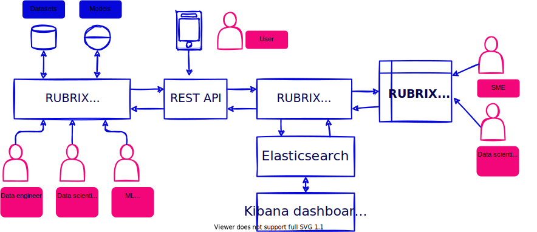

<p align="left">
    
</p>
<h3> Rubrix is an open-source Python framework to label, refine and monitor data for NLP</h3>

<p align="left">
    <a href="https://github.com/recognai/rubrix/actions">
        
    </a>
    
    <a href="https://pypi.org/project/rubrix/">
        
    </a>
    <a href="https://pypi.org/project/rubrix/">
        
    </a>
        <a href="https://hub.docker.com/r/recognai/rubrix">
        
    </a>
    <a href="https://anaconda.org/conda-forge/rubrix">
        
    </a>
    <a href="https://anaconda.org/conda-forge/rubrix">
        
    </a>
    <a href="https://rubrix.readthedocs.io/en/stable/">
        
    </a>
    <a href="https://github.com/ambv/black">
        
    </a>
    <a href="https://twitter.com/rubrixml">
        
    </a>
    <!--img alt="CI" src="https://img.shields.io/docker/v/recognai/rubrix?sort=semver"-->

</p>

---

<p align="justify" style="font-size: 18px">
    <a href="https://join.slack.com/t/rubrixworkspace/shared_invite/zt-whigkyjn-a3IUJLD7gDbTZ0rKlvcJ5g"> 👩🏾‍💻 Join the community on Slack</a></span>
    〰️
    <a href="https://docs.rubrix.ml">📚 Docs</a>
    〰️
    <a href="https://github.com/recognai/rubrix/#get-started">🚀 Get started</a>
    〰️
    <a href="https://github.com/recognai/rubrix/#quick-links">🔗 Quick links</a>
</p>

https://user-images.githubusercontent.com/1107111/148930791-ed4c3640-aa74-41b1-bfc5-5717e137bc1b.mp4

<p align="center">Example: Interactive weak supervision. Building a text classifier with user search queries</p>

## What is Rubrix?

Rubrix is a **production-ready Python framework for exploring, annotating, and managing data** in NLP projects.

Why Rubrix?

- **Open**: Rubrix is free, open-source, and 100% compatible with major NLP libraries (Hugging Face transformers, spaCy, Stanford Stanza, Flair, etc.). In fact, you can **use and combine your preferred libraries** without implementing any specific interface.

- **End-to-end**: Most annotation tools treat data collection as a one-off activity at the beginning of each project. In real-world projects, data collection is a key activity of the iterative process of ML model development. Once a model goes into production, you want to monitor and analyze its predictions, and collect more data to improve your model over time. Rubrix is designed to close this gap, enabling you to **iterate as much as you need**.

- **User and Developer Experience**: The key to sustainable NLP solutions is to make it easier for everyone to contribute to projects. _Domain experts_ should feel comfortable interpreting and annotating data. _Data scientists_ should feel free to experiment and iterate. _Engineers_ should feel in control of data pipelines. Rubrix optimizes the experience for these core users to **make your teams more productive**.

- **Beyond hand-labeling**: Classical hand labeling workflows are costly and inefficient, but having humans-in-the-loop is essential. Easily combine hand-labeling with active learning, bulk-labeling, zero-shot models, and weak-supervision in **novel data annotation workflows**.

## Features

### Advanced NLP labeling

- Programmatic labeling using Weak Supervision. Built-in label models (Snorkel, Flyingsquid)
- Bulk-labeling and search-driven annotation
- Iterate on training data with any pre-trained model or library
- Efficiently review and refine annotations in the UI and with Python
- Use Rubrix built-in metrics and methods for finding label and data errors (e.g., cleanlab)
- Simple integration with active learning workflows

### Monitoring

- Close the gap between production data and data collection activities
- Auto-monitoring for major NLP libraries and pipelines (spaCy, Hugging Face, FlairNLP)
- ASGI middleware for HTTP endpoints
- Rubrix Metrics to understand data and model issues, like entity consistency for NER models
- Integrated with Kibana for custom dashboards

### Team workspaces

- Bring different users and roles into the NLP data and model lifecycles
- Organize data collection, review and monitoring into different workspaces
- Manage workspace access for different users

## Get started

To get started you need to follow three steps:

1. Install the Python client
2. Launch the web app
3. Start logging data

🆕 **Rubrix Cloud Beta**: Use Rubrix on a scalable cloud infrastructure without installing the server. [Join the waiting list](https://www.rubrix.ml/rubrix-cloud/)

### 1. Install the Python client

You can install the Python client with `pip` or `conda`.

**with pip**

```bash
pip install rubrix
```

**with conda**

```sh
conda install -c conda-forge rubrix
```

### 2. Launch the web app

There are two ways to launch the web app:

- a) Using [docker-compose](https://docs.docker.com/compose/) (**recommended**).
- b) Executing the server code manually

#### a) Using docker-compose (recommended)

Create a folder:

```bash
mkdir rubrix && cd rubrix
```

and launch the docker-contained web app with the following command:

```bash
wget -O docker-compose.yml https://git.io/rb-docker && docker-compose up
```

This is the recommended way because it automatically includes an
[Elasticsearch](https://www.elastic.co/elasticsearch/) instance, Rubrix's main persistence layer.

#### b) Executing the server code manually

When executing the server code manually you need to provide an [Elasticsearch](https://www.elastic.co/elasticsearch/) instance yourself.

1. First you need to install
   [Elasticsearch](https://www.elastic.co/guide/en/elasticsearch/reference/7.10/install-elasticsearch.html)
   (we recommend version 7.10) and launch an Elasticsearch instance.
   For MacOS and Windows there are
   [Homebrew formulae](https://www.elastic.co/guide/en/elasticsearch/reference/7.13/brew.html) and a
   [msi package](https://www.elastic.co/guide/en/elasticsearch/reference/current/windows.html), respectively.
2. Install the Python client together with its server dependencies:

```bash
pip install rubrix[server]
```

3. Launch a local instance of the web app

```bash
python -m rubrix.server
```

By default, the Rubrix server will look for your Elasticsearch endpoint at `http://localhost:9200`.
But you can customize this by setting the `ELASTICSEARCH` environment variable.

### 3. Start logging data

The following code will log one record into a data set called `example-dataset`:

```python
import rubrix as rb

rb.log(
    rb.TextClassificationRecord(inputs="My first Rubrix example"),
    name='example-dataset'
)
```

If you go to your Rubrix web app at http://localhost:6900/, you should see your first dataset.
**The default username and password are `rubrix` and `1234`**.
You can also check the REST API docs at http://localhost:6900/api/docs.

Congratulations! You are ready to start working with Rubrix. You can continue reading a working example below.

To better understand what's possible take a look at Rubrix's [Cookbook](https://rubrix.rtfd.io/en/stable/guides/cookbook.html)

## Quick links

| Doc                                                                                                                     | Description                                                            |
| ----------------------------------------------------------------------------------------------------------------------- | ---------------------------------------------------------------------- |
| 🚶 **[First steps](https://rubrix.rtfd.io/en/stable/index.html#first-steps-with-rubrix)**                               | New to Rubrix and want to get started?                                 |
| 👩‍🏫 **[Concepts](https://rubrix.rtfd.io/en/stable/getting_started/concepts.html)**                                       | Want to know more about Rubrix concepts?                               |
| 🛠️ **[Setup and install](https://rubrix.rtfd.io/en/stable/getting_started/setup%26installation.html)**                  | How to configure and install Rubrix                                    |
| 🗒️ **[Tasks](https://rubrix.rtfd.io/en/stable/getting_started/supported_tasks.html)**                                   | What can you use Rubrix for?                                           |
| 📱 **[Web app reference](https://rubrix.readthedocs.io/en/stable/reference/webapp/index.html)**                         | How to use the web-app for data exploration and annotation             |
| 🐍 **[Python client API](https://rubrix.readthedocs.io/en/stable/reference/python/index.html)**                         | How to use the Python classes and methods                              |
| 👩‍🍳 **[Rubrix cookbook](https://rubrix.rtfd.io/en/stable/guides/cookbook.html)**                                         | How to use Rubrix with your favourite libraries (`flair`, `stanza`...) |
| 👋 **[Community forum](https://github.com/recognai/rubrix/discussions)**                                                | Ask questions, share feedback, ideas and suggestions                   |
| 🤗 **[Hugging Face tutorial](https://rubrix.readthedocs.io/en/master/tutorials/01-labeling-finetuning.html)**           | Using `Hugging Face` transformers with Rubrix for text classification  |
| 💫 **[spaCy tutorial](https://rubrix.rtfd.io/en/stable/tutorials/02-spacy.html)**                                       | Using `spaCy` with Rubrix for NER projects                             |
| 🐠 **[Weak supervision tutorial](https://rubrix.readthedocs.io/en/master/tutorials/weak-supervision-with-rubrix.html)** | How to leverage weak supervision with `snorkel` & Rubrix               |
| 🤔 **[Active learning tutorial](https://rubrix.rtfd.io/en/stable/tutorials/05-active_learning.html)**                   | How to use active learning with `modAL` & Rubrix                       |

## Example

Let's see Rubrix in action with a quick example: _Bootstraping data annotation with a zero-shot classifier_

**Why**:

- The availability of pre-trained language models with zero-shot capabilities means you can, sometimes, accelerate your data annotation tasks by pre-annotating your corpus with a pre-trained zeroshot model.
- The same workflow can be applied if there is a pre-trained "supervised" model that fits your categories but needs fine-tuning for your own use case. For example, fine-tuning a sentiment classifier for a very specific type of message.

**Ingredients**:

- A zero-shot classifier from the 🤗 Hub: `typeform/distilbert-base-uncased-mnli`
- A dataset containing news
- A set of target categories: `Business`, `Sports`, etc.

**What are we going to do**:

1. Make predictions and log them into a Rubrix dataset.
2. Use the Rubrix web app to explore, filter, and annotate some examples.
3. Load the annotated examples and create a training set, which you can then use to train a supervised classifier.

### 1. Predict and log

Let's load the zero-shot pipeline and the dataset (we are using the AGNews dataset for demonstration, but this could be your own dataset). Then, let's go over the dataset records and log them using `rb.log()`. This will create a Rubrix dataset, accesible from the web app.

```python
from transformers import pipeline
from datasets import load_dataset
import rubrix as rb

model = pipeline('zero-shot-classification', model="typeform/distilbert-base-uncased-mnli")

dataset = load_dataset("ag_news", split='test[0:100]')

labels = ['World', 'Sports', 'Business', 'Sci/Tech']

for item in dataset:
    prediction = model(item['text'], labels)

    record = rb.TextClassificationRecord(
        inputs=item["text"],
        prediction=list(zip(prediction['labels'], prediction['scores']))
    )

    rb.log(record, name="news_zeroshot")
```

### 2. Explore, Filter and Label

Now let's access our Rubrix dataset and start annotating data. Let's filter the records predicted as `Business` with high probability and use the bulk-labeling feature for labeling 15 records as `Business`:

https://user-images.githubusercontent.com/1107111/132261244-b9151571-608e-4a41-8f34-e9dc1c8b8e38.mp4

### 3. Load and create a training set

After a few iterations of data annotation, we can load the Rubrix dataset and create a training set to train or fine-tune a supervised model.

```python
# load the Rubrix dataset as a pandas DataFrame
rb_df = rb.load(name='news_zeroshot')

# filter annotated records
rb_df = rb_df[rb_df.status == "Validated"]

# select text input and the annotated label
train_df = pd.DataFrame({
    "text": rb_df.inputs.transform(lambda r: r["text"]),
    "label": rb_df.annotation,
})
```

## Architecture

Rubrix main components are:

- **Rubrix Python client**: Python client to log, load, copy and delete Rubrix datasets.
- **Rubrix server**: FastAPI REST service for reading and writing data.
- **Elasticsearch**: The storage layer and search engine powering the API and the web app.
- **Rubrix web app**: Easy-to-use web application for data exploration and annotation.



## Community

As a new open-source project, we are eager to hear your thoughts, fix bugs, and help you get started. Feel free to use the Discussion forum or the Issues and we'll be pleased to help out.

## Contributors

<a href="https://github.com/recognai/rubrix/graphs/contributors">
  
</a>
