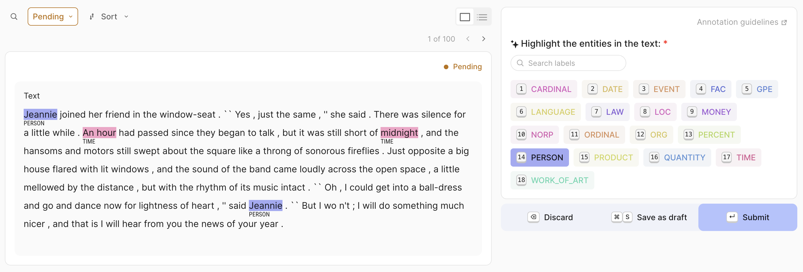

# Dataset management

This guide provides an overview of datasets, explaining the basics of how to set them up and manage them in Argilla.

A **dataset** is a collection of records that you can configure for labelers to provide feedback using the UI. Depending on the specific requirements of your task, you may need various types of feedback. You can customize the dataset to include different kinds of questions, so the first step will be to define the aim of your project and the kind of data and feedback you will need. With this information, you can start configuring a dataset by defining fields, questions, metadata, vectors, and guidelines through settings.

??? Question "Question: Who can manage datasets?"

    Only users with the `owner` role can manage (create, retrieve, update and delete) all the datasets.

    The users with the `admin` role can manage (create, retrieve, update and delete) the datasets in the workspaces they have access to.

!!! info "Main Classes"
    === "`rg.Dataset`"

        ```python
        rg.Dataset(
            name="name",
            workspace="workspace",
            settings=settings,
            client=client
        )
        ```
        > Check the [Dataset - Python Reference](../../reference/argilla_sdk/datasets/datasets.md) to see the attributes, arguments, and methods of the `Dataset` class in detail.

    === "`rg.Settings`"

        ```python
        rg.Settings(
            fields=[rg.TextField(name="text")],
            questions=[
                rg.LabelQuestion(
                    name="label",
                    labels=["label_1", "label_2", "label_3"]
                )
            ],
            metadata=[rg.TermsMetadataProperty(name="metadata")],
            vectors=[rg.VectorField(name="vector", dimensions=10)],
            guidelines="guidelines",
            allow_extra_metadata=True,
        )
        ```

        > Check the [Settings - Python Reference](../../reference/argilla_sdk/settings/settings.md) to see the attributes, arguments, and methods of the `Settings` class in detail.

## Create a dataset

To create a dataset, you can define it in the `Dataset` class and then call the `create` method that will send the dataset to the server so that it can be visualized in the UI. If the dataset does not appear in the UI, you may need to click the refresh button to update the view. For further configuration of the dataset, you can refer to the [settings section](#define-dataset-settings).

> The created dataset will be empty, to add the records refer to this [how-to guide](record.md).

```python
import argilla_sdk as rg

client = rg.Argilla(api_url="<api_url>", api_key="<api_key>")

settings = rg.Settings(
    guidelines="These are some guidelines.",
    fields=[
        rg.TextField(
            name="text",
        ),
    ],
    questions=[
        rg.LabelQuestion(
            name="label",
            labels=["label_1", "label_2", "label_3"]
        ),
    ],
)

dataset = rg.Dataset(
    name="my_dataset",
    workspace="my_workspace",
    settings=settings,
    client=client,
)

dataset.create()
```
!!! tip "Accessing attributes"
    Access the attributes of a dataset by calling them directly on the `dataset` object. For example, `dataset.id`, `dataset.name` or `dataset.settings`. You can similarly access the fields, questions, metadata, vectors and guidelines. For instance, `dataset.fields` or `dataset.questions`.

### Create multiple datasets with the same settings

To create multiple datasets with the same settings, define the settings once and pass it to each dataset.

```python
import argilla_sdk as rg

settings = rg.Settings(
    guidelines="Select the sentiment of the prompt.",
    fields=[rg.TextField(name="prompt", use_markdown=True)],
    questions=[rg.LabelQuestion(name="sentiment", labels=["positive", "negative"])],
)

dataset1 = rg.Dataset(name="sentiment_analysis_1", settings=settings)
dataset2 = rg.Dataset(name="sentiment_analysis_2", settings=settings)

# Create the datasets on the server
dataset1.create()
dataset2.create()
```

### Create a dataset with settings from an existing dataset

To create a new dataset with settings from an existing dataset, get the settings from the existing dataset and pass it
to the new dataset.

```python
import argilla_sdk as rg

# Get the settings from an existing dataset
existing_dataset = client.datasets("sentiment_analysis")

# Create a new dataset with the same settings
dataset = rg.Dataset(name="sentiment_analysis_copy", settings=existing_dataset.settings)

# Create the dataset on the server
dataset.create()
```

## Define dataset settings

### Fields

The fields in a dataset consist of one or more data items requiring annotation. Currently, Argilla only supports plain text and markdown through the `TextField`, though we plan to introduce additional field types in future updates.

A **field** is defined in the `TextField` class that has the following arguments:

* `name`: The name of the field.
* `title` (optional): The name of the field, as it will be displayed in the UI. Defaults to the `name` value.
* `required` (optional): Whether the field is required or not. Defaults to `True`. At least one field must be required.
* `use_markdown` (optional): Specify whether you want markdown rendered in the UI. Defaults to `False`. If you set it to True, you will be able to use all the Markdown features for text formatting, as well as embed multimedia content and PDFs.

!!! note
    The order of the fields in the UI follows the order in which these are added to the fields attribute in the Python SDK.

```python
rg.TextField(
    name="text",
    title="Text",
    required=True,
    use_markdown=False
)
```


### Questions

To collect feedback for your dataset, you need to formulate questions that annotators will be asked to answer. Currently, Argilla supports the following types of questions: `LabelQuestion`, `MultiLabelQuestion`, `RankingQuestion`, `RatingQuestion`, `SpanQuestion`, and `TextQuestion`.

=== "Label"
    A `LabelQuestion` asks annotators to choose a unique label from a list of options. This type is useful for text classification tasks. In the UI, they will have a rounded shape. It has the following configuration:

    - `name`: The name of the question.
    - `title` (optional): The name of the question, as it will be displayed in the UI. Defaults to the `name` value.
    - `description` (optional): The text to be displayed in the question tooltip in the UI. You can use it to give more context or information to annotators.
    - `required` (optional): Whether the question is required or not. Defaults to `True`. At least one question must be required.
    - `labels`: A list of strings with the options for these questions. If you'd like the text of the labels to be different in the UI and internally, you can pass a dictionary instead where the key is the internal name and the value will be the text displayed in the UI.

    ```python
    rg.LabelQuestion(
        name="label",
        title="Is the response relevant for the given prompt?",
        description="Select the one that applies.",
        required=True,
        labels={"YES": "Yes", "NO": "No"}, # or ["YES", "NO"]
    )
    ```
    

=== "Multi-label"
    A `MultiLabelQuestion` asks annotators to choose all applicable labels from a list of options. This type is useful for multi-label text classification tasks. In the UI, they will have a squared shape. It has the following configuration:

    - `name`: The name of the question.
    - `title` (optional): The name of the question, as it will be displayed in the UI. Defaults to the `name` value.
    - `description` (optional): The text to be displayed in the question tooltip in the UI. You can use it to give more context or information to annotators.
    - `required` (optional): Whether the question is required or not. Defaults to `True`. At least one question must be required.
    - `labels`: A list of strings with the options for these questions. If you'd like the text of the labels to be different in the UI and internally, you can pass a dictionary instead where the key is the internal name and the value will be the text displayed in the UI.
    - `visible_labels` (optional): The number of labels that will be visible at first sight in the UI. By default, the UI will show 20 labels and collapse the rest. Set your preferred number to change this limit or set `visible_labels=None` to show all options.

    ```python
    rg.MultiLabelQuestion(
        name="multi_label",
        title="Does the response include any of the following?",
        description="Select all that apply.",
        required=True,
        labels={
            "hate": "Hate Speech",
            "sexual": "Sexual content",
            "violent": "Violent content",
            "pii": "Personal information",
            "untruthful": "Untruthful info",
            "not_english": "Not English",
            "inappropriate": "Inappropriate content"
        }, # or ["hate", "sexual", "violent", "pii", "untruthful", "not_english", "inappropriate"]
        visible_labels=4
    )

    ```
    

=== "Ranking"
    A `RankingQuestion` asks annotators to order a list of options. It is useful to gather information on the preference or relevance of a set of options. Ties are allowed and all options will need to be ranked. It has the following configuration:

    - `name`: The name of the question.
    - `title` (optional): The name of the question, as it will be displayed in the UI. Defaults to the `name` value.
    - `description` (optional): The text to be displayed in the question tooltip in the UI. You can use it to give more context or information to annotators.
    - `required` (optional): Whether the question is required or not. Defaults to `True`. At least one question must be required.
    - `values`: A list of strings with the options they will need to rank. If you'd like the text of the options to be different in the UI and internally, you can pass a dictionary instead where the key is the internal name and the value is the text to display in the UI.

    ```python
    rg.RankingQuestion(
        name="ranking",
        title="Order replies based on your preference",
        description="1 = best, 3 = worst. Ties are allowed.",
        required=True,
        values={
            "reply-1": "Reply 1",
            "reply-2": "Reply 2",
            "reply-3": "Reply 3"
        } # or ["reply-1", "reply-2", "reply-3"]
    )
    ```

    

=== "Rating"
    A `RatingQuestion` asks annotators to select one option from a list of integer values. This type is useful for collecting numerical scores. It has the following configuration:

    - `name`: The name of the question.
    - `title` (optional): The name of the question, as it will be displayed in the UI. Defaults to the `name` value.
    - `description` (optional): The text to be displayed in the question tooltip in the UI. You can use it to give more context or information to annotators.
    - `required` (optional): Whether the question is required or not. Defaults to `True`. At least one question must be required.
    - `values`: A list of unique integers representing the scores that annotators can select from should be defined within the range [1, 10].

    ```python
    rg.RatingQuestion(
        name="rating",
        title="How satisfied are you with the response?",
        description="1 = very unsatisfied, 10 = very satisfied",
        required=True,
        values=[1, 2, 3, 4, 5, 6, 7, 8, 9, 10]
    )
    ```

    

=== "Span"
    A `SpanQuestion` asks annotators to select a portion of the text of a specific field and apply a label to it. This type of question is useful for named entity recognition or information extraction tasks. It has the following configuration:

    - `name`: The name of the question.
    - `title` (optional): The name of the question, as it will be displayed in the UI. Defaults to the `name` value, but capitalized.
    - `description` (optional): The text to be displayed in the question tooltip in the UI. You can use it to give more context or information to annotators.
    - `required` (optional): Whether the question is required or not. Defaults to `True`. At least one question must be required.
    - `labels`: A list of strings with the options for these questions. If you'd like the text of the labels to be different in the UI and internally, you can pass a dictionary instead where the key is the internal name and the value will be the text to display in the UI.
    - `field`: This question is always attached to a specific field. You should pass a string with the name of the field where the labels of the `SpanQuestion` should be used.
    - `allow_overlapping`: This value specifies whether overlapped spans are allowed or not. Defaults to `False`.
    - `visible_labels` (optional): The number of labels that will be visible at first sight in the UI. By default, the UI will show 20 labels and collapse the rest. Set your preferred number to change this limit or set `visible_labels=None` to show all options.

    ```python
    rg.SpanQuestion(
        name="span",
        title="Select the entities in the text",
        description="Select the entities in the text",
        required=True,
        labels={
            "PERSON": "Person",
            "ORG": "Organization",
            "LOC": "Location",
            "MISC": "Miscellaneous"
        },
        field="text",
        allow_overlapping=False,
        visible_labels=None
    )
    ```

    

=== "Text"
    A `TextQuestion` offers to annotators a free-text area where they can enter any text. This type is useful for collecting natural language data, such as corrections or explanations. It has the following configuration:

    - `name`: The name of the question.
    - `title` (optional): The name of the question, as it will be displayed in the UI. Defaults to the `name` value, but capitalized.
    - `description` (optional): The text to be displayed in the question tooltip in the UI. You can use it to give more context or information to annotators.
    - `required` (optional): Whether the question is required or not. Defaults to `True`. At least one question must be required.
    - `use_markdown` (optional): Define whether the field should render markdown text. Defaults to `False`. If you set it to `True`, you will be able to use all the Markdown features for text formatting, as well as embed multimedia content and PDFs.

    ```python
    rg.TextQuestion(
        name="text",
        title="Please provide feedback on the response",
        description="Please provide feedback on the response",
        required=True,
        use_markdown=True
    )
    ```

    

### Metadata

Metadata properties allow you to configure the use of metadata information for the filtering and sorting features available in the UI and Python SDK. There exist three types of metadata you can add: `TermsMetadataProperty`, `IntegerMetadataProperty` and `FloatMetadataProperty`.

=== "Terms"
    A `TermsMetadataProperty` allows to add a list of strings as metadata options. It has the following configuration:

    - `name`: The name of the metadata property.
    - `title` (optional): The name of the metadata property, as it will be displayed in the UI. Defaults to the `name` value, but capitalized.
    - `options` (optional): You can pass a list of valid values for this metadata property, in case you want to run any validation.

    ```python
    rg.TermsMetadataProperty(
        name="terms",
        title="Annotation groups",
        options=["group-a", "group-b", "group-c"]
    )
    ```
    

=== "Integer"
    An `IntegerMetadataProperty` allows to add integer values as metadata. It has the following configuration:

    - `name`: The name of the metadata property.
    - `title` (optional): The name of the metadata property, as it will be displayed in the UI. Defaults to the `name` value, but capitalized.
    - `min` (optional): You can pass a minimum valid value. If none is provided, the minimum value will be computed from the values provided in the records.
    - `max` (optional): You can pass a maximum valid value. If none is provided, the maximum value will be computed from the values provided in the records.

    ```python
    rg.IntegerMetadataProperty(
        name="integer",
        title="length-input",
        min=42,
        max=1984,
    )
    ```
    

=== "Float"
    A `FloatMetadataProperty` allows to add float values as metadata. It has the following configuration:

    - `name`: The name of the metadata property.
    - `title` (optional): The name of the metadata property, as it will be displayed in the UI. Defaults to the `name` value, but capitalized.
    - `min` (optional): You can pass a minimum valid value. If none is provided, the minimum value will be computed from the values provided in the records.
    - `max` (optional): You can pass a maximum valid value. If none is provided, the maximum value will be computed from the values provided in the records.

    ```python
    rg.FloatMetadataProperty(
        name="float",
        title="Reading ease",
        min=-92.29914,
        max=119.6975,
    )
    ```
    

### Vectors

To use the similarity search in the UI and the Python SDK, you will need to configure vectors using the `VectorField` class. It has the following configuration:

* `name`: The name of the vector.
* `title` (optional): A name for the vector to display in the UI for better readability.
* `dimensions`: The dimensions of the vectors used in this setting.

```python
rg.VectorField(
    name="my_vector",
    title="My Vector",
    dimensions=768
),
```


### Guidelines

Once you have decided on the data to show and the questions to ask, it's important to provide clear guidelines to the annotators. These guidelines help them understand the task and answer the questions consistently. You can provide guidelines in two ways:

* In the dataset guidelines: this is added as an argument when you create your dataset in the Python SDK. It will appear in the dataset settings in the UI.
```python
guidelines = "In this dataset, you will find a collection of records that show a category, an instruction, a context and a response to that instruction. [...]"
```


* As question descriptions: these are added as an argument when you create questions in the Python SDK. This text will appear in a tooltip next to the question in the UI.


It is good practice to use at least the dataset guidelines if not both methods. Question descriptions should be short and provide context to a specific question. They can be a summary of the guidelines to that question, but often that is not sufficient to align the whole annotation team. In the guidelines, you can include a description of the project, details on how to answer each question with examples, instructions on when to discard a record, etc.

!!! tip
    If you want further guidance on good practices for guidelines during the project development, check our [blog post](https://argilla.io/blog/annotation-guidelines-practices/).

## List datasets

You can list all the datasets available in a workspace using the `datasets` attribute of the `Workspace` class. You can also use `len(workspace.datasets)` to get the number of datasets in a workspace.

```python
import argilla_sdk as rg

client = rg.Argilla(api_url="<api_url>", api_key="<api_key>")

workspace = client.workspaces("my_workspace")

datasets = workspace.datasets

for dataset in datasets:
    print(dataset)
```

## Retrieve a dataset

You can retrieve a dataset by calling the `datasets` method on the `Argilla` class and passing the name of the dataset as an argument. By default, this method attempts to retrieve the dataset from the first workspace. If the dataset is in a different workspace, you must specify either the workspace name or id as an argument.

```python
import argilla_sdk as rg

client = rg.Argilla(api_url="<api_url>", api_key="<api_key>")

workspace = client.workspaces("my_workspace")

# Retrieve the dataset from the first workspace
retrieved_dataset = client.datasets(name="my_dataset")

# Retrieve the dataset from the specified workspace
retrieved_dataset = client.datasets(name="my_dataset", workspace=workspace)
```

## Check dataset existence

You can check if a dataset exists by calling the `exists` method on the `Dataset` class. This method returns a boolean value.

```python
import argilla_sdk as rg

client = rg.Argilla(api_url="<api_url>", api_key="<api_key>")

dataset = client.datasets(name="my_dataset")

dataset_existed = dataset.exists()
```

## Update a dataset

You can update a dataset by calling the `update` method on the `Dataset` class and passing the new settings as an argument.

!!! note
    Keep in mind that once your dataset is published, only the guidelines can be updated.

```python
import argilla_sdk as rg

client = rg.Argilla(api_url="<api_url>", api_key="<api_key>")

dataset_to_update = client.datasets(name="my_dataset")

settings_to_update = rg.Settings(
    guidelines="These are some updated guidelines.",
    fields=[
        rg.TextField(
            name="text",
        ),
    ],
    questions=[
        rg.LabelQuestion(
            name="label",
            labels=["label_4", "label_5", "label_6"]
        ),
    ],
)

dataset_to_update.settings = settings_to_update

dataset_updated = dataset_to_update.update()
```

## Delete a dataset

You can delete an existing dataset by calling the `delete` method on the `Dataset` class.

```python
import argilla_sdk as rg

client = rg.Argilla(api_url="<api_url>", api_key="<api_key>")

dataset_to_delete = client.datasets(name="my_dataset")

dataset_deleted = dataset_to_delete.delete()
```