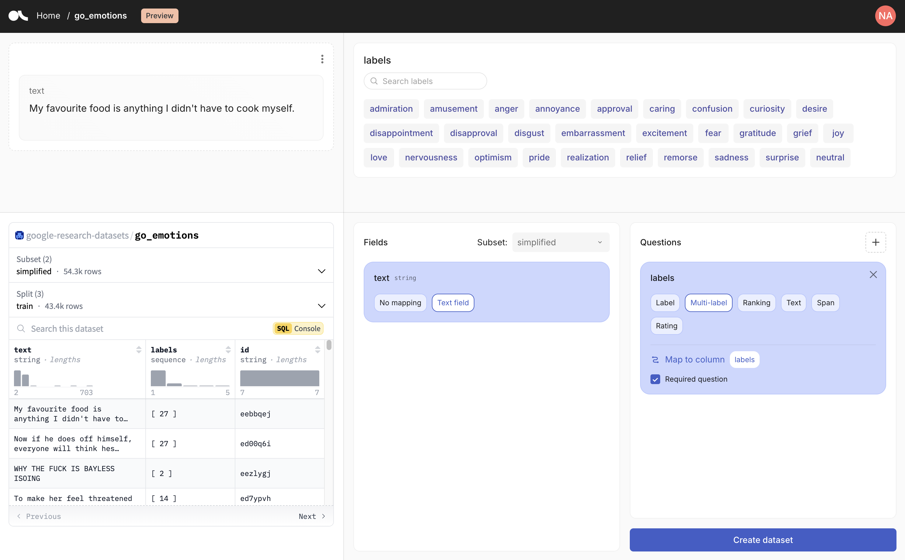

# Quickstart

Argilla is a free, open-source, self-hosted tool. This means you need to deploy its UI to start using it. There is two main ways to deploy Argilla:

!!! huggingface "Deploy on the Hugging Face Hub"

    The **recommended choice to get started**. You can get up and running in under 5 minutes and don't need to maintain a server or run any commands.

    === "No-code"

        If you're just getting started with Argilla, click the deploy button below:

        <div style="margin: 5px">
                <a href="http://huggingface.co/new-space?template=argilla/argilla-template-space&name=my-argilla" target="_blank">
                    
                </a>
        </div>

        You can use the default values following these steps:

        - Leave the default Space owner (your personal account)
        - Leave `USERNAME` and `PASSWORD` secrets empty since you'll sign in with your HF user as the Argilla Space `owner`.
        - Click create Space to launch Argilla 🚀.
        - Once you see the Argilla UI, [go to the Sign in into the Argilla UI section](#sign-in-to-the-argilla-ui). If you see the `Building` message for longer than 2-3 min refresh the page.

    === "Python SDK"

        If you want to deploy Argilla using the Python SDK, follow these steps:

        First, install Argilla:

        ```console
        pip install argilla
        ```

        Next, we can use the `Argilla.deploy_on_spaces` method, which will create a Space in [the Hugging Face Hub](https://huggingface.co/). This method will automatically do the following:

        - Deploy an Argilla Space on the Hugging Face Hub with [OAuth sign-in](#sign-in-to-the-argilla-ui) and a URL like `https://<your-username>-argilla.hf.space`, which takes around 2-3 minutes.
        - Create a default workspace called `argilla` with an owner called `<your-username>` and an Argilla token set to `api_key`.
        - Automatically return the authenticated Argilla client, which can directly be used to interact with your Argilla server.

        ```python
        import argilla as rg

        authenticated_client = rg.Argilla.deploy_on_spaces(api_key="<api_key>")
        ```

    !!! tip "Argilla API Key"
        Your Argilla API key can be found in the `My Settings` page of your Argilla Space. Take a look at the [sign in to the UI section](#sign-in-to-the-argilla-ui) to learn how to retrieve it.

    !!! warning "Persistent storage `SMALL`"
        Not setting persistent storage to `SMALL` means that **you will loose your data when the Space restarts**. Spaces get restarted due to maintainance, inactivity, and every time you change your Spaces settings. If you want to **use the Space just for testing** you can use `FREE` temporarily.

    If you want to deploy Argilla within a Hugging Face organization, setup a more stable Space, or understand the settings, [check out the HF Spaces settings guide](how-to-configure-argilla-on-huggingface.md).

!!! docker "Deploy with Docker"

    If you want to **run Argilla locally on your machine or a server**, or tune the server configuration, choose this option. To use this option, [check this guide](how-to-deploy-argilla-with-docker.md).

## Sign in to the Argilla UI

If everything went well, you should see the Argilla sign in page that looks like this:

{ width=100% height=100% }

!!! info "Building errors"
    If you get a build error, sometimes restarting the Space from the Settings page works, otherwise [check the HF Spaces settings guide](how-to-configure-argilla-on-huggingface.md).

In the sign in page:

1. Click on **Sign in with Hugging Face**.

2. **Authorize the application** and you will be logged in into Argilla as an `owner`.

!!! info "Unauthorized error"
    Sometimes, after authorizing you'll see an unauthorized error, and get redirected to the sign in page. Typically, clicking the Sign in button again will solve this issue.

Congrats! Your Argilla server is ready to start your first project.

## Create your first dataset

The quickest way to start exploring the tool and create your first dataset is by importing an exiting one from the Hugging Face Hub.

To do this, log in to the Argilla UI and in the Home page click on "Import dataset from Hugging Face". You can choose one of the sample datasets or paste a repo id in the input. This will look something like `stanfordnlp/imdb`.

Argilla will automatically interpret the columns in the dataset to map them to Fields and Questions.

**Fields** include the data that you want feedback on, like text, chats, or images. If you want to exclude any of the Fields that Argilla identified for you, simply select the "No mapping" option.

**Questions** are the feedback you want to collect, like labels, ratings, rankings, or text. If Argilla identified questions in your dataset that you don't want, you can eliminate them. You can also add questions of your own.



Note that you will be able to modify some elements of the configuration of the dataset after it has been created from the Dataset Settings page e.g., the titles of fields and questions. Check all the settings you can modify in the [Update a dataset](../how_to_guides/dataset.md#update-a-dataset) section.

When you're happy with the result, you'll need to give a name to your dataset, select a workspace and choose a split, if applicable. Then, Argilla will start importing the dataset in the background. Now you're all set up to start annotating!

!!! info "Importing long datasets"
    Argilla will only import the first 10k rows of a dataset. If your dataset is larger, you can import the rest of the records at any point using the Python SDK.

    To do that, open your dataset and copy the code snippet provided under "Import data". Now, open a Jupyter or Google Colab notebook and install argilla:

    ```python
    !pip install argilla
    ```
    Then, paste and run your code snippet. This will import the remaining records to your dataset.

## Install and connect the Python SDK

For getting started with Argilla and its SDK, we recommend to use Jupyter Notebook or Google Colab. You will need this to manage users, workspaces and datasets in Argilla.

In your notebook, you can install the Argilla SDK with pip as follows:

```python
!pip install argilla
```

To start interacting with your Argilla server, you need to instantiate a client with an API key and API URL:

- The `<api_key>` is in the `My Settings` page of your Argilla Space but make sure you are logged in with the `owner` account you used to create the Space.

- The `<api_url>` is the URL shown in your browser if it ends with `*.hf.space`.

```python
import argilla as rg

client = rg.Argilla(
    api_url="<api_url>",
    api_key="<api_key>"
)
```

!!! info "You can't find your API URL"
    If you're using Spaces, sometimes the Argilla UI is embedded into the Hub UI so the URL of the browser won't match the API URL. In these scenarios, you have several options:

    1. In the Home page of Argilla, click on "Import from the SDK". You will find your API URL and key in the code snippet provided.
    2. Click on the three points menu at the top of the Space, select "Embed this Space", and open the direct URL.
    3. Use this pattern: `https://[your-owner-name]-[your_space_name].hf.space`.

To check that everything is running correctly, you can call `me`. This should return your user information:

```python
client.me
```

From here, you can manage all of your assets in Argilla, including updating the dataset we created earlier and adding advanced information, such as vectors, metadata or suggestions. To learn how to do this, check our [how to guides](../how_to_guides/index.md).

## Export your dataset to the Hub

Once you've spent some time annotating your dataset in Argilla, you can upload it back to the Hugging Face Hub to share with others or version control it.

To do that, first follow the steps in the previous section to connect to your Argilla server using the SDK. Then, you can load your dataset and export it to the hub like this:

```python
dataset = client.datasets(name="my_dataset")

dataset.to_hub(repo_id="<my_org>/<my_dataset>")
```

For more info on exporting datasets to the Hub, read our guide on [exporting datasets](../how_to_guides/import_export.md#export-to-hub).

## Next steps

- To learn how to create your own datasets, workspaces, and manage users, check the [how-to guides](../how_to_guides/index.md).

- To learn Argilla with hands-on examples, check the [Tutorials section](../tutorials/index.md).

- To further configure your Argilla Space, check the [Hugging Face Spaces settings guide](how-to-configure-argilla-on-huggingface.md).
