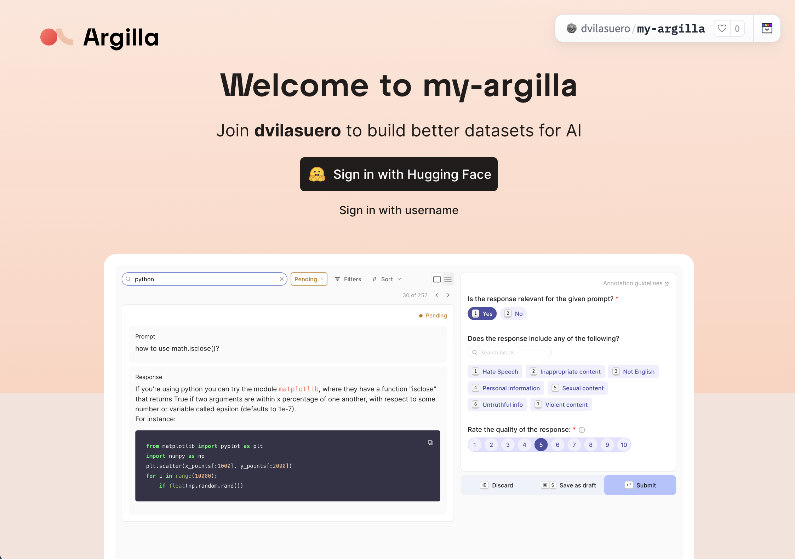

# Quickstart

Argilla is a free, open-source, self-hosted tool. This means you need to deploy its UI to start using it. There is two main ways to deploy Argilla:

!!! huggingface "Deploy on the Hugging Face Hub"

    The **recommended choice to get started**. You can get up and running in under 5 minutes and don't need to maintain a server or run any commands.

    === "Hugging Face Hub"

        If you're just getting started with Argilla, click the deploy button below:

        <div style="margin: 5px">
                <a href="http://huggingface.co/new-space?template=argilla/argilla-template-space&name=my-argilla" target="_blank">
                    
                </a>
        </div>

        You can use the default values following these steps:

        - Leave the default Space owner (your personal account)
        - Leave `USERNAME` and `PASSWORD` secrets empty since you'll sign in with your HF user as the Argilla Space `owner`.
        - Click create Space to launch Argilla 🚀.
        - Once you see the Argilla UI, [go to the Sign in into the Argilla UI section](#sign-in-into-the-argilla-ui). If you see the `Building` message for longer than 2-3 min refresh the page.

    === "SDK"

        First, install Argilla:

        ```console
        pip install argilla
        ```

        Next, `Argilla.deploy_on_spaces`, which will create a Space in [the Hugging Face Hub](https://huggingface.co/).

        ```python
        import argilla as rg

        client = rg.Argilla.deploy_on_spaces(api_key="<api_key>")
        ```

        Learn how to [sign in to the UI](#sign-in-into-the-argilla-ui) and retrieve your API key or continue with the [Create your first dataset section](#create-your-first-dataset).

    !!! warning "Persistent storage `SMALL`"
        Not setting persistent storage to `SMALL` means that **you will loose your data when the Space restarts**. Spaces get restarted due to maintainance, inactivity, and every time you change your Spaces settings. If you want to **use the Space just for testing** you can use `FREE` temporarily.

    If you want to deploy Argilla within a Hugging Face organization, setup a more stable Space, or understand the settings, [check out the HF Spaces settings guide](how-to-configure-argilla-on-huggingface.md).

!!! docker "Deploy with Docker"

    If you want to **run Argilla locally on your machine or a server**, or tune the server configuration, choose this option. To use this option, [check this guide](how-to-deploy-argilla-with-docker.md).

## Sign in into the Argilla UI
If everything went well, you should see the Argilla sign in page that looks like this:

{ width=100% height=100% }

!!! info "Building errors"
    If you get a build error, sometimes restarting the Space from the Settings page works, otherwise [check the HF Spaces settings guide](how-to-configure-argilla-on-huggingface.md).

In the sign in page:

1. Click on **Sign in with Hugging Face**
2. **Authorize the application** and you will be logged in into Argilla as an `owner`.

!!! info "Unauthorized error"
    Sometimes, after authorizing you'll see an unauthorized error, and get redirected to the sign in page. Typically, clicking the Sign in button solves the issue.

Congrats! Your Argilla server is ready to start your first project using the Python SDK. You now have full rights to create datasets. Follow the instructions in the home page, or keep reading this guide if you want a more detailed explanation.

## Install the Python SDK

To manage workspaces and datasets in Argilla, you need to use the Argilla Python SDK. You can install it with pip as follows:

```console
pip install argilla
```

## Create your first dataset

For getting started with Argilla and its SDK, we recommend to use Jupyter Notebook or Google Colab.

To start interacting with your Argilla server, you need to create a instantiate a client with an API key and API URL:

- The `<api_key>` is in the `My Settings` page of your Argilla Space but make sure you are logged in with the `owner` account you used to create the Space.

- The `<api_url>` is the URL shown in your browser if it ends with `*.hf.space`.

```python
import argilla as rg

client = rg.Argilla(
    api_url="<api_url>",
    api_key="<api_key>"
)
```

!!! info "You can't find your API URL"
    If you're using Spaces, sometimes the Argilla UI is embedded into the Hub UI so the URL of the browser won't match the API URL. In these scenarios, there are two options:
        1. Click on the three points menu at the top of the Space, select "Embed this Space", and open the direct URL.
        2. Use this pattern: `https://[your-owner-name]-[your_space_name].hf.space`.

To create a dataset with a simple text classification task, first, you need to **define the dataset settings**.

```python
settings = rg.Settings(
    guidelines="Classify the reviews as positive or negative.",
    fields=[
        rg.TextField(
            name="review",
            title="Text from the review",
            use_markdown=False,
        ),
    ],
    questions=[
        rg.LabelQuestion(
            name="my_label",
            title="In which category does this article fit?",
            labels=["positive", "negative"],
        )
    ],
)
```

Now you can **create the dataset with these settings**. Publish the dataset to make it available in the UI and add the records.

!!! info "About workspaces"
    Workspaces in Argilla group datasets and user access rights. The `workspace` parameter is optional in this case. If you don't specify it, the dataset will be created in the default workspace `argilla`.

    By default, **this workspace will be visible to users joining with the Sign in with Hugging Face button**. You can create other workspaces and decide to grant access to users either with the SDK or the [changing the OAuth configuration](how-to-configure-argilla-on-huggingface.md).

```python
dataset = rg.Dataset(
    name=f"my_first_dataset",
    settings=settings,
    client=client,
    #workspace="argilla"
)
dataset.create()
```

Now you can **add records to your dataset**. We will use the IMDB dataset from the Hugging Face Datasets library as an example. The `mapping` parameter indicates which keys/columns in the source dataset correspond to the Argilla dataset fields.

```python
from datasets import load_dataset

data = load_dataset("imdb", split="train[:100]").to_list()

dataset.records.log(records=data, mapping={"text": "review"})
```

🎉 You have successfully created your first dataset with Argilla. You can now access it in the Argilla UI and start annotating the records.

## Next steps

- To learn how to create your datasets, workspace, and manage users, check the [how-to guides](../how_to_guides/index.md).

- To learn Argilla with hands-on examples, check the [Tutorials section](../tutorials/index.md).

- To further configure your Argilla Space, check the [Hugging Face Spaces settings guide](how-to-configure-argilla-on-huggingface.md).