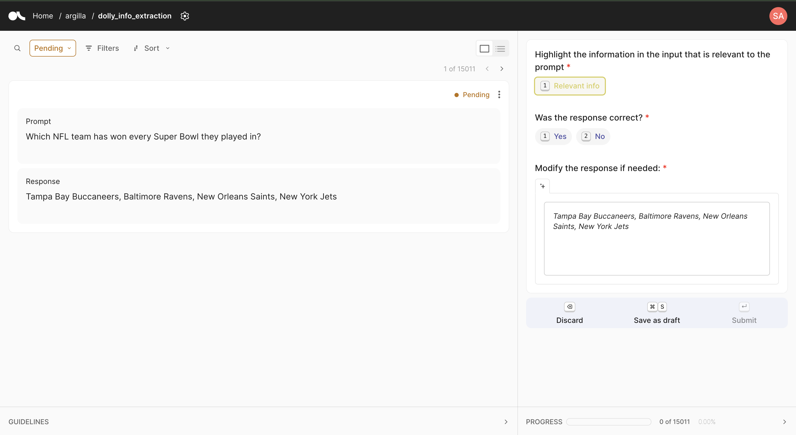

# Annotate your dataset

!!! note ""
    To experience the UI features firsthand, you can take a look at the [Demo ↗](https://demo.argilla.io/sign-in?auth=ZGVtbzoxMjM0NTY3OA==).

Argilla UI offers many functions to help you manage your annotation workflow, aiming to provide the most flexible approach to fit the wide variety of use cases handled by the community.

## Annotation interface overview

### Flexible layout

The UI is responsive with two columns for larger devices and one column for smaller devices. This enables you to annotate data using your mobile phone for simple datasets (i.e., not very long text and 1-2 questions) or resize your screen to get a more compact UI.

=== "Header"

    At the right side of the navigation breadcrumb, you can customize the dataset settings and edit your profile.

=== "Left pane"
    This area displays the **control panel** on the top. The control panel is used for performing keyword-based search, applying filters, and sorting the results.

    Below the control panel, the record card(s) are displayed one by one (Focus view) or in a vertical list (Bulk view).

=== "Right pane"

    This is where you annotate your dataset. Simply fill it out as a form, then choose to `Submit`, `Save as Draft`, or `Discard`.

=== "Left bottom panel"

    This expandable area displays the annotation guidelines. The annotation guidelines can be edited by owner and admin roles in the dataset settings.

=== "Right bottom panel"

    This expandable area displays your annotation progress.

### Shortcuts

The Argilla UI includes a range of shortcuts. For the main actions (submit, discard, save as draft and selecting labels) the keys are showed in the corresponding button.

To learn how to move from one question to another or between records using the keyboard, take a look at the table below.

Shortcuts provide a smoother annotation experience, especially with datasets using a single question (Label, MultiLabel, Rating, or Ranking).

??? "Available shortcuts"

    | Action | Keys |
    | --- | --- |
    | Activate form | ⇥ Tab |
    | Move between questions | ↓ Down arrow or ↑ Up arrow |
    | Select and unselect label | 1, 2, 3 |
    | Move between labels or ranking options | ⇥ Tab or ⇧ Shift ⇥ Tab |
    | Select rating and rank | 1, 2, 3 |
    | Fit span to character selection | Hold ⇧ Shift |
    | Activate text area | ⇧ Shift ↵ Enter |
    | Exit text area | Esc |
    | Discard | ⌫ Backspace |
    | Save draft (Mac os) | ⌘ Cmd S |
    | Save draft (Other) | Ctrl S |
    | Submit | ↵ Enter |
    | Move between pages | → Right arrow or ← Left arrow |

### View by status

The view selector is set by default on Pending.

If you are starting an annotation effort, all the records are initially kept in the Pending view. Once you start annotating, the records will move to the other queues: Draft, Submitted, Discarded.

- **Pending**: The records without a response.
- **Draft**: The records with partial responses. They can be submitted or discarded later. You can’t move them back to the pending queue.
- **Discarded**: The records may or may not have responses. They can be edited but you can’t move them back to the pending queue.
- **Submitted**: The records have been fully annotated and have already been submitted. You can remove them from this queue and send them to the draft or discarded queues, but never back to the pending queue.

!!! note
    If you are working as part of a team, the number of records in your Pending queue may change as other members of the team submit responses and those records get completed.

!!! tip
    If you are working as part of a team, the records in the draft queue that have been completed by other team members will show a check mark to indicate that there is no need to provide a response.

### Suggestions

If your dataset includes model predictions, you will see them represented by a sparkle icon `✨` in the label or value button. We call them “Suggestions” and they appear in the form as pre-filled responses. If confidence scores have been included by the dataset admin, they will be shown alongside with the label. Additionally, admins can choose to always show suggested labels at the beginning of the list. This can be configured from the dataset settings.

If you agree with the suggestions, you just need to click on the `Submit` button, and they will be considered as your response. If the suggestion is incorrect, you can modify it and submit your final response.

### Focus view

{ width=10% height=10% }

This is the default view to annotate your dataset linearly, displaying one record after another.

!!! tip
    You should use this view if you have a large number of required questions or need a strong focus on the record content to be labelled. This is also the recommended view for annotating a dataset sample to avoid potential biases introduced by using filters, search, sorting and bulk labelling.

Once you submit your first response, the next record will appear automatically. To see again your submitted response, just click on `Prev`.

**Navigating through the records**

To navigate through the records, you can use the `Prev`, shown as `<`, and `Next`, `>` buttons on top of the record card.

Each time the page is fully refreshed, the records with modified statuses (Pending to Discarded, Pending to Save as Draft, Pending to Submitted) are sent to the corresponding queue. The **control panel** displays the **status selector**, which is set to Pending by default.

### Bulk view

{ width=10% height=10% }

The bulk view is designed to speed up the annotation and get a quick overview of the whole dataset.

The bulk view displays the records in a vertical list. Once this view is active, some functions from the control panel will activate to optimize the view. You can define the number of records to display by page between `10`, `25`, `50`, `100` and whether records are shown with a fixed (`Collapse records`) or their natural height (`Expand records`).

!!! tip
    You should use this to quickly explore a dataset. This view is also recommended if you have a good understanding of the domain and want to apply your knowledge based on things like similarity and keyword search, filters, and suggestion score thresholds. For a datasets with a large number of required questions or very long fields, the focus view would be more suitable.

    With multiple questions, think about using the bulk view to annotate massively one question. Then, you can complete the annotation per record from the draft queue.

!!! note
    Please note that suggestions are not shown in bulk view (except for Spans) and that you will need to save as a draft when you are not providing responses to all required questions.

### Annotation progress

You can track the progress of an annotation task in the progress bar shown in the dataset list and in the progress panel inside the dataset. This bar shows the number of records that have been completed (i.e., those that have the minimum number of submitted responses) and those left to be completed.

You can also track your own progress in real time expanding the right-bottom panel inside the dataset page. There you can see the number of records for which you have `Pending`, `Draft`, `Submitted` and `Discarded` responses.

!!! note
    You can also explore the dataset progress from the SDK. Check the [Track your team's progress](./distribution.md#track-your-teams-progress) to know more about it.

## Use search, filters, and sort

The UI offers various features designed for data exploration and understanding. Combining these features with bulk labelling can save you and your team hours of time.

!!! tip
    You should use this when you are familiar with your data and have large volumes to annotate based on verified beliefs and experience.

### Search

From the **control panel** at the top of the left pane, you can search by keyword across the entire dataset. If you have more than one field in your records, you may specify if the search is to be performed “All” fields or on a specific one. Matched results are highlighted in color.

!!! note
    If you introduce more than one keyword, the search will return results where **all** keywords have a match.

!!! tip
    For more advanced searches, take a look at the [advanced queries DSL](query.md#advanced-queries).

### Order by record semantic similarity

You can retrieve records based on their similarity to another record if vectors have been added to the dataset.

!!! note
    Check these guides to know how to add vectors to your [dataset](dataset.md) and [records](record.md).

To use the search by semantic similarity function, click on `Find similar` within the record you wish to use as a reference. If multiple vectors are available, select the desired vector. You can also choose whether to retrieve the most or least similar records.

The retrieved records are then ordered by similarity, with the similarity score displayed on each record card.

While the semantic search is active, you can update the selected vector or adjust the order of similarity, and specify the number of desired results.

To cancel the search, click on the cross icon next to the reference record.

### Filter and sort by metadata, responses, and suggestions

#### Filter

If the dataset contains metadata, responses and suggestions, click on **Filter** in the **control panel** to display the available filters. You can select multiple filters and combine them.

!!! note
    Record info including metadata is visible from the ellipsis menu in the record card.

From the `Metadata` dropdown, type and select the property. You can set a range for integer and float properties, and select specific values for term metadata.

!!! note
    Note that if a metadata property was set to `visible_for_annotators=False` this metadata property will only appear in the metadata filter for users with the `admin` or `owner` role.

From the `Responses` dropdown, type and select the question. You can set a range for rating questions and select specific values for label, multi-label, and span questions.

!!! note
    The text and ranking questions are not available for filtering.

From the Suggestions dropdown, filter the suggestions by `Suggestion values`, `Score` , or `Agent`. 

#### Sort

You can sort your records according to one or several attributes.

The insertion time and last update are general to all records.

The suggestion scores, response, and suggestion values for rating questions and metadata properties are available only when they were provided.