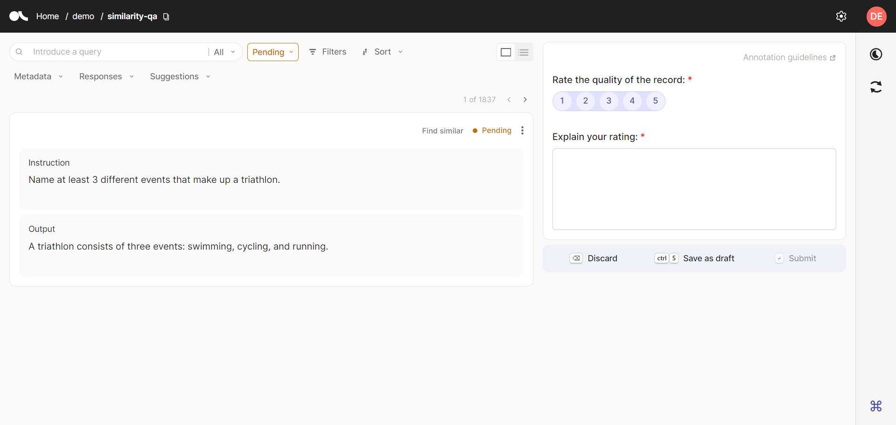

# Annotate records

This guide provides a detailed overview of how to annotate records in the UI, with separate workflows for each use case.

To improve clarity, we will reference three main areas in the UI: the *preferences view* on the top left, the *record view* below in a white box, and the *annotation view* on the right.

!!! tip
    To experience the UI features firsthand, you can access the Demo UI by clicking [here](https://demo.argilla.io/sign-in?auth=ZGVtbzoxMjM0NTY3OA==).

## Annotate linearly

!!! info "Main use cases"
    * You are handling one or a few questions.
    * You are conducting exploratory work on the records.
    * You are getting familiar with the data.

### Focus view

As you open a dataset in the UI, you will see a *single-record view* by default, i.e. a **focus view**.

In the record view, on the left, you can find the record to annotate. Each field of the record is headed with a title and displayed in a separate box. On the top right, the status of the record is indicated, i.e. `Pending`, `Draft`, `Submitted` or `Discarded`. The pending records will be the first to be displayed by default.

In the annotation view, on the right, you can find the questions to annotate. Each question is headed with a title and will be marked with a red asterisk (*) if it is required, i.e, you will not be able to submit the response until you provide a response. Next to it, you can find the information icon `i`, which will show you a detailed description of the question when provided.

Some questions may include a suggested response marked with ✨. You will see it as a pre-filled response. If you agree with it and do not make any modification, there is nothing you need to do and the suggestion will be saved as your response once submitted. In case the suggestion is not right, you will need to make the necessary modifications.

??? info "Consult how to annotate each question type"

    * **Label**: Select a single label from a collection of labels.
    * **Multi-label**: Select all applicable labels from a selection of labels.
    * **Ranking**: Order a collection of values. Note that you will need to order all the values to complete the response to this question, which means no value can be left unassigned. Ties are allowed.
    * **Rating**: Select a single value from a list of values.
    * **Span**: Select pieces of text in the field linked to the span question and apply a label.
    * **Text**: Provide a text response inside the text area.

At the bottom of the annotation view, you can find the `Discard`, `Save as draft` and `Submit` buttons. The `Discard` button will discard the record if you decide not to provide any response. `Save as draft` will allow you to save your responses for review before submission. Finally, the `Submit` button will submit your responses for the given record, but it will be disabled until you provide responses for all required questions.

### Navigation buttons

To navigate through the records, you can use the `Prev`, shown as `<`, and `Next`, `>` buttons in the bottom right corner of the preferences view.

### Shortcuts use

If you are looking to speed up your annotation process, you can use keyboard shortcuts. They will help you to move between questions, select labels, and navigate through the annotation view. It can be particularly useful when you have a long list of labels or a single question form.

??? info "Consult the available shortcuts"

    | Action                                 | Keys                              |
    | -------------------------------------- | --------------------------------- |
    | Activate form                          | `⇥ Tab`                           |
    | Move between questions                 | `↓ Down arrow` or `↑ Up arrow`    |
    | Select and unselect label              | `1`, `2`, `3`                     |
    | Move between labels or ranking options | `⇥ Tab` or `⇧ Shift` `⇥ Tab`      |
    | Select rating and rank                 | `1`, `2`, `3`                     |
    | Fit span to character selection        | Hold `⇧ Shift`                    |
    | Activate text area                     | `⇧ Shift` `↵ Enter`               |
    | Exit text area                         | `Esc`                             |
    | Discard                                | `⌫ Backspace`                     |
    | Save draft (Mac os)                    | `⌘ Cmd` `S`                       |
    | Save draft (Other)                     | `Ctrl` `S`                        |
    | Submit                                 | `↵ Enter`                         |
    | Move between pages                     | `→ Right arrow` or `← Left arrow` |

## Annotate in bulk

!!! info "Main use cases"
    * You have a good understanding of your data and a clear idea of the patterns to expect.
    * You are doing basic text classification.

!!! note
    The *bulk view* is not available for **span questions**. You will need to switch to the *focus view* for their annotation. In that case, we recommend you to annotate the rest of the questions in bulk, save them as drafts and answer the span questions in the *focus view* of the *Draft* queue.

As you open a dataset in the UI, you will see a *focus view* by default. To switch to the **bulk view**, you will need to click the `Bulk view` button on the top right of the preferences view. It is only available for the `Pending` queue.

Now, in the record view, on the left, you can find a list of multiple records to annotate. Each record is displayed in a different white box with its corresponding fields, headed with a title, and the status on the top right.

In the annotation view, on the right, you can find the questions to annotate. The annotation view in the bulk view is similar to the focus view. Each question has a title and the description (`i` icon), if available, and you will need to answer all the required questions marked with * to be able to submit the responses. However, suggestions are not available in the bulk view, so you will have to switch to the focus view if you need them.

At the bottom of the annotation view, you can find the `Discard`, `Save as draft` and `Submit` buttons that will be enabled when at least one record is selected and, in the case of `Submit`, when all the required questions are annotated. To select specific records, you can click on the checkbox on the top left of each record. To select all records, you can click the checkbox in the bottom left of the preferences view. When discarded/saved as draft/submitted, **all the selected records** will change their status, so you can continue annotating the rest of the records.

!!! Tip
    Some specific situations in which you may want to use the bulk view are:

    * Applying the same label to the results of a similarity search.
    * Discarding all records in a specific language or that do not match a certain pattern or guidelines.
    * Saving/submitting records with a suggestion score over a safe threshold.

### Custom record view

The bulk view also allows you to customize the record view, which can be particularly useful when your records are long.

=== "Collapse records"

    You can collapse the records to focus on the fields you are annotating. To do so, you can click on the `Record size` button at the bottom right of the preferences view. A dropdown will appear with the options `Expand records` and `Collapse records`.

=== "Manage the number of records by page"

    You can manage the number of records displayed by page. To do so, you can click on the `Page size` button at the bottom right of the preferences view. A dropdown will appear with the options `10`, `25`, `50` and `100`.

## Understand patterns in your data

!!! info "Main use cases"
    * You have a large volume of data to annotate.
    * You need to perform extensive cleaning.
    * You have numerous and/or long fields.
    * You are familiar with your data.

The UI provides different features to help you understand patterns in your data and manage the annotation task more efficiently.

### Search and highlight

You can search for records with specific words in their field content. For this, you should click on the magnifying glass icon in the top right of the preferences view. A search bar will appear where you can type the word or words you are looking for. If your records have multiple fields, you will be able to select a specific field for the search or select `All` to search on all the fields. Pressing `Enter` will show the records that contain these words, highlighted in coral, in the selected fields.

### Order by similar record

> Consult these guides, to know how to add vectors to your [dataset](dataset.md) and [records](record.md).

You can retrieve records based on their similarity with another record if vectors have been added to the dataset, which is quite useful for the *bulk view*. If available, go to the record you would like to use for the semantic search and click on the `Find similar` button at the top right of the record view. If there is more than one vector, you will be asked to select which vector to use or whether you want the most or least similar records.

Once you have selected the vector, you will see the records ordered by similarity. The similarity score will be displayed next to the `Find similar` button. In addition, a new bar above will allow you to update the selected vector or similarity order, and choose the number of results you would like to see. On the right of the bar, you will find a button to expand or collapse the record that was used for the search as a reference.

To undo the search, you can click on the cross next to the reference record.

### View by status

You can view the records according to their status. For this, you can click on the status selector in the top left of the preferences view. A dropdown will appear with the options `Pending`, `Draft`, `Submitted` and `Discarded`.

??? info "Consult the available status"

    * **Pending**: The records with this status have no responses.
    * **Draft**: The records with this status have responses that have been saved as a draft, not yet submitted or discarded.
    * **Discarded**: The records with this status may or may not have responses but have been discarded by the annotator.
    * **Submitted**: The records with this status have responses already submitted by the annotator.

### Filter by metadata, responses and suggestions

When you have metadata, responses and suggestions, you can filter the records by these attributes, in that case, the `Filters` button will be enabled next to the status selector. Clicking on it will open a dropdown with the available filters. You can select multiple filters and combine them to get the records you need. To remove a filter, you can click on the `x` next to the filter.

=== "By metadata"

    You can filter the records by the metadata properties defined in your dataset. Select the `Metadata` dropdown, write the name of the metadata property, if needed, and select it from the list. The integer and float metadata will allow you to set a range of values and the term metadata will allow you to select the values you want to filter on.

=== "By responses"

    You can filter the records by the responses given *by the current user*. Select the `Responses` dropdown, write the name of the question, if needed, and select it from the list. The rating questions will allow you to set a range of values and the label, multi-label and span questions will allow you to select the values you want to filter on. The text and ranking questions are not available for filtering.

=== "By suggestions"

    You can filter the records by the suggestions to the questions. Select the `Suggestions` dropdown, write the name of the question, if needed, and select it from the list. Then, select one of `Suggestion values`, `Score` or `Agent` when available. To filter using the suggested values, the rating questions will allow you to set a range of values and the label, multi-label and span questions will allow you to select the values you want to filter on. The text and ranking questions are not available for filtering. To filter by the score, you can set a range of values. To filter by the agent, you can select the agent you want to filter on.

### Sort

You can sort your records according to one or several attributes. To do so, you can click on the `Sort` button in the top left of the preferences view. A dropdown will appear with the available attributes to sort by. The time of insertion and last update are available for all the records. The suggestion scores, response and suggestion values for rating questions and metadata properties are available only when they were provided. To add a new attribute to sort by, you can click on the `Add another field` button. To remove an attribute, you can click on the `x` next to the attribute.

## Annotate in team

!!! info "Main use cases"
    Multiple users on the same dataset need to be specially aligned on the task.

!!! note
    The 2.1 version of argilla will come with task distribution, which will allow you to assign records to specific users easily.

### Access the annotation guidelines

Before starting the annotation, we highly recommend consulting the annotation guidelines when available. If they have been specified, you can find them by clicking the `Annotation guidelines` button on the top right of the annotation view.

### Edit guidelines in the settings

You can edit the guidelines if you are `owner` or `admin` of the dataset. For that, you can click on the `Dataset settings` button on the the right of the top black bar. You will just need to write them or update them and save the changes.

!!! tip
    If you want further guidance on good practices for guidelines during the project development, check our [blog post](https://argilla.io/blog/annotation-guidelines-practices/).

## See the progress

!!! info "Main use cases"
    You want to see the progress of the annotation task.

### General progress view

On the main page, before accessing the dataset, you can see the general progress of the annotation task. This is indicated in the `Global progress` column that shows the number of remaining records to be annotated and a progress bar. The progress bar displays the percentage and number of records submitted, conflicting (i.e. those with overlap), discarded and pending by hovering your mouse over it.

### Individual progress view

You can track your progress and the distribution of `Pending`, `Draft`, `Submitted` and `Discarded` responses by clicking the `Progress` icon in the sidebar.
