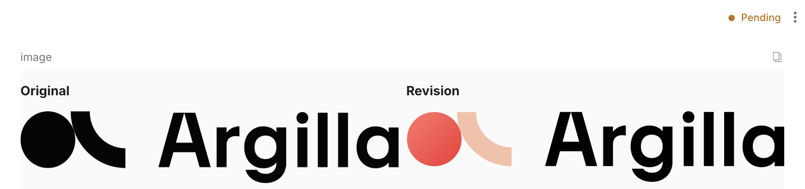

# Custom fields with layout templates

This guide demonstrates how to create custom fields in Argilla using HTML, CSS, and JavaScript templates.

!!! info "Main Class"

    ```python
    rg.CustomField(
        name="custom",
        title="Custom",
        template="<div>{{record.fields.custom.key}}</div>",
        advanced_mode=False,
        required=True,
        description="Field description",
    )
    ```

    > Check the [CustomField - Python Reference](../reference/argilla/settings/fields.md#src.argilla.settings._field.CustomField) to see the attributes, arguments, and methods of the `CustomField` class in detail.

## Understanding the Record Object

The `record` object is the main object that contains all the information about the Argilla `record` object in the UI, like `fields`, `metadata`, etc. Your template can use this object to display record information within the custom field. You can for example access the fields of the record by navigating to `{{record.fields.<field_name>}}` and this generally works the same for `metadata`, `responses`, etc.

## Using Handlebars in your template

By default, custom fields will use the [handlebars syntax engine](https://handlebarsjs.com/) to render templates with `record` information. This engine will convert the content inside the brackets `{{}}` to the values of record's field's object that you reference within your template. As described in the [Accessing record information](#accessing-record-information) section, you can access the fields of the record by navigating to `{{record.fields.<field_name>}}`. For more complex use cases, handlebars has various [expressions, partials, and helpers](https://handlebarsjs.com/guide/) that you can use to render your data. You can deactivate the `handlebars` engine with the `advanced_mode=False` parameter in `CustomField`, then you will need to define custom javascript to access the record attributes, like described in the [Advanced Mode](#advanced-mode) section.

### Usage example

Because of the handlebars syntax engine, we only need to pass the HTML and potentially some CSS in between the `<style>` tags.

```python
css_template = """
<style>
#container {
    display: flex;
    gap: 10px;
}
.column {
    flex: 1;
}
</style>
""" # (1)

html_template = """
<div id="container">
    <div class="column">
        <h3>Original</h3>
        
    </div>
    <div class="column">
        <h3>Revision</h3>
        
    </div>
</div>
""" # (2)
```

1. This is a CSS template, which ensures that the container and columns are styled.
2. This is an HTML template, which creates a `container` with two columns and injects the value corresponding to the `key` of the `image` field into it.

We can now pass these templates to the `CustomField` class.

```python
import argilla as rg

custom_field = rg.CustomField(
    name="image",
    template=css_template + html_template,
)

settings = rg.Settings(
    fields=[custom_field],
    questions=[rg.TextQuestion(name="response")],
)

dataset = rg.Dataset(
    name="custom_field_dataset",
    settings=settings,
).create()

dataset.records.log([
    rg.Record(
        fields={
            "image": {
                "original": "https://argilla.io/brand-assets/argilla/argilla-logo-color-black.png",
                "revision": "https://argilla.io/brand-assets/argilla/argilla-logo-black.png",
            }
        }
    )]
)
```

The result will be the following:



### Example Gallery

??? "Metadata in a table"

    You can make it easier to read metadata by displaying it in a table. This uses handlebars to iterate over the metadata object and display each key-value pair in a row.

    ```python
    template = """
    <style>
        .container {
            border: 1px solid #ddd;
            font-family: sans-serif;
        }
        .row {
            display: flex;
            border-bottom: 1px solid #ddd;
        }
        .row:last-child {
            border-bottom: none;
        }
        .column {
            flex: 1;
            padding: 8px;
        }
        .column:first-child {
            border-right: 1px solid #ddd;
        }
    </style>
    <div class="container">
        <div class="header">
            <div class="column">Metadata</div>
            <div class="column">Value</div>
        </div>
        {{#each record.metadata}}
        <div class="row">
            <div class="column">{{@key}}</div>
            <div class="column">{{this}}</div>
        </div>
        {{/each}}
    </div>
    """
    record = rg.Record(
        fields={"text": "hello"},
        metadata={
            "name": "John Doe",
            "age": 25,
        }
    )
    ```
    

??? "JSON viewer"

    If you want to display a JSON object, you can use the `json` helper to convert the object to a string.

    ```python
    template = "{{ json record.fields.user_profile }}"

    record = rg.Record(
        fields={
            "user_profile": {
                "name": "John Doe",
                "age": 30,
                "address": "123 Main St",
                "email": "john.doe@hooli.com",
            }
        },
    )
    ```

## Advanced Mode

When `advanced_mode=True`, you can use the `template` argument to pass a full HTML page. This allows for more complex customizations, including the use of JavaScript. The record object will be available in the global scope, so you can access it in your JavaScript code as described in the [Record Object](#understanding-the-record-object) section.

### Usage example

Let's reproduce example from the [Without advanced mode](#without-advanced-mode) section but this time we will insert the [handlebars syntax engine](https://handlebarsjs.com/) ourselves.

```python
render_template = """
<script id="template" type="text/x-handlebars-template">
    <style>
        .div {{
            font-weight: bold;
        }}
    </style>
    <div class="div">{{record.fields.custom.key}}</div>
</script>
""" # (1)

script = """
<script src="https://cdn.jsdelivr.net/npm/handlebars@latest/dist/handlebars.min.js"></script>
<script>
    const template = document.getElementById('template').innerHTML;
    const compiled_template = Handlebars.compile(template);
    const rendered = compiled_template({ record: record_object });
    document.body.innerHTML = html;
</script>
""" # (2)
```

1. This is a JavaScript template script. We set `id` to `template` to use it later in our JavaScript code and `type` to `text/x-handlebars-template` to indicate that this is a Handlebars template.
2. This is a JavaScript template script. We load the Handlebars library and then use it to compile the template and render the record.

We can now pass these templates to the `CustomField` class, ensuring that the `advanced_mode` is set to `True`.

```python
import argilla as rg

custom_field = rg.CustomField(
    name="custom",
    template=render_template + script,
    advanced_mode=True
)
```

### Example Gallery

??? "3D object viewer"

    ```python
    import argilla as rg
    ```

