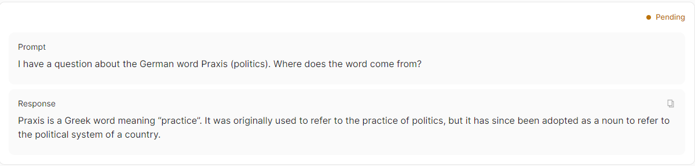
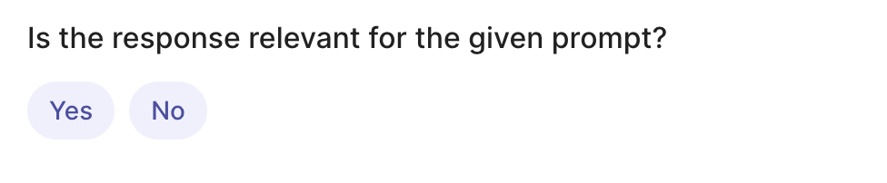
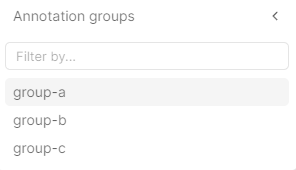
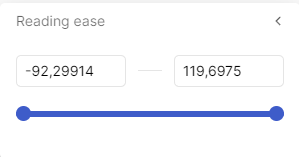
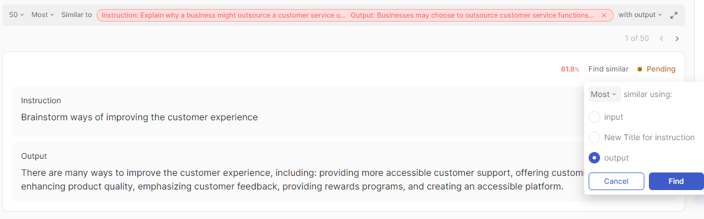

# Dataset management

This guide provides an overview of datasets, explaining the basics of how to set them up and manage them in Argilla.

A **dataset** is a collection of records that you can configure for labelers to provide feedback using the UI. Depending on the specific requirements of your task, you may need various types of feedback. You can customize the dataset to include different kinds of questions, so the first step will be to define the aim of your project and the kind of data and feedback you will need. With this information, you can start configuring a dataset by defining fields, questions, metadata, vectors, and guidelines through settings.

??? Question "Question: Who can manage datasets?"

    Only users with the `owner` role can manage (create, retrieve, update and delete) all the datasets.

    The users with the `admin` role can manage (create, retrieve, update and delete) the datasets in the workspaces they have access to.

!!! info "Main Classes"
    === "`rg.Dataset`"

        ```python
        rg.Dataset(
            name="name",
            workspace="workspace",
            settings=settings,
            client=client
        )
        ```
        > Check the [Dataset - Python Reference](../reference/argilla/datasets/datasets.md) to see the attributes, arguments, and methods of the `Dataset` class in detail.

    === "`rg.Settings`"

        ```python
        rg.Settings(
            fields=[rg.TextField(name="text")],
            questions=[
                rg.LabelQuestion(
                    name="label",
                    labels=["label_1", "label_2", "label_3"]
                )
            ],
            metadata=[rg.TermsMetadataProperty(name="metadata")],
            vectors=[rg.VectorField(name="vector", dimensions=10)],
            guidelines="guidelines",
            allow_extra_metadata=True,
            distribution=rg.TaskDistribution(min_submitted=2),
        )
        ```

        > Check the [Settings - Python Reference](../reference/argilla/settings/settings.md) to see the attributes, arguments, and methods of the `Settings` class in detail.

## Create a dataset

To create a dataset, you can define it in the `Dataset` class and then call the `create` method that will send the dataset to the server so that it can be visualized in the UI. If the dataset does not appear in the UI, you may need to click the refresh button to update the view. For further configuration of the dataset, you can refer to the [settings section](#define-dataset-settings).

!!! info
    If you have deployed Argilla with Hugging Face Spaces and HF Sign in, you can use `argilla` as a workspace name. Otherwise, you might need to create a workspace following [this guide](workspace.md#create-a-new-workspace).

```python
import argilla as rg

client = rg.Argilla(api_url="<api_url>", api_key="<api_key>")

settings = rg.Settings(
    guidelines="These are some guidelines.",
    fields=[
        rg.TextField(
            name="text",
        ),
    ],
    questions=[
        rg.LabelQuestion(
            name="label",
            labels=["label_1", "label_2", "label_3"]
        ),
    ],
)

dataset = rg.Dataset(
    name="my_dataset",
    workspace="my_workspace",
    settings=settings,
)

dataset.create()
```
> The created dataset will be empty, to add records go to this [how-to guide](record.md).

!!! tip "Accessing attributes"
    Access the attributes of a dataset by calling them directly on the `dataset` object. For example, `dataset.id`, `dataset.name` or `dataset.settings`. You can similarly access the fields, questions, metadata, vectors and guidelines. For instance, `dataset.fields` or `dataset.questions`.

### Create multiple datasets with the same settings

To create multiple datasets with the same settings, define the settings once and pass it to each dataset.

```python
import argilla as rg

client = rg.Argilla(api_url="<api_url>", api_key="<api_key>")

settings = rg.Settings(
    guidelines="These are some guidelines.",
    fields=[rg.TextField(name="text", use_markdown=True)],
    questions=[
        rg.LabelQuestion(name="label", labels=["label_1", "label_2", "label_3"])
    ],
    distribution=rg.TaskDistribution(min_submitted=3),
)

dataset1 = rg.Dataset(name="my_dataset_1", settings=settings)
dataset2 = rg.Dataset(name="my_dataset_2", settings=settings)

# Create the datasets on the server
dataset1.create()
dataset2.create()
```

### Create a dataset from an existing dataset

To create a new dataset from an existing dataset, get the settings from the existing dataset and pass them to the new dataset.

```python
import argilla as rg

client = rg.Argilla(api_url="<api_url>", api_key="<api_key>")

existing_dataset = client.datasets("my_dataset")

new_dataset = rg.Dataset(name="my_dataset_copy", settings=existing_dataset.settings)

new_dataset.create()
```

!!! info
    You can also copy the records from the original dataset to the new one:

    ```python
    records = list(existing_dataset.records)
    new_dataset.records.log(records)
    ```

## Define dataset settings

!!! tip
    Instead of defining your own custom settings, you can use some of our pre-built templates for text classification, ranking and rating. Learn more [here](../reference/argilla/settings/settings.md#creating-settings-using-built-in-templates).

### Fields

The fields in a dataset consist of one or more data items requiring annotation. Currently, Argilla supports plain text and markdown through the `TextField`, images through the `ImageField`, chat formatted data through the `ChatField` and full custom templates through our `CustomField`.

!!! note
    The order of the fields in the UI follows the order in which these are added to the fields attribute in the Python SDK.

> Check the [Field - Python Reference](../reference/argilla/settings/fields.md) to see the field classes in detail.

=== "Text"

    ```python
    rg.TextField(
        name="text",
        title="Text",
        use_markdown=False,
        required=True,
        description="Field description",
    )
    ```
    

=== "Image"

    ```python
    rg.ImageField(
        name="image",
        title="Image",
        required=True,
        description="Field description",
    )
    ```
    

=== "Chat"

    ```python
    rg.ChatField(
        name="chat",
        title="Chat",
        use_markdown=True,
        required=True,
        description="Field description",
    )
    ```
    

=== "Custom"
    A `CustomField` allows you to use a custom template for the field. This is useful if you want to use a custom UI for the field. You can use the `template` argument to pass a string that will be rendered as the field's UI.

    By default, `advanced_mode=False`, which will use a brackets syntax engine for the templates. This engine converts `{{record.fields.field.key}}` to the values of record's field's object. You can also use `advanced_mode=True`, which deactivates the above brackets syntax engine and allows you to add custom javascript to your template to render the field.

    ```python
    rg.CustomField(
        name="custom",
        title="Custom",
        template="<div>{{record.fields.custom.key}}</div>",
        advanced_mode=False,
        required=True,
        description="Field description",
    )
    ```

    !!! tip
        To learn more about how to create custom fields with HTML and CSS templates, check this [how-to guide](custom_fields.md).

### Questions

To collect feedback for your dataset, you need to formulate questions that annotators will be asked to answer.

> Check the [Questions - Python Reference](../reference/argilla/settings/questions.md) to see the question classes in detail.

=== "Label"
    A `LabelQuestion` asks annotators to choose a unique label from a list of options. This type is useful for text classification tasks. In the UI, they will have a rounded shape.

    ```python
    rg.LabelQuestion(
        name="label",
        labels={"YES": "Yes", "NO": "No"}, # or ["YES", "NO"]
        title="Is the response relevant for the given prompt?",
        description="Select the one that applies.",
        required=True,
        visible_labels=10
    )
    ```
    

=== "Multi-label"
    A `MultiLabelQuestion` asks annotators to choose all applicable labels from a list of options. This type is useful for multi-label text classification tasks. In the UI, they will have a squared shape.

    ```python
    rg.MultiLabelQuestion(
        name="multi_label",
        labels={
            "hate": "Hate Speech",
            "sexual": "Sexual content",
            "violent": "Violent content",
            "pii": "Personal information",
            "untruthful": "Untruthful info",
            "not_english": "Not English",
            "inappropriate": "Inappropriate content"
        }, # or ["hate", "sexual", "violent", "pii", "untruthful", "not_english", "inappropriate"]
        title="Does the response include any of the following?",
        description="Select all that apply.",
        required=True,
        visible_labels=10,
        labels_order="natural"
    )
    ```
    

=== "Ranking"
    A `RankingQuestion` asks annotators to order a list of options. It is useful to gather information on the preference or relevance of a set of options.

    ```python
    rg.RankingQuestion(
        name="ranking",
        values={
            "reply-1": "Reply 1",
            "reply-2": "Reply 2",
            "reply-3": "Reply 3"
        } # or ["reply-1", "reply-2", "reply-3"]
        title="Order replies based on your preference",
        description="1 = best, 3 = worst. Ties are allowed.",
        required=True,
    )
    ```

    

=== "Rating"
    A `RatingQuestion` asks annotators to select one option from a list of integer values. This type is useful for collecting numerical scores.

    ```python
    rg.RatingQuestion(
        name="rating",
        values=[0, 1, 2, 3, 4, 5, 6, 7, 8, 9, 10]
        title="How satisfied are you with the response?",
        description="1 = very unsatisfied, 10 = very satisfied",
        required=True,
    )
    ```

    

=== "Span"
    A `SpanQuestion` asks annotators to select a portion of the text of a specific field and apply a label to it. This type of question is useful for named entity recognition or information extraction tasks.

    ```python
    rg.SpanQuestion(
        name="span",
        field="text",
        labels={
            "PERSON": "Person",
            "ORG": "Organization",
            "LOC": "Location",
            "MISC": "Miscellaneous"
        }, # or ["PERSON", "ORG", "LOC", "MISC"]
        title="Select the entities in the text",
        description="Select the entities in the text",
        required=True,
        allow_overlapping=False,
        visible_labels=10
    )
    ```

    

=== "Text"
    A `TextQuestion` offers to annotators a free-text area where they can enter any text. This type is useful for collecting natural language data, such as corrections or explanations.

    ```python
    rg.TextQuestion(
        name="text",
        title="Please provide feedback on the response",
        description="Please provide feedback on the response",
        required=True,
        use_markdown=True
    )
    ```

    

### Metadata

Metadata properties allow you to configure the use of metadata information for the filtering and sorting features available in the UI and Python SDK.

> Check the [Metadata - Python Reference](../reference/argilla/settings/metadata_property.md) to see the metadata classes in detail.

=== "Terms"
    A `TermsMetadataProperty` allows to add a list of strings as metadata options.

    ```python
    rg.TermsMetadataProperty(
        name="terms",
        options=["group-a", "group-b", "group-c"]
        title="Annotation groups",
        visible_for_annotators=True,
    )
    ```
    

=== "Integer"
    An `IntegerMetadataProperty` allows to add integer values as metadata.

    ```python
    rg.IntegerMetadataProperty(
        name="integer",
        title="length-input",
        min=42,
        max=1984,
    )
    ```
    

=== "Float"
    A `FloatMetadataProperty` allows to add float values as metadata.

    ```python
    rg.FloatMetadataProperty(
        name="float",
        title="Reading ease",
        min=-92.29914,
        max=119.6975,
    )
    ```
    

!!! note
    You can also set the `allow_extra_metadata` argument in the dataset to `True` to specify whether the dataset will allow metadata fields in the records other than those specified under metadata. Note that these will not be accessible from the UI for any user, only retrievable using the Python SDK.

### Vectors

To use the similarity search in the UI and the Python SDK, you will need to configure vectors using the `VectorField` class.

> Check the [Vector - Python Reference](../reference/argilla/settings/vectors.md) to see the `VectorField` class in detail.

```python
rg.VectorField(
    name="my_vector",
    title="My Vector",
    dimensions=768
)
```


### Guidelines

Once you have decided on the data to show and the questions to ask, it's important to provide clear guidelines to the annotators. These guidelines help them understand the task and answer the questions consistently. You can provide guidelines in two ways:

* In the dataset guidelines: this is added as an argument when you create your dataset in the Python SDK. They will appear in the annotation interface.

```python
guidelines = "In this dataset, you will find a collection of records that show a category, an instruction, a context and a response to that instruction. [...]"
```


* As question descriptions: these are added as an argument when you create questions in the Python SDK. This text will appear in a tooltip next to the question in the UI.


It is good practice to use at least the dataset guidelines if not both methods. Question descriptions should be short and provide context to a specific question. They can be a summary of the guidelines to that question, but often that is not sufficient to align the whole annotation team. In the guidelines, you can include a description of the project, details on how to answer each question with examples, instructions on when to discard a record, etc.

!!! tip
    If you want further guidance on good practices for guidelines during the project development, check our [blog post](https://argilla.io/blog/annotation-guidelines-practices/).

### Distribution

When working as a team, you may want to distribute the annotation task to ensure efficiency and quality. You can use the `TaskDistribution` settings to configure the number of minimum submitted responses expected for each record. Argilla will use this setting to automatically handle records in your team members' pending queues.

> Check the [Task Distribution - Python Reference](../reference/argilla/settings/task_distribution.md) to see the `TaskDistribution` class in detail.

```python
rg.TaskDistribution(
    min_submitted = 2
)
```

> To learn more about how to distribute the task among team members in the [Distribute the annotation guide](../how_to_guides/distribution.md).


## List datasets

You can list all the datasets available in a workspace using the `datasets` attribute of the `Workspace` class. You can also use `len(workspace.datasets)` to get the number of datasets in a workspace.

```python
import argilla as rg

client = rg.Argilla(api_url="<api_url>", api_key="<api_key>")

workspace = client.workspaces("my_workspace")

datasets = workspace.datasets

for dataset in datasets:
    print(dataset)
```

When you list datasets, dataset settings are not preloaded, since this can introduce extra requests to the server. If you want to work with settings when listing datasets, you need to load them:

```python
import argilla as rg

client = rg.Argilla(api_url="<api_url>", api_key="<api_key>")

for dataset in client.datasets:
    dataset.settings.get() # this will get the dataset settings from the server
    print(dataset.settings)
```

!!! tip "Notebooks"
    When using a notebook, executing `client.datasets` will display a table with the `name`of the existing datasets, the `id`, `workspace_id` to which they belong, and the last update as `updated_at`. .

## Retrieve a dataset

You can retrieve a dataset by calling the `datasets` method on the `Argilla` class and passing the `name` or `id` of the dataset as an argument. If the dataset does not exist, a warning message will be raised and `None` will be returned.

=== "By name"

    By default, this method attempts to retrieve the dataset from the first workspace. If the dataset is in a different workspace, you must specify either the workspace or workspace name as an argument.

    ```python
    import argilla as rg

    client = rg.Argilla(api_url="<api_url>", api_key="<api_key>")

    # Retrieve the dataset from the first workspace
    retrieved_dataset = client.datasets(name="my_dataset")

    # Retrieve the dataset from the specified workspace
    retrieved_dataset = client.datasets(name="my_dataset", workspace="my_workspace")
    ```

=== "By id"

    ```python
    import argilla as rg

    client = rg.Argilla(api_url="<api_url>", api_key="<api_key>")

    dataset = client.datasets(id="<uuid-or-uuid-string>")
    ```

## Check dataset existence

You can check if a dataset exists. The `client.datasets` method will return `None` if the dataset was not found.

```python
import argilla as rg

client = rg.Argilla(api_url="<api_url>", api_key="<api_key>")

dataset = client.datasets(name="my_dataset")

if dataset is not None:
    pass
```

## Update a dataset

Once a dataset is published, there are limited things you can update. Here is a summary of the attributes you can change for each setting:

=== "Fields"
    | Attributes | From SDK | From UI |
    | ---------- | -------- | ------- |
    |Name        |❌        |❌        |
    |Title       |✅        |✅        |
    |Required    |❌        |❌        |
    |Use markdown|✅        |✅        |
    |Template    |✅        |❌        |

=== "Questions"
    | Attributes      | From SDK | From UI |
    | --------------- | -------- | ------- |
    |Name             |❌        |❌        |
    |Title            |❌        |✅        |
    |Description      |❌        |✅        |
    |Required         |❌        |❌        |
    |Labels           |❌        |❌        |
    |Values           |❌        |❌        |
    |Label order      |❌        |✅        |
    |Suggestions first|❌        |✅        |
    |Visible labels   |❌        |✅        |
    |Field            |❌        |❌        |
    |Allow overlapping|❌        |❌        |
    |Use markdown     |❌        |✅        |

=== "Metadata"
    | Attributes           | From SDK | From UI |
    | -------------------- | -------- | ------- |
    |Name                  |❌        |❌        |
    |Title                 |✅        |✅        |
    |Options               |❌        |❌        |
    |Minimum value         |❌        |❌        |
    |Maximum value         |❌        |❌        |
    |Visible for annotators|✅        |✅        |
    |Allow extra metadata  |✅        |✅        |


=== "Vectors"
    | Attributes | From SDK | From UI |
    | ---------- | -------- | ------- |
    |Name        |❌        |❌        |
    |Title       |✅        |✅        |
    |Dimensions  |❌        |❌        |

=== "Guidelines"
    | From SDK | From UI |
    | -------- | ------- |
    |✅        |✅        |

=== "Distribution"
    | Attributes      | From SDK | From UI |
    | --------------- | -------- | ------- |
    |Minimum submitted|✅        |✅        |


To modify these attributes, you can simply set the new value of the attributes you wish to change and call the `update` method on the `Dataset` object.

```python
import argilla as rg

client = rg.Argilla(api_url="<api_url>", api_key="<api_key>")

dataset = client.datasets("my_dataset")

dataset.settings.fields["text"].use_markdown = True
dataset.settings.metadata["my_metadata"].visible_for_annotators = False

dataset.update()
```

You can also **add and delete metadata properties and vector fields** using the `add` and `delete` methods.

=== "Add"

    ```python
    import argilla as rg

    client = rg.Argilla(api_url="<api_url>", api_key="<api_key>")

    dataset = client.datasets("my_dataset")

    dataset.settings.vectors.add(rg.VectorField(name="my_new_vector", dimensions=123))
    dataset.settings.metadata.add(
        rg.TermsMetadataProperty(
            name="my_new_metadata",
            options=["option_1", "option_2", "option_3"],
        ),
    )
    dataset.update()
    ```

=== "Delete"

    ```python
    import argilla as rg

    client = rg.Argilla(api_url="<api_url>", api_key="<api_key>")

    dataset = client.datasets("my_dataset")

    dataset.settings.vectors["my_old_vector"].delete()
    dataset.settings.metadata["my_old_metadata"].delete()

    dataset.update()
    ```

## Delete a dataset

You can delete an existing dataset by calling the `delete` method on the `Dataset` class.

```python
import argilla as rg

client = rg.Argilla(api_url="<api_url>", api_key="<api_key>")

dataset_to_delete = client.datasets(name="my_dataset")

dataset_deleted = dataset_to_delete.delete()
```
