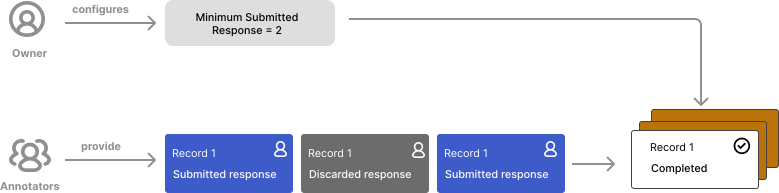

# Distribute the annotation task among the team

This guide explains how you can use Argilla’s **automatic task distribution** to efficiently divide the task of annotating a dataset among multiple team members.

Owners and admins can define the minimum number of submitted responses expected for each record. Argilla will use this setting to handle automatically the records that will be shown in the pending queues of all users with access to the dataset.

When a record has met the minimum number of submissions, the status of the record will change to `completed`, and the record will be removed from the `Pending` queue of all team members so they can focus on providing responses where they are most needed. The dataset’s annotation task will be fully completed once all records have the `completed` status.



!!! note
    The status of a record can be either `completed`, when it has the required number of responses with `submitted` status, or `pending`, when it doesn’t meet this requirement.

    Each record can have multiple responses, and each of those can have the status `submitted`, `discarded`, or `draft.`

!!! info "Main Class"

    ```python
    rg.TaskDistribution(
        min_submitted = 2
    )
    ```
    > Check the [Task Distribution - Python Reference](../reference/argilla/settings/task_distribution.md) to see the attributes, arguments, and methods of the `TaskDistribution` class in detail.

## Configure task distribution settings

By default, Argilla will set the required minimum submitted responses to 1. This means that whenever a record has at least 1 response with the status `submitted` the status of the record will be `completed` and removed from the `Pending` queue of other team members.

!!! tip
    Leave the default value of minimum submissions (1) if you are working on your own or when you don't require more than one submitted response per record.

If you wish to set a different number, you can do so through the `distribution` setting in your dataset settings:

```python
settings = rg.Settings(
    guidelines="These are some guidelines.",
    fields=[
        rg.TextField(
            name="text",
        ),
    ],
    questions=[
        rg.LabelQuestion(
            name="label",
            labels=["label_1", "label_2", "label_3"]
        ),
    ],
    distribution=rg.TaskDistribution(min_submitted=3)
)
```

> Learn more about configuring dataset settings in the [Dataset management guide](../how_to_guides/dataset.md).

!!! tip
    Increase the number of minimum subsmissions if you’d like to ensure you get more than one submitted response per record. Make sure that this number is never higher than the number of members in your team. Note that the lower this number is, the faster the task will be completed.

!!! note
    Note that some records may have more responses than expected if multiple team members submit responses on the same record simultaneously.

## Change task distribution settings

If you wish to change the minimum submitted responses required in a dataset, you can do so as long as the annotation hasn’t started, i.e., the dataset has no responses for any records.

Admins and owners can change this value from the dataset settings page in the UI or from the SDK:

```python
import argilla as rg

client = rg.Argilla(api_url="<api_url>", api_key="<api_key>")

dataset = client.datasets("my_dataset")

dataset.settings.distribution.min_submitted = 4

dataset.update()
```

## Track your team's progress

You can check the progress of the annotation task by using the `dataset.progress` method.
This method will return the number of records that have the status `completed`, `pending`, and the
total number of records in the dataset.

```python
import argilla as rg

client = rg.Argilla(api_url="<api_url>", api_key="<api_key>")

dataset = client.datasets("my_dataset")

progress = dataset.progress()
```
```json
{
    "total": 100,
    "completed": 10,
    "pending": 90
}
```

You can see also include to the progress the users distribution by setting the `with_users_distribution` parameter to `True`.
This will return the number of records that have the status `completed`, `pending`, and the total number of records in the dataset,
as well as the number of completed submissions per user. You can visit the [Annotation Progress](../how_to_guides/annotate.md#annotation-progress) section for more information.

```python
import argilla as rg

client = rg.Argilla(api_url="<api_url>", api_key="<api_key>")

dataset = client.datasets("my_dataset")

progress = dataset.progress(with_users_distribution=True)
```
```json
{
    "total": 100,
    "completed": 50,
    "pending": 50,
    "users": {
        "user1": {
           "completed": { "submitted": 10, "draft": 5, "discarded": 5},
           "pending": { "submitted": 5, "draft": 10, "discarded": 10},
        },
        "user2": {
           "completed": { "submitted": 20, "draft": 10, "discarded": 5},
           "pending": { "submitted": 2, "draft": 25, "discarded": 0},
        },
        ...
}
```

!!! note
    Since the completed records can contain submissions from multiple users, the number of completed submissions per user may not match the total number of completed records.
