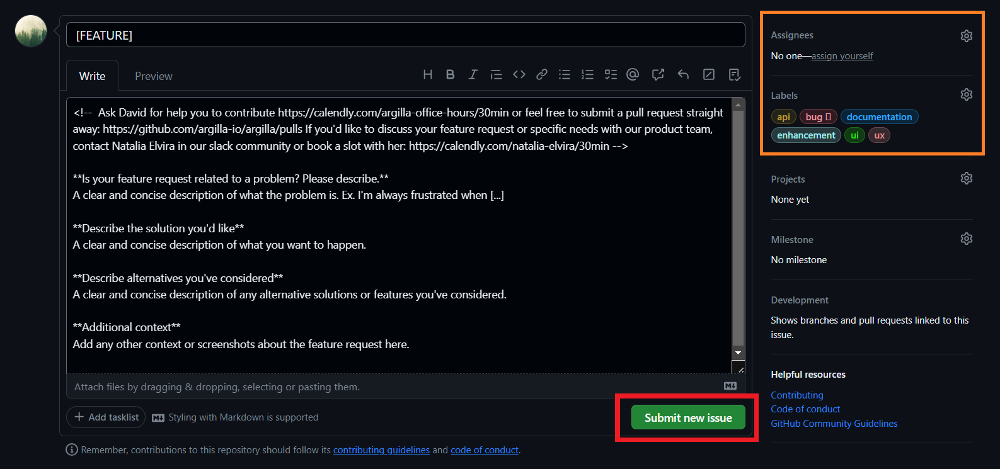
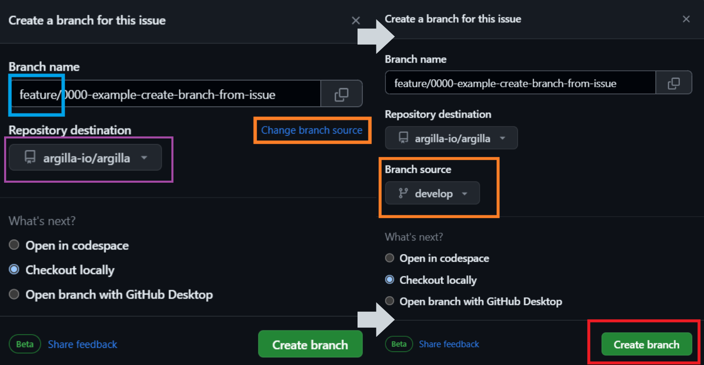
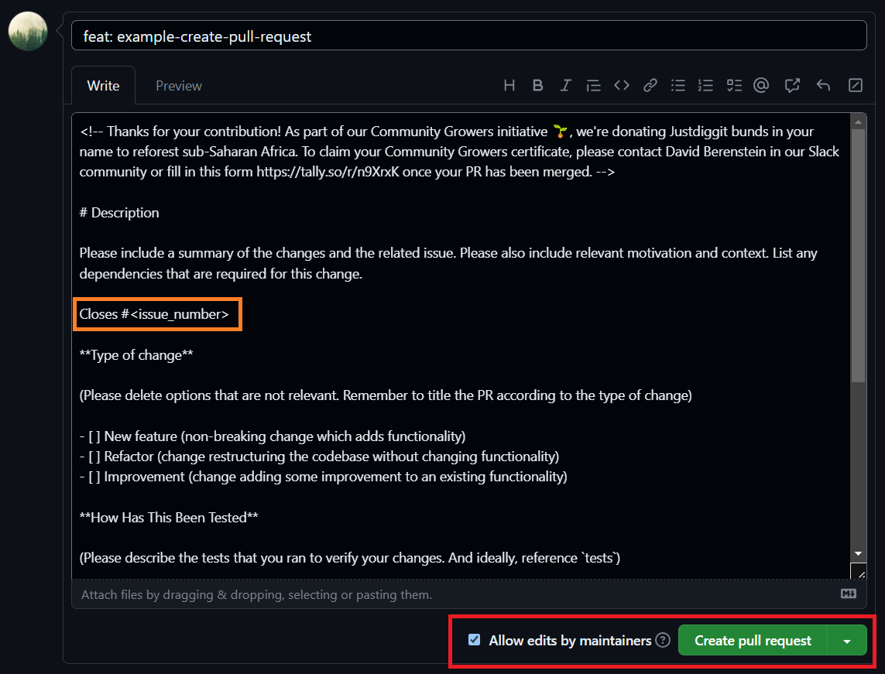

# Contributor Documentation

Thank you for investing your time in contributing to the project! Any contribution you make will be reflected in the most recent version of [Argilla](https://github.com/argilla-io/argilla) 🤩.

> Please read the [Code of Conduct](https://github.com/argilla-io/argilla/blob/develop/CODE_OF_CONDUCT.md) to keep the community approachable and respectable.

If you're a new contributor, we recommend you start reading the [New Contributor Guide](#new-contributor-guide), if it's not your case, feel free to jump to the section you need.


## New Contributor Guide

If you're a new contributor, read the [README](https://github.com/argilla-io/argilla/blob/develop/README.md) to get an overview of the project. In addition, here are some resources to help you get started with open-source contributions:

* **Discord**: You are welcome to join the [Argilla Discord community](http://hf.co/join/discord), where you can keep in touch with other users, contributors and the Argilla team. In the following [section](#first-contact-in-discord), you can find more information on how to get started in Discord.
* **Git**: This is a very useful tool to keep track of the changes in your files. Using the command-line interface (CLI), you can make your contributions easily. For that, you need to have it [installed and updated](https://git-scm.com/book/en/v2/Getting-Started-Installing-Git) on your computer.
* **GitHub**: It is a platform and cloud-based service that uses git and allows developers to collaborate on projects. To contribute to Argilla, you'll need to create an account. Check the [Contributor Workflow with Git and Github](#contributor-workflow-with-git-and-github) for more info.
* **Developer Documentation**: To collaborate, you'll need to set up an efficient environment. Check the [developer documentation](/community/developer_docs.md) to know how to do it.
* **Schedule a meeting with our developer advocate**: If you have more questions, do not hesitate to contact to our developer advocate and [schedule a meeting](https://calendly.com/david-berenstein-huggingface/30min).


## First Contact in Discord

Discord is a handy tool for more casual conversations and to answer day-to-day questions. As part of Hugging Face, we have set up some Argilla channels on the server. Click [here](http://hf.co/join/discord) to join the Hugging Face Discord community effortlessly.

When part of the Hugging Face Discord, you can select "Channels & roles" and select "Argilla" along with any of the other groups that are interesting to you. "Argilla" will cover anything about argilla and distilabel. You can join the following channels:

* **#argilla-distilabel-general**: 📣 Stay up-to-date and general discussions.
* **#argilla-distilabel-help**: 🙋‍♀️ Need assistance? We're always here to help. Select the appropriate label (argilla or distilabel) for your issue and post it.

So now there is only one thing left to do: introduce yourself and talk to the community. You'll always be welcome! 🤗👋


## Contributor Workflow with Git and GitHub

If you're working with Argilla and suddenly a new idea comes to your mind or you find an issue that can be improved, it's time to actively participate and contribute to the project! The main steps will be the following:

<!-- no toc -->
1. [Report an issue](#report-an-issue)
2. [Work with a fork](#work-with-a-fork)
3. [Create a new branch](#create-a-new-branch)
4. [Make changes and push them](#make-changes-and-push-them)
5. [Create a pull request](#create-a-pull-request)
6. [Review your pull request](#review-your-pull-request)
7. [Your PR is merged!](#your-pr-is-merged)


### Report an issue

If you spot a problem, [search if an issue already exists](https://github.com/argilla-io/argilla/issues?q=is%3Aissue). You can use the `Label` filter. If that is the case, participate in the conversation. If it does not exist, create an issue by clicking on `New Issue`.


This will show various templates, choose the one that best suits your issue.


Below, you can see an example of the `Feature request` template. Once you choose one, you will need to fill in it following the guidelines. Try to be as clear as possible. In addition, you can assign yourself to the issue and add or choose the right labels. Finally, click on `Submit new issue`.




### Work with a fork

#### Fork the Argilla repository

After having reported the issue, you can start working on it. For that, you will need to create a fork of the project. To do that, click on the `Fork` button.


Now, fill in the information. Remember to uncheck the `Copy develop branch only` if you are going to work in or from another branch (for instance, to fix documentation the `main` branch is used). Then, click on `Create fork`.


Now, you will be redirected to your fork. You can see that you are in your fork because the name of the repository will be your `username/argilla`, and it will indicate `forked from argilla-io/argilla`.


#### Clone your forked repository

In order to make the required adjustments, clone the forked repository to your local machine. Choose the destination folder and run the following command:

```sh
git clone https://github.com/[your-github-username]/argilla.git
cd argilla
```

To keep your fork’s main/develop branch up to date with our repo, add it as an upstream remote branch. For more info, check the [documentation](/community/developer_docs.md).

```sh
git remote add upstream https://github.com/argilla-io/argilla.git
```


### Create a new branch

For each issue you're addressing, it's advisable to create a new branch. GitHub offers a straightforward method to streamline this process.

> ⚠️ Never work directly on the `main` or `develop` branch. Always create a new branch for your changes.

Navigate to your issue and on the right column, select `Create a branch`.


After the new window pops up, the branch will be named after the issue, include a prefix such as feature/, bug/, or docs/ to facilitate quick recognition of the issue type. In the `Repository destination`, pick your fork ( [your-github-username]/argilla), and then select `Change branch source` to specify the source branch for creating the new one. Complete the process by clicking `Create branch`.

> 🤔 Remember that the `main` branch is only used to work with the documentation. For any other changes, use the `develop` branch.



Now, locally change to the new branch you just created.

```sh
git fetch origin
git checkout [branch-name]
```

### Use CHANGELOG.md

If you are working on a new feature, it is a good practice to make note of it for others to keep up with the changes. For that, we utilize the `CHANGELOG.md` file in the root directory. This file is used to list changes made in each version of the project and there are headers that we use to denote each type of change.
- **Added:** for new features.
- **Changed:** for changes in existing functionality.
- **Deprecated:** for soon-to-be removed features.
- **Removed:** for now removed features.
- **Fixed:** for any bug fixes.
- **Security:** in case of vulnerabilities.

A sample addition would be:

```md
- Fixed the key errors for the `init` method ([#NUMBER_OF_PR](LINK_TO_PR)). Contributed by @github_handle.
```

You can have a look at the [CHANGELOG.md](https://raw.githubusercontent.com/argilla-io/argilla/develop/CHANGELOG.md) file to see more cases and examples.

### Make changes and push them

Make the changes you want in your local repository, and test that everything works and you are following the guidelines. Check the [documentation](/community/developer_docs.md) for more information about the development.

Once you have finished, you can check the status of your repository and synchronize with the upstreaming repo with the following command:

```sh
# Check the status of your repository
git status

# Synchronize with the upstreaming repo
git checkout [branch-name]
git rebase [default-branch]
```

If everything is right, we need to commit and push the changes to your fork. For that, run the following commands:

```sh
# Add the changes to the staging area
git add filename

# Commit the changes by writing a proper message
git commit -m "commit-message"

# Push the changes to your fork
git push origin [branch-name]
```

When pushing, you will be asked to enter your GitHub login credentials. Once the push is complete, all local commits will be on your GitHub repository.


### Create a pull request

Come back to GitHub, navigate to the original repository where you created your fork, and click on `Compare & pull request`.


First, click on `compare across forks` and select the right repositories and branches.

> In the base repository, keep in mind to select either `main` or `develop` based on the modifications made. In the head repository, indicate your forked repository and the branch corresponding to the issue.


Then, fill in the pull request template. In the title, add the feat, bug or docs prefix depending on the type of modification. A general template will be shown, please click on `Preview` and choose the corresponding pull request template. In addition, on the right side, you can select a reviewer (for instance, if you discussed the issue with a member of the Argilla team) and assign the pull request to yourself.

It is highly advisable to add labels to PR as well. You can do this again by the labels section right to the screen. For instance, if you are addressing a bug, add the `bug` label or if the PR is related to the documentation, add the `documentation` label. This way, PRs can be easily filtered.

Additionally, you should add a prefix to the PR name as we did with the branch above. If you are working on a new feature, you can name your PR as `feat: TITLE`. If your PR consists of a solution for a bug, you can name your PR as `bug: TITLE` And, if your work is for improving the documentation, you can name your PR as `docs: TITLE`.

Finally, click on `Create pull request`.


Below, we chose the feature template. Now, fill in it carefully and follow the guidelines. Remember to link the original issue. Finally, enable the checkbox to allow maintainer edits so the branch can be updated for a merge and click on `Create pull request`.




### Review your pull request

Once you submit your PR, a team member will review your proposal. We may ask questions, request additional information or ask for changes to be made before a PR can be merged, either using [suggested changes](https://docs.github.com/en/github/collaborating-with-issues-and-pull-requests/incorporating-feedback-in-your-pull-request) or pull request comments.

You can apply the changes directly through the UI (check the files changed and click on the right-corner three dots, see image below) or from your fork, and then commit them to your branch. The PR will be updated automatically and the suggestions will appear as outdated.


> If you run into any merge issues, check out this [git tutorial](https://github.com/skills/resolve-merge-conflicts) to help you resolve merge conflicts and other issues.


### Your PR is merged!

Congratulations 🎉🎊 We thank you 🤩

Once your PR is merged, your contributions will be publicly visible on the [Argilla GitHub](https://github.com/argilla-io/argilla#contributors).

Additionally, we will include your changes in the next release based on our [development branch](https://github.com/argilla-io/argilla/tree/develop).

## Additional resources

Here are some helpful resources for your reference.

* [Configuring Discord](https://support.discord.com/hc/en-us/categories/115000217151), a guide to learn how to get started with Discord.
* [Pro Git](https://git-scm.com/book/en/v2), a book to learn Git.
* [Git in VSCode](https://code.visualstudio.com/docs/sourcecontrol/overview), a guide to learn how to easily use Git in VSCode.
* [GitHub Skills](https://skills.github.com/), an interactive course to learn GitHub.
