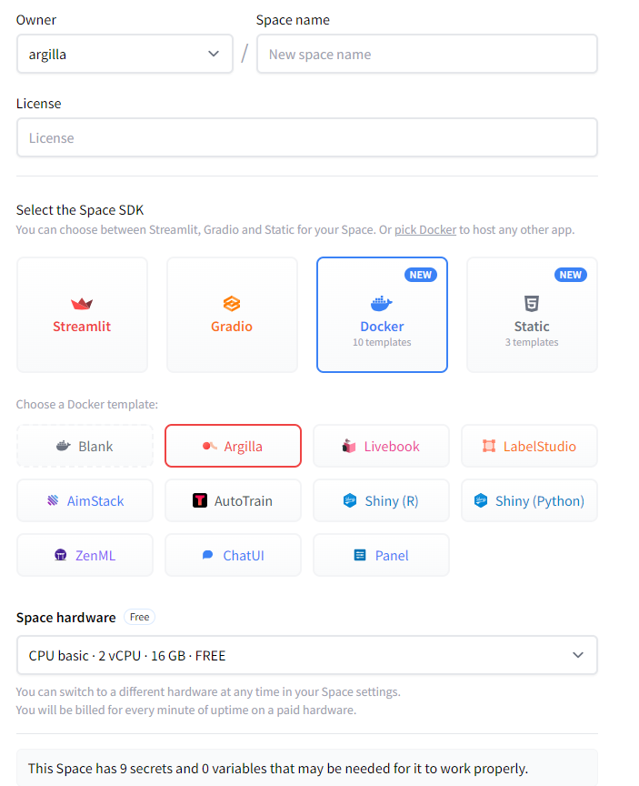
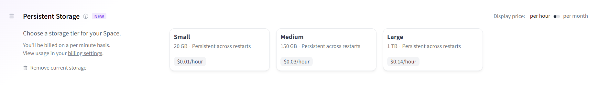

# Hugging Face Spaces

Argilla nicely integrates with the Hugging Face stack (`datasets`, `transformers`, `hub`, and `setfit`), and now it can also be deployed using the Hub's Spaces.

```{warning}
Hugging Face Spaces now have persistent storage and this is supported from Argilla 1.11.0 onwards, but you will need to manually activate it via the Hugging Face Spaces settings. Otherwise, unless you're on a paid space upgrade, after 48 hours of inactivity the space will be shut off and you will lose all the data. To avoid losing data, we highly recommend using the persistent storage layer offered by Hugging Face. For more info check the ["Setting up persistent storage"](#setting-up-persistent-storage) section.
```

In this guide, you'll learn to deploy your own Argilla app and use it for data labeling workflows right from the Hub.

## Your first Argilla Space

In this section, you'll learn to deploy an Argilla Space and use it for data annotation and training a sentiment classifier with [SetFit](https://github.com/huggingface/setfit/), an amazing few-shot learning library.

### Deploy Argilla on Spaces

You can deploy Argilla on Spaces with just a few clicks:

<a  href="https://huggingface.co/new-space?template=argilla/argilla-template-space">
    
</a>

You need to define the **Owner** (your personal account or an organization), a **Space name**, and the **Visibility** (`Public` or `Private`, in which case you will need to [set a `HF_TOKEN`](https://huggingface.co/settings/tokens)). If you plan to use the Space frequently or handle large datasets for data labeling and feedback collection, upgrading the hardware with a more powerful CPU and increased RAM can enhance performance.



:::{tip}
If you want to customize the title, emojis, and colors of your space, go to "Files and Versions" and edit the metadata of your README.md file.
:::

You'll see the `Building` status and once it becomes `Running` your space is ready to go. If you don't see the Argilla login UI refresh the page.


:::{tip}
You'll see the login screen where you need to use either `admin` or `argilla` with the default passwords (12345678). Remember you can change the passwords using secret environment variables. If you get a 500 error when introducing the credentials, make sure you have introduced the correct password.
:::

<div class="flex justify-center">

</div>

:::{tip}
For quick experimentation, you can jump directly into the next section. If you want to add access restrictions, go to the ["Setting up secret environment variables"](#setting-up-secret-environment-variables) at the end of this document. In addition, if you prefer to enable persistent storage, go to the following [section](#setting-up-persistent-storage). Setting up secret variables and persistent storage is recommended for longer-term usage.
:::

### Your Argilla Space URL

Once Argilla is running, you can use the UI with the Direct URL. This URL gives you access to a full-screen, stable Argilla instance, and is the `api_url` for reading and writing datasets using the Argilla Python library.

* If you have a public space, you'll find the Direct URL in the "Embed this Space" option (top right). You'll see a URL like this: `https://dvilasuero-argilla-setfit.hf.space`


* If you are using a private space, the Direct URL should be constructed as follows: `https://[your-owner-name]-[your_space_name].hf.space`. For instance, if the owner of the space is `dvilasuero` and your space name is `argilla-setfit`, your Direct URL will be `https://dvilasuero-argilla-setfit.hf.space`.

### Create your first dataset

To create your first dataset, you need to pip install `argilla` on Colab or your local machine:

```bash
pip install argilla
```

Then, you have to connect to your Argilla HF Space. Get the `api_url` as mentioned before and copy the `api_key` from "My settings" (UI):

```python
import argilla as rg

# If you connect to your public HF Space
rg.init(
  api_url="[your_space_url]",
  api_key="admin.apikey" # this is the default API key, don't change it if you didn't set up one during the Space creation
  )

# If you connect to your private HF Space
rg.init(
  api_url="[your_space_url]",
  api_key="admin.apikey", # this is the default API key, don't change it if you didn't set up one during the Space creation
  extra_headers={"Authorization": f"Bearer {os.environ['HF_TOKEN']}"}
  )
```
Now, create a dataset for text classification. We'll use a task template, check the [docs](../../../practical_guides/create_update_dataset/create_dataset.md) to create a custom dataset. Indicate the workspace where the dataset will be created. You can check them in "My settings" (UI).

```python
dataset = rg.FeedbackDataset.for_text_classification(
    labels=["sadness", "joy"],
    multi_label=False,
    use_markdown=True,
    guidelines=None,
    metadata_properties=None,
    vectors_settings=None,
)
# Create the dataset to be visualized in the UI (uses default workspace)
dataset.push_to_argilla(name="my-first-dataset", workspace="admin")
```
To add the records, create a list with the records you want to add. Match the fields with the ones specified before. You can also use pandas or `load_dataset` to read an existing dataset and create records from it.

```python
records = [
    rg.FeedbackRecord(
        fields={
            "text": "I am so happy today",
        },
    ),
    rg.FeedbackRecord(
        fields={
            "text": "I feel sad today",
        },
    )
]
dataset.add_records(records)
```

Congrats! You now have a dataset available from the Argilla UI to start browsing and labeling. Once annotated, you can also easily push it back to the Hub.

```python
dataset = rg.FeedbackDataset.from_argilla("my-first-dataset", workspace="admin")
dataset.push_to_huggingface("my-repo/my-first-dataset")
```

As a next step, you can check the [Argilla Tutorials](https://docs.v1.argilla.io/en/latest/tutorials/tutorials.html) section. All the tutorials can be run using Colab or local Jupyter Notebooks, so you can start building datasets with Argilla and Spaces!

## Feedback and support

If you have improvement suggestions or need specific support, please join [Argilla Slack community](http://hf.co/join/discord) or reach out on [Argilla's GitHub repository](https://github.com/argilla-io/argilla).

## Setting up persistent storage

Hugging Face Spaces recently introduced a feature for persistent storage, which must be enabled manually through the Hugging Face Spaces settings. Without this activation, and if you're not subscribed to a paid space upgrade, the space will automatically shut down after 48 hours of inactivity and do a factory reset when it is restarted, meaning that all the data in the space will be lost, including all created users, workspaces and datasets. To prevent this, we highly recommend using the persistent storage layer offered by Hugging Face.

To enable [persistent storage](https://huggingface.co/docs/hub/spaces-storage#persistent-storage), go to the "Settings" tab on your created Space and click on the desired plan on the "Persistent Storage" section. This will enable persistent storage for your Space and you will be able to use it for data labeling and feedback collection.



```{warning}
The moment you enable persistent storage, the space will restart and all data in the space will be lost. Make sure that you enable the storage before creating any assets or save the datasets you wish to keep and re-create your assets once the space has restarted.
```

```{note}
If you haven't enabled persistent storage, Argilla will show a warning message by default. If you don't require persistent storage for your space and want to prevent the warning message from appearing, you can set the environment variable `ARGILLA_SHOW_HUGGINGFACE_SPACE_PERSISTENT_STORAGE_WARNING` to `false`. This will suppress the warning message, even if persistent storage is not enabled for the space.
```

## Setting up secret environment variables

The Space template provides a way to set up different **optional settings** focusing on securing your Argilla Space.

To set up these secrets, you can go to the Settings tab on your created Space. Make sure to save these values somewhere for later use.

The template space has three users: `owner`, `admin` and `argilla`. The username `owner` corresponds to the root user, who can create users, workspaces, and upload datasets within your Argilla Space. The username `admin` can upload datasets in their workspace/s. And, the username `argilla` is an annotator user with access to the `argilla` workspace and to the datasets uploaded there.

The usernames, passwords, and API keys to upload, read, update, and delete datasets can be configured using the following secrets:

* `OWNER_USERNAME`: The owner username to log in Argilla. The default owner username is `owner`. By setting up
  a custom username you can use your own username to log in to the app.
* `OWNER_PASSWORD`: This sets a custom password to log in to the app with the `owner` username. The default
  password is `12345678`. By setting up a custom password you can use your own password to log in to the app.
* `OWNER_API_KEY`: Argilla provides a Python library to interact with the app (read, write, and update data, log model
  predictions, etc.). If you don't set this variable, the library and your app will use the default API key
  i.e. `owner.apikey`. If you want to secure your app for reading and writing data, we recommend you to set up this
  variable. The API key you choose can be any string of your choice and you can check an online generator if you like.
* `ADMIN_USERNAME`: The admin username to log in Argilla. The default admin username is `admin`. By setting up
  a custom username you can use your own username to log in to the app.
* `ADMIN_PASSWORD`: This sets a custom password to log in to the app with the `admin` username. The default
  password is `12345678`. By setting up a custom password you can use your own password to log in to the app.
* `ADMIN_API_KEY`: Argilla provides a Python library to interact with the app (read, write, and update data, log model
  predictions, etc.). If you don't set this variable, the library and your app will use the default API key
  i.e. `admin.apikey`. If you want to secure your app for reading and writing data, we recommend you to set up this
  variable. The API key you choose can be any string of your choice and you can check an online generator if you like.
* `ANNOTATOR_USERNAME`: The annotator username to log in Argilla. The default annotator username is `argilla`. By setting
  up a custom username you can use your own username to log in to the app.
* `ANNOTATOR_PASSWORD`: This sets a custom password to log in to the app with the `argilla` username. The default password
  is `12345678`. By setting up a custom password you can use your own password to log in to the app.

The combination of these secret variables gives you the following setup options:

1. *I want to avoid that anyone without the API keys adds, deletes, or updates datasets using the Python client*: You need to set up `ADMIN_PASSWORD` and `ADMIN_API_KEY`.
2. *Additionally, I want to avoid that the `argilla` username deletes datasets from the UI*: You need to set up `ANNOTATOR_PASSWORD` and use the `argilla` generated API key with the Python Client (check your Space logs). This option might be interesting if you want to control dataset management but want anyone to browse your datasets using the `argilla` user.
3. *Additionally, I want to avoid that anyone without password browses my datasets with the `argilla` user*: You need to set up `ANNOTATOR_PASSWORD`. In this case, you can use the `argilla` generated API key and/or `ADMIN_API_KEY` values with the Python Client depending on your needs for dataset deletion rights.

Additionally, the `LOAD_DATASETS` will let you configure the sample datasets that will be pre-loaded. The default value is `single` and the supported values for this variable are:
    1. `single`: Load single datasets for TextClassification task.
    2. `full`: Load all the sample datasets for NLP tasks (TokenClassification, TextClassification, Text2Text)
    3. `none`: No datasets being loaded.

## Setting up HF Authentication

From version `1.23.0` you can enable Hugging Face authentication for your Argilla Space. This feature allows you to give access to your Argilla Space to users that are logged in to the Hugging Face Hub.

```{note}
This feature is specially useful for public crowdsourcing projects. If you would like to have more control over who can log in to the Space, you can set this up on a private space so that only members of your Organization can sign in. Alternatively, you may want to [create users](/getting_started/installation/configurations/user_management.md#create-a-user) and use their credentials instead.
```

To enable this feature, you will first need to [create an OAuth App in Hugging Face](https://huggingface.co/docs/hub/oauth#creating-an-oauth-app). To do that, go to your user settings in Hugging Face and select *Connected Apps* > *Create App*. Once inside, choose a name for your app and complete the form with the following information:

* **Homepage URL:** [Your Argilla Space Direct URL](/getting_started/installation/deployments/huggingface-spaces.md#your-argilla-space-url).
* **Logo URL:** `[Your Argilla Space Direct URL]/favicon.ico`
* **Scopes:** `openid` and `profile`.
* **Redirect URL:** `[Your Argilla Space Direct URL]/oauth/huggingface/callback`

This will create a Client ID and an App Secret that you will need to add as variables of your Space. To do this, go to the Space *Settings* > *Variables and Secrets* and save the Client ID and App Secret as environment secrets like so:

1. **Name:** `OAUTH2_HUGGINGFACE_CLIENT_ID` - **Value:** [Your Client ID]
2. **Name:** `OAUTH2_HUGGINGFACE_CLIENT_SECRET` - **Value:** [Your App Secret]

Alternatively, you can provide the environment variables in the `.oauth.yaml` file like so:

```yaml
# This attribute will enable or disable the Hugging Face authentication
enabled: true

providers:
# The OAuth provider setup
# For now, only Hugging Face is supported
  - name: huggingface
    # This is the client ID of the OAuth app. You can find it in your Hugging Face settings.
    # see https://huggingface.co/docs/hub/oauth#creating-an-oauth-app for more info.
    # You can also provide it by using the env variable `OAUTH2_HUGGINGFACE_CLIENT_ID`
    client_id: XXXXXXXX-XXXX-XXXX-XXXX-XXXXXXXXXXXXX

    # This is the client secret of the OAuth app. You can find it in your Hugging Face settings.
    # See https://huggingface.co/docs/hub/oauth#creating-an-oauth-app for more info.
    # We encourage you to provide it by using the env variable `OAUTH2_HUGGINGFACE_CLIENT_SECRET`
    client_secret: XXXXXXXX-XXXX-XXXX-XXXX-XXXXXXXXXXXXX

    # The scope of the OAuth app. At least `openid` and `profile` are required.
    scope: openid profile

# This section defines the allowed workspaces for the oauth users.
# Workspaces defined here must exist in Argilla.
allowed_workspaces:
    - name: admin
```

```{warning}
Be aware that the `.oauth.yaml` file is public in the case of public spaces or may be accesible by other members of your organization if it is a private space.

Therefore, we recommend setting these variables as enviroment secrets.
```

Now check that the `enabled` parameter is set to `true` in your `.oauth.yaml` file and go back to the *Settings* to do a *Factory rebuild*. Once the Space is restarted, you and your collaborators can sign and log in to your Space using their Hugging Face accounts.
