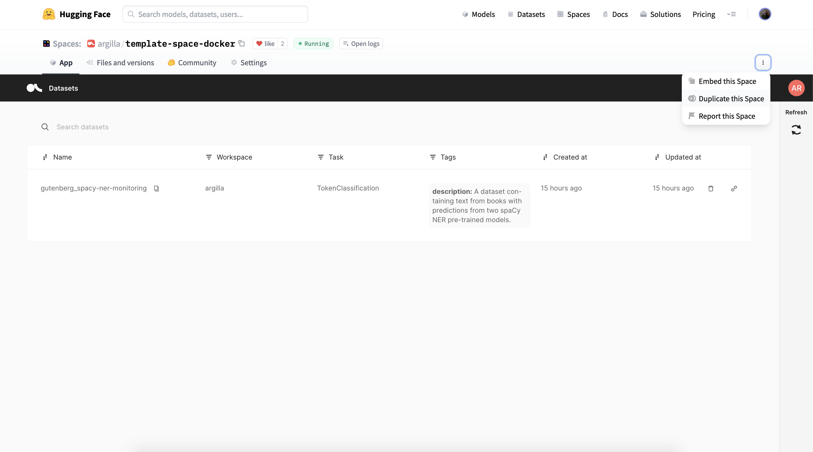

# Deploying Argilla with Hugging Face Spaces

Argilla nicely integrates with the Hugging Face stack (`datasets`, `transformers`, `hub`, and `setfit`), and now it can also be deployed using the Hub's Spaces.

In this guide, you'll learn to deploy your own Argilla app and use it for data labelling workflows right from the Hub.

If you want to play with the Argilla UI without installing anything, check this [live demo](https://huggingface.co/spaces/argilla/live-demo). The demo is powered by Hugging Face Docker Spaces, the same technology you'll learn in this guide. To login into the UI use: username: `huggingface`, password: `1234`.


## Your first Argilla Docker Space

In this section, you'll learn to deploy an Argilla Docker Space and use it for data annotation and training a sentiment classifier with [SetFit](https://github.com/huggingface/setfit/), a few-shot learning library.

You can find the final app at [this example Space](https://huggingface.co/spaces/dvilasuero/argilla-setfit) and the step-by-step tutorial in this [notebook](https://colab.research.google.com/drive/1GeBBuRw8CIZ6SYql5Vdx4Q2Vv74eFa1I?usp=sharing).

### Duplicate the Argilla Docker Template and create your Space

The easiest way to get started is by [duplicating the Argilla Docker Template](https://huggingface.co/spaces/argilla/template-space-docker?duplicate=true). You need to define the **Owner** (your personal account or an organization you are part of), a **Space name**, and the **Visibility**, which we recommend to set up to Public if you want to interact with the Argilla app from the outside. Once you are all set, click "Duplicate Space".

Note: You'll see a mention to the need of setting up environment variables (`API_KEY`) by adding a secret to your Space but will see this in a second.

### Setting up secret environment variables

The Space template provides a way to set up two optional settings:

- `API_KEY`: As mentioned earlier, Argilla provides a Python library to interact with the app (read and write data, log model predictions, etc.). If you don't set this variable, the library and your app will use the default API key. If you want to secure your Space for reading and writing data, we recommend you to set up this variable. The API key you choose can be any string of your choice and you can check an online generator if you like.

- `PASSWORD`: This setting allows you to set up a custom password for login into the app. The default password is `1234` and the default user is `argilla`. By setting up a custom password you can use your own password to login into the app. The value of the `PASSWORD` secret must be a hashed password, you can generate one following [this guide](https://docs.argilla.io/en/latest/getting_started/installation/user_management.html#override-default-password).

In order to set up these secrets, you need to go to the Settings tab on your newly created Space and make sure to store the values somewhere safe on your local machine for later use. For testing purposes, you can completely skip this step, or just set one of the two variables. If you do this, the default values from the [basic Argilla setup](https://docs.argilla.io/en/latest/getting_started/installation/installation.html) will be kept.

### Create your first dataset

Once your Argilla Space is running, you can start interacting with the it using the Direct URL you'll find in the "Embed this Space" option (top right). Let's say it's https://dvilasuero-argilla-setfit.hf.space. This URL will give you access to a full-screen, stable Argilla app, but will also serve as an endpoint for interacting with Argilla Python library. Let's see how to create our first dataset for labelling.



Another option is to embed the app directly using the provided iframe, which can be handy for quick experimentation using Google Colab for example.

You also can access the app directly using the main URL of the Space, for example: https://huggingface.co/spaces/dvilasuero/argilla-setfit.


First we need to pip install `datasets` and `argilla` on Colab or your local machine:

```bash
pip install datasets argilla
```

Then, you can read the example dataset using the `datasets` library (this dataset is just a CSV file uploaded to the Hub using the drag and drop feature).

```python
from datasets import load_dataset

dataset = load_dataset("dvilasuero/banking_app", split="train").shuffle()
```

Now you can create your first dataset by logging it into Argilla using your endpoint URL and (optionally) `API_KEY`:

```python
import argilla as rg

# connect to your app endpoint
rg.init(api_url="https://dvilasuero-argilla-setfit.hf.space", api_key="YOUR_SECRET_API_KEY")

# transform dataset into Argilla's format and log it
rg.log(rg.read_datasets(dataset, task="TextClassification"), name="bankingapp_sentiment")
```

If everything went well, you now have a dataset available from the Argilla UI to start browsing and labelling. In the code above, we've used one of the many integrations with Hugging Face libraries, which let you [read hundreds of datasets](https://docs.argilla.io/en/latest/guides/features/datasets.html#Importing-a-Dataset) available on the Hub.

### Data labelling and model training

At this point, you can label your data directly using your Argilla Space and read the training data to train your model of choice. In this [Colab notebook](https://colab.research.google.com/drive/1GeBBuRw8CIZ6SYql5Vdx4Q2Vv74eFa1I?usp=sharing), you can follow the full step-by-step tutorial, but let's see how we can retrieve data from our interactive data annotation session, and the code need to train a SetFit model.

```python
# this will read our current dataset and turn it into a clean dataset for training
dataset = rg.load("bankingapp_sentiment").prepare_for_training()
```

You can also get the full dataset and push it to the Hub for reproducibility and versioning:

```python
# save full argilla dataset for reproducibility
rg.load("bankingapp_sentiment").to_datasets().push_to_hub("bankingapp_sentiment")
```

Finally, this is how you can train a SetFit model using data from your Argilla Space:

```python
from sentence_transformers.losses import CosineSimilarityLoss

from setfit import SetFitModel, SetFitTrainer

# Create train test split
dataset = dataset.train_test_split()

# Load SetFit model from Hub
model = SetFitModel.from_pretrained("sentence-transformers/paraphrase-mpnet-base-v2")

# Create trainer
trainer = SetFitTrainer(
    model=model,
    train_dataset=dataset["train"],
    eval_dataset=dataset["test"],
    loss_class=CosineSimilarityLoss,
    batch_size=8,
    num_iterations=20,
)

# Train and evaluate
trainer.train()
metrics = trainer.evaluate()
```

## Advanced settings

This section provides details about what's done under the hood for setting up the Template Docker Space. You can use this guide to set up your own Docker Space.

### Dockerfile

The [`Dockerfile`](https://huggingface.co/spaces/argilla/template-space-docker/blob/main/Dockerfile) is based on the Elasticsearch image, which is the database used by Argilla apps. The build process does the following high-level steps:

1. Install Python, pip, and dependencies defined on the `requirements.txt` file.
2. Read secrets from the Space settings and make them available. You can find out more about how to use secrets in Docker spaces on [this guide](https://huggingface.co/docs/hub/spaces-sdks-docker#secret-management).
3. Launch Elasticsearch, setup the `API_KEY` and `PASSWORD` if available, and launch the Argilla service. This done in the `start.sh` script described below.

### start.sh
This script launches Elasticsearch, uses the `waitforit.sh` utility to make sure Elasticsearch is up and running for the Argilla service, sets up the environment variables `API_KEY` and `PASSWORD` if available, and run `python -m argilla` which serves the webapp and API endpoint for reading and writing data.

### Demo Space: Setting up workspaces and users
If you are looking for a more advanced configuration of Argilla, which involves setting up several users and workspaces, can check out the [Argilla Demo Docker Space codebase](https://huggingface.co/spaces/argilla/live-demo/tree/main).

## Feedback and support
If you have improvement suggestions or need specific support, please join our [Slack community]() or reach out on [Argilla's GitHub repository](https://github.com/argilla-io/argilla).


