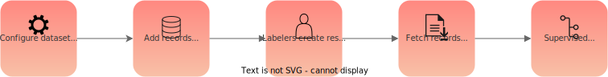

# Conceptual Guide

Welcome to Argilla Feedback, a specific task within the Argilla Platform designed to support Reinforcement Learning from Human Feedback (RLHF) and LLM (Large Language Model) projects.

Argilla Feedback assists in two critical stages of the RLHF process. The first is the collection of demonstration data for supervised fine-tuning of large language models. This stage, while a part of the RLHF process, also operates independently. In supervised fine-tuning, models learn from human-guided examples, improving their prediction capabilities. Argilla Feedback also streamlines instruction-following tasks, simplifying the collection of diverse and context-rich data, which is integral to large language model training workflows.

The second stage where Argilla Feedback proves beneficial is in the collection of comparison data, a key element for training your reward model. By making this process more efficient, Argilla Feedback helps ensure your model learns from a comprehensive and robust dataset.

The platform's versatility is showcased in its two main components: the Python SDK and a robust User Interface (UI). The Python SDK allows data teams to integrate Argilla workflows with their existing tools, enhancing productivity and reducing friction. This adaptability makes the platform suitable for a variety of workflows and environments.

The UI is another significant component, designed for efficient data collection and curation. This tool further simplifies the process of collecting, curating, and using data, enhancing its overall utility.

Argilla Feedback stands as a key resource for Reinforcement Learning from Human Feedback (RLHF) and LLM workflows. It equips developers and data teams with necessary capabilities during critical stages of the RLHF process.

This guide offers a conceptual overview of Argilla Feedback, setting the foundation for exploring its technical applications and utilities.

Let’s start with the two main use cases: ***Collecting demonstration data** and **Collecting comparison data**

## Collecting and curating demonstration data

When training large language models, the collection and curation of demonstration data play a significant role. This data, consisting of prompts and responses, is used in the supervised fine-tuning process where models learn to generate responses to prompts based on human-provided examples. Argilla Feedback is designed to simplify this process.

Consider this example. You have a set of prompts, perhaps from an existing database like ShareGPT or from your internal resources, and you aim to fine-tune a model to respond accurately to these prompts. Using Argilla Feedback, you distribute the prompts to human labelers who then generate responses as if they were the model. This set of 'model responses' becomes a key component of the supervised fine-tuning process.

Moreover, Argilla Feedback can be used to collect prompts as well. In this case, you would ask the labelers not only to provide a response to a given prompt but also to generate the prompts themselves. This dual functionality enhances the diversity of your dataset and can lead to more robust model performance.

Additionally, you may choose to gather extra feedback on the prompts. For example, you could ask labelers to rate the clarity or relevance of each prompt, or to provide general comments. This auxiliary information can be invaluable for refining your prompts and guiding the training process.

This section of the guide outlines how to leverage Argilla Feedback effectively for collecting and curating demonstration data in these scenarios.

## Collecting and curating comparison data

