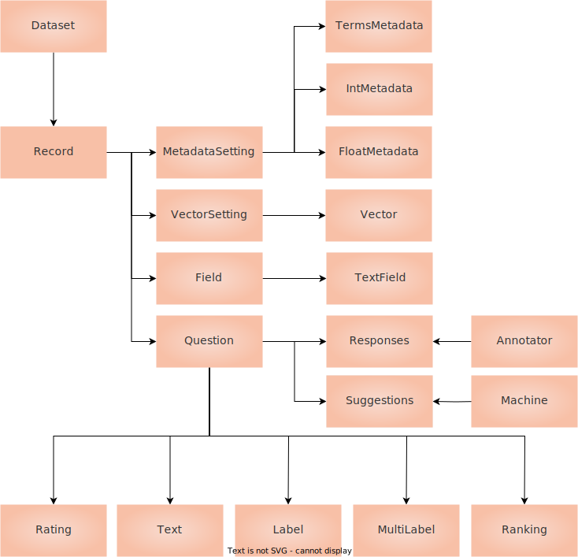

# Conceptual Guide
Argilla Feedback is carefully crafted for custom and multi-aspect feedback in LLM projects. Argilla Feedback stands as a key resource for LLM fine-tuning and Reinforcement Learning from Human Feedback (RLHF). It equips teams with a highly flexible platform for the critical stages of evaluating and fine-tuning LLMs, and potentially aligning them with RLHF.

:::{note}
This guide offers a conceptual overview of Argilla Feedback, setting the foundation for exploring its technical applications. If you are looking for a hands-on practical introduction, feel free to jump directly in the How-to Guides or the Examples section.
:::

## Data collection for LLMs: the ChatGPT path
The following figure shows the stages for training and fine-tuning LLMs. From top to bottom, it shows, the data needed at each stage (note the color for the data collected with human feedback), the stage (namely, pre-training, supervised fine-tuning, reward modelling, and reinforcement learning), and finally the model created at each stage. Argilla Feedback makes the process of collecting human feedback seamless at each step after pre-training.

:::{note}
This guide uses a combination of terminology defined in the seminal "Training language models to follow instructions with human feedback" paper by OpenAI and the wonderful “State of GPT” talk by Andrej Karpathy. The figure above is highly inspired by the figure shown by Andrej during the talk.
:::

Argilla Feedback assists in three critical stages of the LLM fine-tuning process. The first is the **collection of completion data for supervised fine-tuning of large language models**. This stage, while a part of the RLHF process, also operates independently. In supervised fine-tuning, models learn from human-guided examples, steering them, and improving their capabilities.

The second stage where Argilla Feedback proves beneficial is in the **collection of comparison data**, a key element for training a reward model for RLHF.

Similarly, Argilla Feedback can be used to write or select prompts for the last stage: Reinforcement learning. This collection process is highly similar to the first stage except that we don't ask users to write completions.

To understand how Argilla Feedback works, let’s deep-dive into the **Collecting completion data** and **Collecting comparison data** stages.

## Collecting completion data
When training large language models, the collection of completion data play a significant role. This data, consisting of prompts and completions, is used in the supervised fine-tuning process where models learn to generate responses to prompts based on human-provided examples. Other common names for this stage are instruction-tuning and behaviour cloning. Argilla Feedback is designed to simplify and to seamlessly distribute this process across multiple labelers. As shown by recent research, like the LIMA work[TODO add reference], collecting and curating even a small set of high-quality and diverse examples can

Consider this example. Your company has access to a database of prompts, perhaps from an existing database like ShareGPT or from your internal resources, and you aim to fine-tune a model to respond accurately to these prompts. Using Argilla Feedback, you can efficiently distribute the prompts to human labelers who then generate responses as if they were the model. This set of model responses becomes a key component of the supervised fine-tuning process.

:::{tip}
As you can add unlimited users to your Argilla instance and datasets, Argilla can be seamlessly used to distribute the workload among hundreds of labelers or experts within your company, in the line of other efforts like the Dolly v2 dataset from Databricks. If you’d like help setting up such effort, reach out to us and we’ll gladly help out.
:::

Moreover, Argilla Feedback can be used to collect prompts as well. In this case, you would ask the labelers not only to provide a response to a given prompt but also to write the prompts themselves. This dual functionality enhances the diversity of your dataset and can lead to more robust model performance.

Additionally, you may choose to gather extra feedback on the prompts. For example, you could ask labelers to rate the clarity or relevance of each prompt, or to provide general comments in natural language. This auxiliary information can be invaluable for refining your prompts and guiding the assessment and training processes.

:::{tip}
Beyond instruction-tuning, collecting and curating demonstration data is an important step for aligning the model with certain values and reduce its toxicity. An important related work is "Process for Adapting Language Models to Society (PALMS) with Values-Targeted Datasets". In this work, researchers improve language model behaviour by fine-tuning on a curated dataset of <100 examples of prompts and values-aligned responses. If you’d like help setting up such effort, reach out to us and we’ll gladly help out.
:::

## Collecting comparison data
The most significant reasons behind the success of ChatGPT by OpenAI or Claude by Anthropic is the application of a third stage after supervised fine-tuning. This third stage uses Reinforcement Learning to steer and align the model with human preferences. The most well-known technique for this stage is called RLHF.

:::{note}
There are other, potentially complementary, approaches like Reinforcement Learning From AI Feedback, but we strongly believe that fine-tuning LLMs with humans in the loop is key to building robust, responsible, and safe models.
:::

RLHF itself has two stages: collecting comparison data and training a reward model and training a supervised policy. In this section, we discuss how to collect and curate demonstration data with Argilla Feedback.

Consider this example. Your company has access to an instruction-following model, after going through the supervised fine-tuning stage or reusing an open-source instruction-following model. After an internal evaluation process, the model shows undesired behaviours like generating made up facts (sometimes referred to as “hallucinations”), harmful content, or just unhelpful responses. This is where a second stage of alignment with human preferences becomes relevant.

Using Argilla, you can setup an offline feedback collection process to ask labelers to rank two or more model outputs for a given prompt.

:::{tip}
You can use Argilla Feedback for the internal evaluation process by registering the interactions with the model and asking labelers to rate the quality of the responses. If you’d like help setting up such effort, reach out to us and will gladly help with the setup.
:::

## Feedback Data Model

