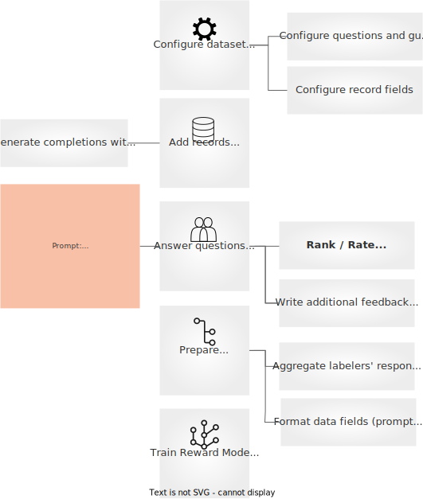

# Conceptual Guide
Argilla Feedback is carefully crafted for custom and multi-aspect feedback in LLM projects. Argilla Feedback stands as a key resource for LLM fine-tuning and Reinforcement Learning from Human Feedback (RLHF). It equips teams with a highly flexible platform for the critical stages of evaluating and fine-tuning LLMs, and potentially aligning them with RLHF.

:::{note}
This guide offers a conceptual overview of Argilla Feedback, setting the foundation for exploring its technical applications. For a hands-on practical introduction, go directly to the How-to Guides or Examples section.
:::

## Data collection for LLMs: the ChatGPT path
The following figure shows the stages for training and fine-tuning LLMs. From top to bottom, it shows, the data needed at each stage (note the color for the data collected with human feedback), the stage (namely, pre-training, supervised fine-tuning, reward modelling, and reinforcement learning), and finally the model created at each stage. Argilla Feedback makes the process of collecting human feedback seamless at each step after pre-training.


:::{note}
This guide are highly inspired by the "Training language models to follow instructions with human feedback" paper and the amazing introduction to RLHF by Chip Huyen. The above figure is an adaptation from the figure created by Chip Huyen for this post.
:::

Argilla Feedback assists in three critical stages of the LLM fine-tuning process. The first is the **collection of completion data for supervised fine-tuning of large language models**. This stage, while a part of the RLHF process, also operates independently. In supervised fine-tuning, models learn from human-guided examples, steering them, and improving their capabilities.

The second stage where Argilla Feedback proves beneficial is in the **collection of comparison data**, a key element for training a reward model for RLHF.

Similarly, Argilla Feedback can be used to write or select prompts for the last stage: Reinforcement learning. This collection process is highly similar to the first stage except that we don't ask users to write completions.

To understand how Argilla Feedback works, let’s deep-dive into the **Collecting completion data** and **Collecting comparison data** stages.

## Collecting completion data
When training large language models, the collection of completion data play a significant role. This data, consisting of prompts and completions, is used in the supervised fine-tuning process where models learn to generate responses to prompts based on human-provided examples. Other common names for this stage are instruction-tuning and behaviour cloning. Argilla Feedback is designed to simplify and to seamlessly distribute this process across multiple labelers. As shown by recent research, like the LIMA work[TODO add reference], collecting and curating even a small set of high-quality and diverse examples can

Consider this example. Your company has access to a database of prompts, perhaps from an existing database like ShareGPT or from your internal resources, and you aim to fine-tune a model to respond accurately to these prompts. Using Argilla Feedback, you can efficiently distribute the prompts to human labelers who then generate responses as if they were the model. This set of model responses becomes a key component of the supervised fine-tuning process.

:::{tip}
As you can add unlimited users to your Argilla instance and datasets, Argilla can be seamlessly used to distribute the workload among hundreds of labelers or experts within your company, in the line of other efforts like the Dolly v2 dataset from Databricks. If you’d like help setting up such effort, reach out to us and we’ll gladly help out.
:::

Moreover, Argilla Feedback can be used to collect prompts as well. In this case, you would ask the labelers not only to provide a response to a given prompt but also to write the prompts themselves. This dual functionality enhances the diversity of your dataset and can lead to more robust model performance.

Additionally, you may choose to gather extra feedback on the prompts. For example, you could ask labelers to rate the clarity or relevance of each prompt, or to provide general comments in natural language. This auxiliary information can be invaluable for refining your prompts and guiding the assessment and training processes.

:::{tip}
Beyond instruction-tuning, collecting and curating demonstration data is an important step for aligning the model with certain values and reduce its toxicity. An important related work is "Process for Adapting Language Models to Society (PALMS) with Values-Targeted Datasets". In this work, researchers improve language model behaviour by fine-tuning on a curated dataset of <100 examples of prompts and values-aligned responses. If you’d like help setting up such effort, reach out to us and we’ll gladly help out.
:::

Let's implement this workflow with Argilla. The following figure illustrates the steps for setting up completion data collection from a team of labelers and performing supervised fine-tuning. The steps are: **configure the dataset**, **add records**, **labelers use write completions**, **fetch records with completions**, **prepare the dataset**, and **fine-tune the SFT model**.


:::{note}
The following sections give a detailed, conceptual description of the above steps. For a hands-on practical introduction, go directly to the How-to Guides or Examples section.
:::

### Configure the dataset

First, we need to configure a **dataset**. Argilla datasets allows you to mix different **questions** for labelers to answer. In this case, we want to collect **completions** from our labelers. We’ll just need to define a **text question**. Datasets are configured using the Argilla Python SDK. This is how you’d define this field.

```python
import argilla as rg

questions =[
    rg.TextQuestion(
        name="completion",
        title="Please write a harmless and helpful response for the prompt:",
        required=True
    )
]
```

Argilla Datasets are composed of **records**. A **record** is a data point that can be labeled by one or more labelers. A record consists of one or more **fields**. These fields and the order in which they are presented to labelers is fully configurable. In this case, we want to show labelers a prompt. We’ll just need to define a **********text field.********** This is how you’d define this field using the Python SDK:

```python
fields = [
    rg.TextField(name="prompt", required=True)
]
```

To configure the dataset, the final step is to define the **guidelines** for labelers. These guidelines help labelers understand and answer the questions consistently. This is how you’d configure the dataset, including the guidelines:

```python
dataset = rg.FeedbackDataset(
	guidelines="Please, read the prompt carefully and...",
	questions=questions,
	fields=fields
)
```

### Add records

Once you have configured the dataset, you need to add records and publish it for labelers. In this case, the records will contain a single field, the **prompt**. This **prompt** will be shown to labelers in the UI and we will ask them to provide a **completion**. The most important questions at this step are: **where to get the prompts from** and **how to select them** in order to maximise the quality of the resulting LLM.

TIP

Important features for the resulting dataset include diversity, consistent completion style, and quality. These must be considered when designing the data collection process.

For collecting **prompts** or instructions, there are at least the following options:

**Use an existing internal database of prompts or user queries related to your use case**. If your goal is to fine-tune a LLM for your use case, this is the best option. As shown by the recent “LIMA: Less is More for Alignment” paper, you can get good results by collecting a diverse, high-quality, consistent dataset of 1,000-5,000 examples. Previous research recommends using 10,000 to 20,000 examples.


:::{tip}
As the field is rapidly evolving and lacking consensus, we suggest beginning with a small dataset of the highest quality. Argilla Feedback is built for iteration. Starting small allows for faster iteration: training is cheaper and faster, and the length of the feedback loop is reduced.
:::

**Use an open dataset of prompts or user queries**. If you don’t have an internal database for your use case, you can sample and select prompts from an open dataset. The rough steps here can include: (1) finding an open dataset that might contain prompts related to your use case, (2) perform exploratory data analysis and topic extraction to understand the data, and (3) filter and select prompts based on topic, quality, text descriptives, etc.

Some general and freely available datasets are [ShareGPT](https://huggingface.co/datasets/anon8231489123/ShareGPT_Vicuna_unfiltered), [Open Assistant Conversation Dataset](https://huggingface.co/datasets/OpenAssistant/oasst1), or [Stack Exchange](https://huggingface.co/datasets/HuggingFaceH4/stack-exchange-preferences). Please be aware that some of these datasets might contain innapropriate, irrelevant, or bad quality examples for your use cases.

:::{note}
Some of these datasets already contain responses, so you may be able to skip the completion data collection process entirely. If you want to build a good quality instruction-following model for your use case, these datasets cover a wide range of topics, but the responses may not fit your use case's quality and style. Also, there are several models already trained with these dataset. If you think the quality and style of these datasets already fit your use case, we recommend you to run an evaluation campaign using one of these models with your own data.
:::

An alternative is to obtain a dataset of user queries in your domain and apply the same process of data analysis and sampling. A good strategy is to search for datasets of user intent or utterances. For example, if you plan to fine-tune an LLM for a customer service banking assistant, you might start with the [banking77](https://huggingface.co/datasets/banking77) dataset.

**Ask humans to write prompts or instructions.** If none of the above is possible, a third option is to ask humans to write prompts for your use case. This option is expensive and has limitations. The main limitation is the risk of creating artificial prompts that won't match the diversity, topics, or writing style of end-users if the prompts are not written by them. Besides involving end-users in the process, this limitation might be overcome by defining clear guidelines and preparing a diverse set of topics. Such effort can be easily set up with Argilla Feedback by using **guidelines** and creating records with a **text field** indicating the labeler what to write the prompt about. By adding this field, you can control the diversity and desired distribution of prompt topics. This is how you’d set up the field and the question using the Python SDK:

```python
# this will be populated from the list of writing topics you create
fields = [
    rg.TextField(name="writing-topic", required=True)
]

# we will ask the labeler to write a possible prompt or instruction
question = rg.TextQuestion(
	name="prompt",
	title="Imagine and write a possible instruction for the given topic:",
	required=True
)
```

Please note that you can also ask labelers to provide a response for the proposed instruction. This strategy may work depending on the project and resources available, but it can make labeling more complex and affect overall consistency.

:::{tip}
No matter the option you choose, for maximum quality, we recommend to build a feedback workflow with Argilla where you ask labelers to rate the quality of prompts. You can use the aggregated ratings to select the highest quality examples.
:::


## Collecting comparison data
The key behind the success of ChatGPT by OpenAI or Claude by Anthropic is the application of a third stage. This third stage uses Reinforcement Learning to steer and align the model with human preferences. The most well-known technique for this stage is called RLHF.

:::{note}
There are other, potentially complementary, approaches like Reinforcement Learning From AI Feedback, but we strongly believe that fine-tuning LLMs with humans in the loop is key to building robust, responsible, and safe models.
:::

RLHF itself has two stages: collecting comparison data and training a reward model and training a supervised policy. In this section, we discuss how to collect and curate demonstration data with Argilla Feedback.

Consider this example. Your company has access to an instruction-following model, after going through the supervised fine-tuning stage or reusing an open-source instruction-following model. After an internal evaluation process, the model shows undesired behaviours like generating made up facts (sometimes referred to as “hallucinations”), harmful content, or just unhelpful responses. This is where a second stage of alignment with human preferences becomes relevant.

Using Argilla, you can setup an offline feedback collection process to ask labelers to rank two or more model outputs for a given prompt.

:::{tip}
You can use Argilla Feedback for the internal evaluation process by registering the interactions with the model and asking labelers to rate the quality of the responses. If you’d like help setting up such effort, reach out to us and will gladly help with the setup.
:::





## Feedback Data Model

