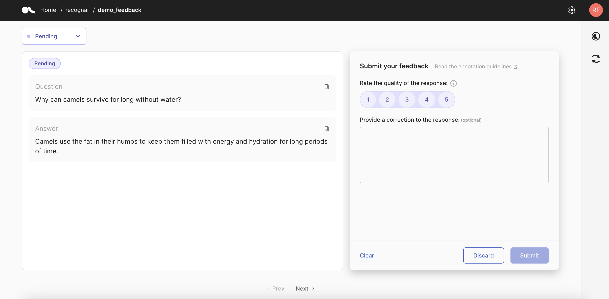

# Conceptual Guides
Argilla Feedback is carefully crafted for custom and multi-aspect feedback in LLM projects. Argilla Feedback stands as a key resource for LLM fine-tuning and Reinforcement Learning from Human Feedback (RLHF). It equips teams with a highly flexible platform for the critical stages of evaluating and fine-tuning LLMs, and potentially aligning them with RLHF.

:::{note}
These guides offer a conceptual overview of Argilla Feedback, setting the foundation for exploring its technical applications. For a hands-on practical introduction, go directly to the How-to Guides or Examples section.
:::


````{grid}  1 1 3 3
:class-container: tuto-section-2
```{grid-item-card} Data collection for LLMs: the ChatGPT path
:link: rlhf.html

Introduction to data collection for LLMs and RLHF

```
```{grid-item-card} Collecting demonstration data
:link: sft.html

Introduction to data collection for supervised and instruction tuning.
```
```{grid-item-card} Collecting comparison data
:link: rm.html

Introduction to data collection for reward modeling.

```
```{grid-item-card} Argilla Feedback Data Model
:link: data_model.html

Argilla Feedback Data Model
```
````



```{toctree}
:maxdepth: 2
:hidden:

rlhf
sft
rm
data_model
```