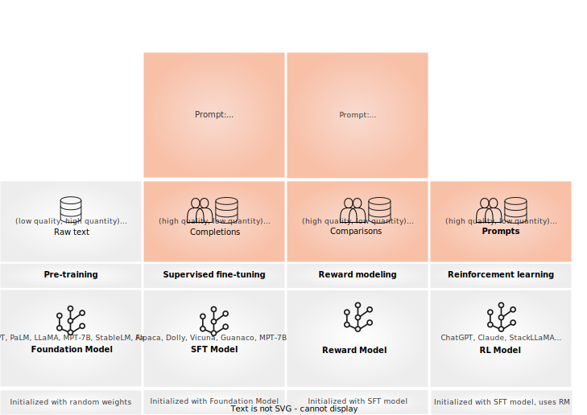

# Conceptual Guide
Argilla Feedback is purpose-built to support **customized and multifaceted feedback in Large Language Model (LLM) projects**. Serving as a critical tool for LLM fine-tuning and Reinforcement Learning from Human Feedback (RLHF), Argilla Feedback provides a flexible platform essential for the evaluation and fine-tuning stages of LLMs tailored to unique use cases. The figure below encapsulates the stages detailed in these guides:




For a practical, hands-on introduction, you can dive straight into our How-to Guides or Examples section. Alternatively, get started exploring one of the guides below:


````{grid}  1 1 3 3
:class-container: tuto-section-2
```{grid-item-card} Data collection for LLMs
:link: rlhf.html

Introduction to data collection for LLMs and RLHF.

```
```{grid-item-card} Collecting demonstration data
:link: sft.html

Introduction to data collection for supervised and instruction fine-tuning.
```
```{grid-item-card} Collecting comparison data
:link: rm.html

Introduction to data collection for reward modeling.

```
```{grid-item-card} Argilla Feedback Data Model
:link: data_model.html

Introduction to the main components to build human-in-the-loop workflows for LLMs.
```
````


```{toctree}
:hidden:

rlhf
sft
rm
data_model
```