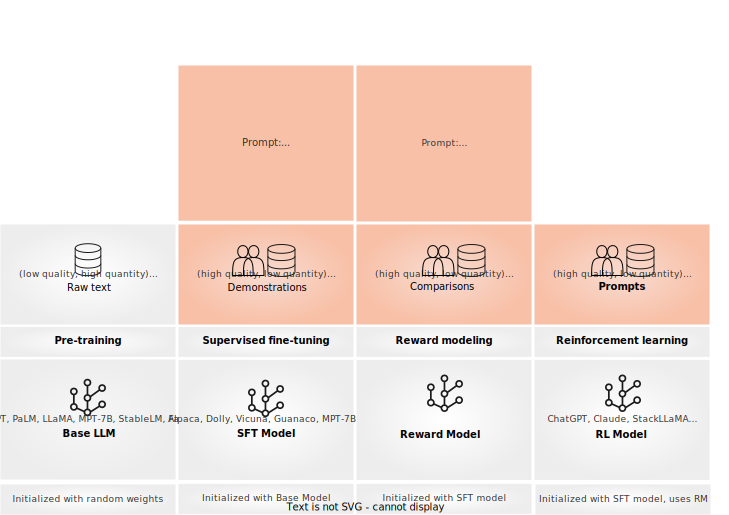

# Conceptual Guides
Argilla Feedback is carefully crafted for **custom and multi-aspect feedback in LLM projects**. Argilla Feedback stands as a key resource for **LLM fine-tuning and Reinforcement Learning from Human Feedback** (RLHF). It equips teams with a highly flexible platform for the critical stages of **evaluating and fine-tuning LLMs for custom use cases**. These guides offer a **conceptual overview of Argilla Feedback**, setting the foundation for exploring its technical applications.

The figure below provides a summary of the various stages discussed across these guides:



For a practical, hands-on introduction, you can dive straight into our How-to Guides or Examples section. Alternatively, get started exploring the guides below:


````{grid}  1 1 3 3
:class-container: tuto-section-2
```{grid-item-card} Data collection for LLMs
:link: rlhf.html

Introduction to data collection for LLMs and RLHF.

```
```{grid-item-card} Collecting demonstration data
:link: sft.html

Introduction to data collection for supervised and instruction fine-tuning.
```
```{grid-item-card} Collecting comparison data
:link: rm.html

Introduction to data collection for reward modeling.

```
```{grid-item-card} Argilla Feedback Data Model
:link: data_model.html

Introduction to the main components to build human-in-the-loop workflows for LLMs.
```
````


```{toctree}
:maxdepth: 2
:hidden:

rlhf
sft
rm
data_model
```