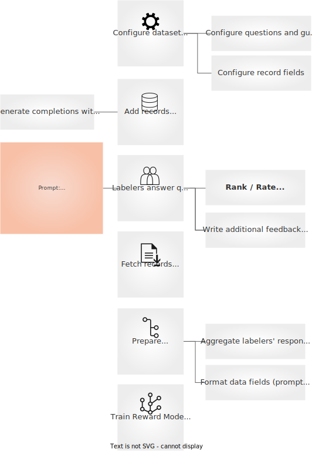

# Collecting comparison data
The key behind the success of ChatGPT by OpenAI or Claude by Anthropic is the application of a third stage. This third stage uses Reinforcement Learning to steer and align the model with human preferences. The most well-known technique for this stage is called RLHF.

:::{note}
There are other, potentially complementary, approaches like Reinforcement Learning From AI Feedback, but we strongly believe that fine-tuning LLMs with humans in the loop is key to building robust, responsible, and safe models.
:::

RLHF itself has two stages: collecting comparison data and training a reward model and training a supervised policy. In this section, we discuss how to collect and curate demonstration data with Argilla Feedback.

Consider this example. Your company has access to an instruction-following model, after going through the supervised fine-tuning stage or reusing an open-source instruction-following model. After an internal evaluation process, the model shows undesired behaviours like generating made up facts (sometimes referred to as “hallucinations”), harmful content, or just unhelpful responses. This is where a second stage of alignment with human preferences becomes relevant.

Using Argilla, you can setup an offline feedback collection process to ask labelers to rank two or more model outputs for a given prompt.

:::{tip}
You can use Argilla Feedback for the internal evaluation process by registering the interactions with the model and asking labelers to rate the quality of the responses. If you’d like help setting up such effort, reach out to us and will gladly help with the setup.
:::

