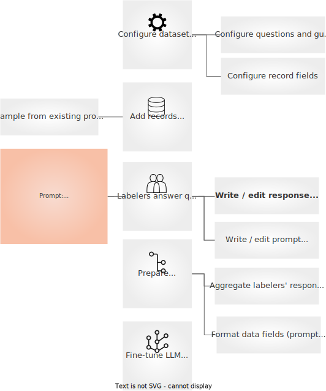

# Collecting demonstration data
This guide explains how to implement workflows for collecting demonstration data. The following figure illustrates the steps to collect feedback from a team of labelers and perform supervised fine-tuning. The steps are: **configure the dataset**, **add records**, **labelers write demonstrations**, **fetch records with demonstrations**, **prepare the dataset**, and **fine-tune the SFT model**.




:::{note}
The following sections give a detailed, conceptual description of the above steps. For a hands-on practical introduction, go directly to the How-to Guides or Examples section.
:::

### Configure the dataset

First, we need to configure a **dataset**. Argilla datasets allows you to mix different **questions** for labelers to answer. In this case, we want to collect **demonstrations** from our labelers. We’ll just need to define a **text question**. Datasets are configured using the Argilla Python SDK. This is how you can define this field:

```python
import argilla as rg

questions =[
    rg.TextQuestion(
        name="demonstration",
        title="Please write a harmless and helpful response for the prompt:",
        required=True
    )
]
```

Argilla Datasets are composed of **records**. A **record** is a data point that can be labeled by one or more labelers. A record consists of one or more **fields**. These fields and the order in which they are presented to labelers is fully configurable. In this case, we want to show labelers a prompt. We’ll just need to define a **********text field.********** This is how you can define this field:

```python
fields = [
    rg.TextField(name="prompt", required=True)
]
```

To configure the dataset, the final step is to define the **guidelines** for labelers. These guidelines help labelers understand and answer the questions consistently. This is how you can configure the dataset, including the guidelines:

```python
dataset = rg.FeedbackDataset(
	guidelines="Please, read the prompt carefully and...",
	questions=questions,
	fields=fields
)
```

### Add records

Once you have configured the dataset, you need to add records and publish it for labelers. In this case, the records will contain a single field, the **prompt**. This **prompt** will be shown to labelers in the UI and we will ask them to provide a **completion**. The most important questions at this step are: **where to get the prompts from** and **how to select them** in order to maximise the quality of the resulting LLM.

:::{tip}
Important features for the resulting dataset include diversity, consistent completion style, and quality. These features must be considered when designing the data selection and collection processes.
:::

For collecting **prompts** or instructions, there are at least the following options:

**Use an existing internal database of prompts or user queries related to your use case**. If your goal is to fine-tune a LLM for your use case, this is the best option. As shown by the recent “LIMA: Less is More for Alignment” paper, you can get good results by collecting a diverse, high-quality, consistent dataset of 1,000-5,000 examples. Previous research recommends using 10,000 to 20,000 examples.


:::{tip}
As the field is rapidly evolving and lacking consensus, we suggest beginning with a small dataset of the highest quality. Argilla Feedback is built for iteration. Starting small allows for faster iteration: training is cheaper and faster, and the length of the feedback loop is reduced.
:::

**Use an open dataset of prompts or user queries**. If you don’t have an internal database for your use case, you can sample and select prompts from an open dataset. The steps here can include: (1) *finding an open dataset that might contain prompts related to your use case*, (2) *perform exploratory data analysis and topic extraction to understand the data*, and (3) *filter and select prompts based on topic, quality, text descriptives, etc.*

Some general and freely available datasets are [ShareGPT](https://huggingface.co/datasets/anon8231489123/ShareGPT_Vicuna_unfiltered), [Open Assistant Conversation Dataset](https://huggingface.co/datasets/OpenAssistant/oasst1), or [Stack Exchange](https://huggingface.co/datasets/HuggingFaceH4/stack-exchange-preferences). Please be aware that some of these datasets might contain innapropriate, irrelevant, or bad quality examples for your use case.

:::{note}
Open datasets might contain responses, so you might be able to skip the completion data collection process entirely. If you want to build a good quality instruction-following model for your use case, these datasets cover a wide range of topics, but the responses may not fit your use case's quality and style. Also, there are several models already trained with these datasets. If you think the quality and style of the data already fit your use case, we recommend you running an evaluation campaign using one of the model with your own data.
:::

An alternative is to obtain a dataset of user queries in your domain and apply the same process of data analysis and sampling. A good strategy is to search for datasets of user intent or utterances. For example, if you plan to fine-tune an LLM for a customer service banking assistant, you might start with the [banking77](https://huggingface.co/datasets/banking77) dataset.

**Ask humans to write prompts or instructions.** If none of the above is possible, a third option is to ask humans to write prompts for your use case. This option is expensive and has limitations. The main limitation is the risk of creating artificial prompts that won't match the diversity, topics, or writing style of end-users if the prompts are not written by them. Besides involving end-users in the process, this limitation might be overcome by defining clear guidelines and preparing a diverse set of topics. Such effort can be easily set up with Argilla Feedback by using **guidelines** and creating records with a **text field** indicating the labeler what to write the prompt about. By adding this field, you can control the diversity and desired distribution of prompt topics. This is how you can set up the field and the question using the Python SDK:

```python
# this will be populated from the list of writing topics you create
fields = [
    rg.TextField(name="writing-topic", required=True)
]

# we will ask the labeler to write a possible prompt or instruction
question = rg.TextQuestion(
	name="prompt",
	title="Imagine and write a possible instruction for the given topic:",
	required=True
)
```

Please note that you can also ask labelers to provide a response for the proposed instruction. This strategy may work depending on the project and resources available, but it can make labeling more complex and affect overall consistency.

:::{tip}
No matter the option you choose, for maximum quality, we recommend to build a feedback workflow with Argilla where you ask labelers to rate the quality of prompts. You can use the aggregated ratings to select the highest quality examples.
:::

Once you have the dataset with prompts ready, you just need to create the records, add them to the dataset, and push the dataset to Argilla to make it available for labelers (or yourself):

```python
from datasets import load_dataset

# This is only for demonstration and assumes you use a HF dataset
prompts = load_dataset('your_prompts_dataset', split=["train"])

records = [
	rg.FeedbackRecord(fields={"prompt": record["prompt"]})
	for record in dataset
]

dataset.add_records(records)

# This publishes the dataset and pushes the records into Argilla
dataset.push_to_argilla(name="my-dataset", workspace="my-workspace")
```

### Labelers write completions
After pushing the to Argilla you and your team can start annotating with Argilla UI. Argilla Feedback enables...

### Prepare dataset

### Fine-tune LLM