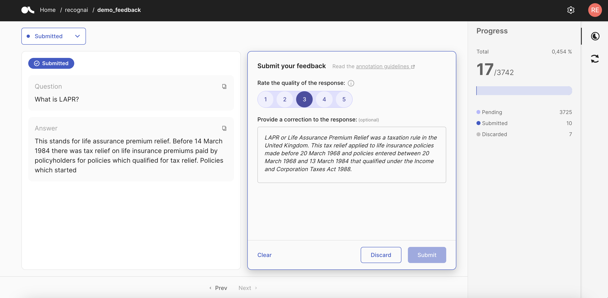

# Annotate a Feedback Dataset



After pushing a `FeedbackDataset` to Argilla, as explained in [Create a Feedback Dataset](create_dataset.ipynb), you can start annotating it through the Argilla UI.

As you open the dataset in the UI, you will see by default the records with `Pending` responses, i.e. records that still don't have a response (annotation), in a single-record view. On the left, you can find the record to annotate and on the right the form with the questions to answer. You can navigate through the records using the `Prev` and `Next` buttons in the bottom bar. You may use the search bar to filter the records based on specific words or phrases.

```{hint}
It is important that the dataset has annotations for a wide variety of records with diverse content. Try not to restrict your annotations to records retrieved in a single search or records with very similar content.
```
```{note}
If you are having issues with the search engine, you may need to reindex the dataset, as explained [here](../../../getting_started/installation/configurations/database_migrations.md#feedback-datasets).
```

We highly recommend that you read the annotation guidelines before starting the annotation, if there are any. If the guidelines have been specified, you can find them either on the dataset settings page or by clicking the "Read the annotation guidelines" button on the top right of the feedback panel, before starting the annotation.

In the annotation view, you will be able to provide responses/annotations to the given questions. Additionally, if a question has a description, you will find an info icon next to it. You can click it to see additional information about the question itself.

Here's a description of the different types of questions you may find:

::::{tab-set}

:::{tab-item} Label

Select a single label from a collection of labels.


:::

:::{tab-item} Multi-label

Select all applicable labels from a selection of labels.


:::

:::{tab-item} Ranking

Order a collection of values. Note that you will need to order all the values to complete the response to this question, which means no value can be left unassigned. Ties are allowed.


:::

:::{tab-item} Rating

Select a single value from a list of values.


:::

:::{tab-item} Text

Provide a text response inside the text area.


:::

::::

Some questions may include a suggested response as well. Those questions will be marked with this icon ✨ and you will see the suggestion as a pre-filled response. If you agree with the suggestion, there is nothing you need to do; if you don't do any modifications, the suggestion will be saved as your response once you submit the response. In case the suggestion is not quite right, you will just need to make the necessary modifications.

Once all required questions have responses, the `Submit` button will be enabled and you will be able to submit your response for the questions of the given record. If you decide not to provide responses for a record, you can either move to the next record or you discard it instead using the `Discard` button.

If you need to review your submitted or discarded responses, you can select the queue you need. From there, you can modify, submit or discard responses. You can also use the `Clear` button to remove the response and send the record back to the `Pending` queue.

You can track your progress and the number of `Pending`, `Submitted` and `Discarded` responses by clicking the `Progress` icon in the sidebar.


## Shortcuts

```{include} /_common/shortcuts.md
```