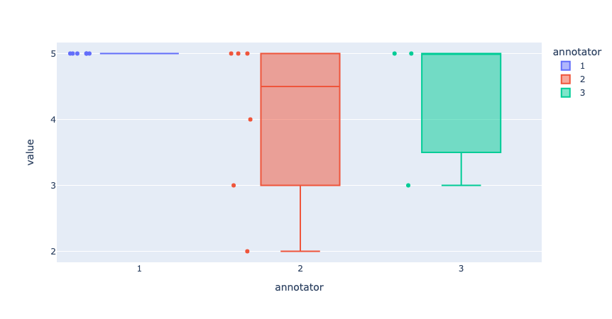

# Collect responses from an annotated Feedback Dataset

To collect the responses given by annotators via Python, you can simply load the dataset from Argilla as follows:

```python
import argilla as rg

rg.init(
    api_url="...",
    api_key="...",
)

feedback = rg.FeedbackDataset.from_argilla("demo_feedback", workspace="recognai")
```

Each record in `feedback.records` will have an attribute `responses` where you will find a list with all the responses to that record, if any. Each response will have the following attributes:

- `user_id`: contains the Argilla user ID of the annotator
- `values`: contains the responses given by the annotator in the shape of a dictionary, where the key is the name of the question and the value is another dictionary where you can find the answer to the question under the key `value`.
- `status`: contains the status of the response i.e., whether it is `submitted`, or `discarded`.


If your dataset doesn't have any annotation overlap i.e., all records have at most one response, the post-processing stage will be quite simple since you won't need to decide which annotations to keep and which to discard.

```{note}
Remember to only take into account responses with the `submitted` status.
```

## Measure disagreements

If your dataset does have records with more than one `submitted` response, you will need to unify the responses before using the data for training.

Ratings often represent a subjective value, meaning that there is no wrong or right answer to these questions. However, since a `RatingQuestion` has a closed set of options, their results can help with visualizing the disagreement between annotators. On the other hand, texts are unique and subjective, making it almost impossible that two annotators will give the same answer for a `TextQuestion`. For this reason, we don't recommend using these responses to measure disagreements.

If you want to do an initial exploration of the responses, you can use your preferred library for plotting data. Here are some simple examples of some visualizations that you could do to evaluate the potential disagreement between annotators:

```python
# plot 1: submitted responses per record
from collections import Counter, OrderedDict
import plotly.express as px

count_submitted = Counter()
for record in feedback.records:
    if record.responses:
        submitted = [r for r in record.responses if r.status == "submitted"]
        count_submitted[len(submitted)] += 1
count_submitted = OrderedDict(sorted(count_submitted.items()))
count_submitted = [{"submitted_responses": k, "no_records": v} for k, v in count_submitted.items()]


fig = px.bar(count_submitted, x="submitted_responses", y="no_records")
fig.update_xaxes(title_text="No. of submitted responses", dtick=1)
fig.update_yaxes(title_text="No. of records")
fig.show()
```


```python
# plot 2: distance between responses in rating question
list_values = []
for record_ix,record in enumerate(feedback):
    if record.responses:
        submitted = [r for r in record.responses if r.status == "submitted"]
        if len(submitted) > 1:
            for response_ix, response in enumerate(submitted):
                list_values.append({"record": str(record_ix+1), "annotator": str(response_ix+1), "value": response.values["rating"].value})


fig = px.box(list_values, x="annotator", y="value", color="annotator", points="all", hover_data="record")
fig.update_yaxes(dtick=1)
fig.show()
```




```{hint}
If you feel that the disagreement between annotators is too high, especially for questions that aren"t as subjective, this is a good sign that you should review your annotation guidelines and/or the questions and options.
```

## Unifying Disagreements

In this section, we explore some techniques you can use to solve disagreements in the responses. These are not the only possible techniques and you should choose them carefully according to the needs of your project and annotation team. Even though there are many ways in which you can unify responses, we offer support for some of them out-of-the box. There are two some ways to do this per question

### Code

```{include} /_common/tabs/unfication_strategies.md
```

Once you have unified your responses, you will have a dataset that"s ready for [fine-tuning](fine_tune.ipynb). Remember to save your unified dataset following one of the methods explained in [Export a Feedback dataset](export_dataset.ipynb).

### Background

#### TextQuestions


* *Rate / rank the responses*: Make a new dataset that includes the texts you have collected in the record fields and ask your annotation team to rate or rank the responses. Then choose the response with the highest score. If there is a tie, choose one of the options randomly or consider duplicating the record as explained [below](#duplicate-the-record).
* *Choose based on the annotator*: Take a subset of the records (enough to get a good representation of responses from each annotator), and rate / rank them as explained in the section above. Then, give each annotator a score based on the preferences of the team. You can use this score to choose text responses over the whole dataset.
* *Choose based on answers to other questions*: You can use the answers to other questions as quality markers. For example, you can assume that whoever gave the lowest score will make a more extensive correction and you may want to choose that as the final text. However, this method does not guarantee that the text will be of good quality.
* *Duplicate the record*: You may consider that the different answers given by your annotation team are all valid options. In this case, you can duplicate the record to keep each answer. Again, this method does not guarantee the quality of the text, so it is recommended to check the quality of the text, for example using a rating question.
#### RatingQuestions

* *Majority vote*: If a record has more than 2 submitted responses, you can take the most popular option as the final score. In the case of a tie, you can break it by choosing a random option or the lowest / highest score.
* *Mean score*: For this technique, you can take all responses and calculate the mean score. That will be the final rating.
* *Lowest / highest score*: Depending on how the question is formulated, you can take the `max` or `min` value. That will be the final rating.

#### LabelQuestions

* *Majority vote (single-label questions)*: As with the rating, labels can be aggregated using the most popular option. For this option, we recommend that you have more than 2 submitted responses. In the case of a tie, you can break it by choosing a random option.
* *Majority vote (multi-label questions)*: If you are aggregating labels from a multi-label question, it would be more correct to calculate the majority vote per label. That means that for each label you need to check whether the majority of the annotators selected that specific label or not.
* *Weighted majority vote*: You may decide to give some of your annotators more weight than others when aggregating labels so that their decisions count more than others. Some reasons to consider a weighted majority might be: because some annotators tend to have better agreement with ground truth annotations, they are experts or they represent the demographic target for specific questions. If you want to choose this option, first calculate a score from 0 to 1 for each annotator, then apply these weights to their responses. Finally, sum all the values and choose the option with the highest score.
* *Train with disagreements*: If your labels are meant to solve highly subjective tasks, like sentiment analysis or abusive language detection, you may want to consider other options that preserve the natural disagreement between annotators during training. This is specially helpful to avoid diluting the feedback of minorities within your annotation team. If you want to learn more about this approach, we recommend checking the different methods discussed in [Davani et al. (2021)](https://arxiv.org/pdf/2110.05719.pdf).
