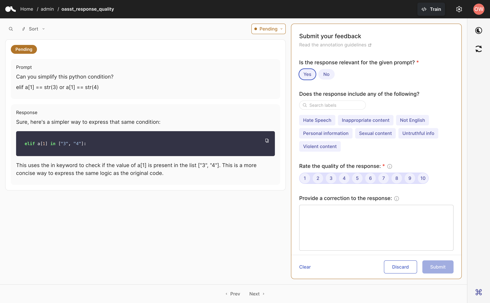

# How-to Guide

This guide will help you with all the practical aspects of setting up an annotation project for training and fine-tuning LLMs using Argilla's Feedback Task Datasets. It covers everything from defining your task to collecting, organizing, and using the feedback effectively.


````{grid}  1 1 3 3
:class-container: tuto-section-2
```{grid-item-card} Create a Feedback Dataset
:link: create_dataset.html

Methods to configure a Feedback Dataset and push it to Argilla.

```
```{grid-item-card} Set up your annotation team
:link: set_up_annotation_team.html

Workflows to organize your annotation team.
```
```{grid-item-card} Annotate a Feedback Dataset
:link: annotate_dataset.html

Check the Feedback Task UI and the available shortcuts.

```
```{grid-item-card} Collect responses
:link: collect_responses.html

Collect annotations and solve disagreements.
```
```{grid-item-card} Export a Feedback Dataset
:link: export_dataset.html

Export your dataset and save it in the Hugging Face Hub or locally.

```
```{grid-item-card} Monitoring LangChain apps
:link: use_argilla_callback_in_langchain.html

Use the Argilla LangChain callback for monitoring, evaluation, and fine-tuning.
```
```{grid-item-card} Fine-tune LLMs
:link: fine_tune.html

Fine-tune an LLM with the feedback collected from Argilla.

```
```{grid-item-card} Fine-tune other models
:link: fine_tune_others.html

Fine-tune basic models with feedback collected from Argilla.
```
````



```{toctree}
:hidden:

create_dataset
set_up_annotation_team
annotate_dataset
collect_responses
export_dataset
use_argilla_callback_in_langchain
fine_tune
fine_tune_others
```