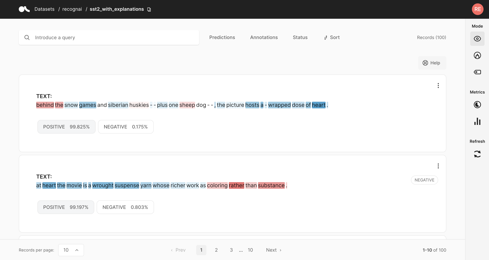
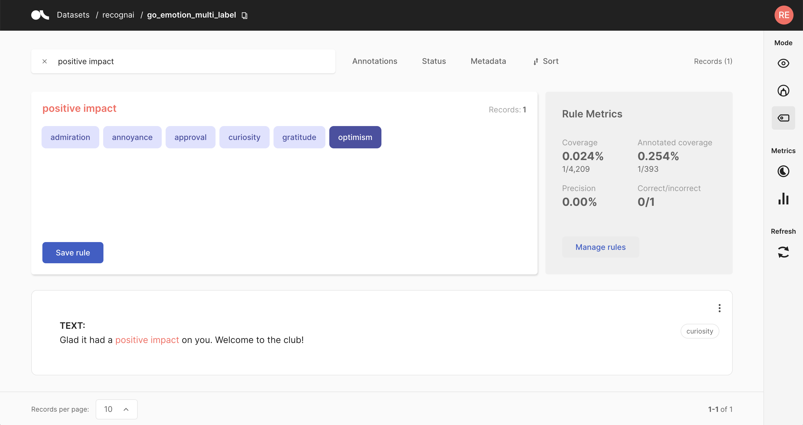

## 🔎 Explainability and bias

Explainability and bias are becoming more and more important in the world of data. Luckily, Argilla was developed with data-centricity in mind, which means we have some nice tailormade features that deal with these topics.
### Certainty filters
#### Oops! Something is missing.

```{include} /_common/general.md
```

### Token attributions



Argilla enables you to register token attributions as part of the dataset records. For getting token attributions, you can use methods such as Integrated Gradients or SHAP. These methods try to provide a mechanism to interpret model predictions. The attributions work as follows:

* **[0,1] Positive attributions (in blue)** reflect those tokens that are making the model predict the specific predicted label.

* **[-1, 0] Negative attributions (in red)** reflect those tokens that can influence the model to predict a label other than the specific predicted label.

### Metrics
The Argilla package gets shipped with build-in metrics for `TextClassification`and `TokenClassification`. These provide insight in model performance, annotation correctness and training impact. For an overview of how to use them, take a look at our [metric](../features/metrics.ipynb) section.
#### Weak Supervision


Besides our more general metrics, we also provide the option to keep track of the impact of weak supervision rules. This impact is determined by testing against verified annotated data and unannotated data, which gives you an understanding of how the rules perform in real-life and what percentage of the data is influenced by them.

### Data Drift and Data Shift

#### Oops! Something is missing.

```{include} /_common/general.md
```