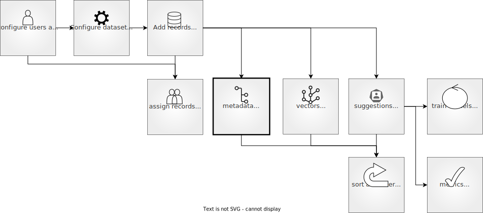

# Metadata

## Feedback Dataset

```{include} /_common/feedback_dataset.md
```



##### Define `metadata_properties`

Metadata properties allow you to configure the use of metadata information for the filtering and sorting features available in the UI and Python SDK.

You can define metadata properties using the Python SDK by providing the following arguments:

- `name`: The name of the metadata property, as it will be used internally.
- `title` (optional): The name of the metadata property, as it will be displayed in the UI. Defaults to the `name` value, but capitalized.
- `visible_for_annotators` (optional): A boolean to specify whether the metadata property will be accessible for users with an `annotator` role in the UI (`True`), or if it will only be visible for users with `owner` or `admin` roles (`False`). It is set to `True` by default.

The following arguments apply to specific metadata types:
- `values` (optional): In a `TermsMetadataProperty`, you can pass a list of valid values for this metadata property, in case you want to run a validation. If none are provided, the list of values will be computed from the values provided in the records.
- `min` (optional): In an `IntegerMetadataProperty` or a `FloatMetadataProperty`, you can pass a minimum valid value. If none is provided, the minimum value will be computed from the values provided in the records.
- `max` (optional): In an `IntegerMetadataProperty` or a `FloatMetadataProperty`, you can pass a maximum valid value. If none is provided, the maximum value will be computed from the values provided in the records.

```{include} /_common/tabs/metadata_types.md
```

```{note}
You can also define metadata properties after the dataset has been configured or add them to an existing dataset in Argilla. To do that use the `add_metadata_property` method as explained [here](/practical_guides/create_dataset.md).
```

ds.metadata_property_by_name("groups")
# rg.TermsMetadataProperty(
#     name="groups",
#     title="Annotation groups",
#     values=["group-a", "group-b", "group-c"]
# )
```


## Configuration
This works for both local and remote `FeedbackDataset` instances.
```python
# Add metadata to the dataset
ds = rg.FeedbackDataset(...)

metadata = rg.TermsMetadataProperty(name="metadata", values=["like", "dislike"])

ds.add_metadata_property(metadata)

# Delete a metadata property
ds.delete_metadata_properties(metadata_properties="metadata")


#### Format `metadata`
Record metadata can include any information about the record that is not part of the fields in the form of a dictionary. If you want the metadata to correspond with the metadata properties configured for your dataset so that these can be used for filtering and sorting records, make sure that the key of the dictionary corresponds with the metadata property `name`. When the key doesn't correspond, this will be considered extra metadata that will get stored with the record (as long as `allow_extra_metadata` is set to `True` for the dataset), but will not be usable for filtering and sorting.

```python
record = rg.FeedbackRecord(
    fields={...},
    metadata={"source": "encyclopedia", "text_length":150}
)
```

## Other datasets

https://docs.argilla.io/en/latest/reference/python/python_client.html#argilla.client.models.Text2TextRecord.prediction_as_tuples

https://docs.argilla.io/en/latest/tutorials/notebooks/labelling-tokenclassification-skweak-weaksupervision.html