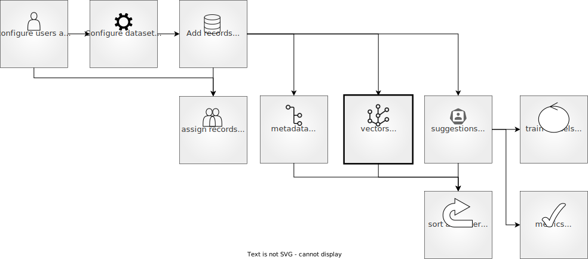

# Vectors

## Feedback Dataset

```{include} /_common/feedback_dataset.md
```




##### Define `vectors_settings`

To use the similarity search in the UI and the Python SDK, you will need to configure vector settings. These are defined using the SDK as a list of up to 5 vectors. They have the following arguments:

- `name`: The name of the vector, as it will appear in the records.
- `dimensions`: The dimensions of the vectors used in this setting.
- `title` (optional): A name for the vector to display in the UI for better readability.

```python
vectors_settings = [
    rg.VectorSettings(
        name="my_vector",
        dimensions=768
    ),
    rg.VectorSettings(
        name="my_other_vector",
        title="Another Vector", # optional
        dimensions=768
    )
]
```


## Configuration
This works for both local and remote `FeedbackDataset` instances.
```python
ds = rg.FeedbackDataset(...)

# Add vector settings to the dataset
ds.add_vector_settings(rg.VectorSettings(name="my_new_vectors", dimensions=786))

# Change vector settings title
vector_cfg = ds.vector_settings_by_name("my_vector")
vector_cfg.title = "Old vectors"
ds.update_vectors_settings(vector_cfg)

# Delete vector settings
ds.delete_vectors_settings("my_vectors")


#### Format `vectors`
You can associate vectors, like text embeddings, to your records. This will enable the [semantic search](filter_dataset.md#semantic-search) in the UI and the Python SDK. These are saved as a dictionary, where the keys corresponds to the `name`s of the vector settings that were configured for your dataset and the value is a list of floats. Make sure that the length of the list corresponds to the dimensions set in the vector settings.

```{hint}
Vectors should have the following format `List[float]`. If you are using numpy arrays, simply convert them using the method `.tolist()`.
```

```python
record = rg.FeedbackRecord(
    fields={...},
    vectors={"my_vector": [...], "my_other_vector": [...]}
)
```


## Other datasets

https://docs.argilla.io/en/latest/practical_guides/annotation_workflows/semantic_search.html#configure-your-dataset