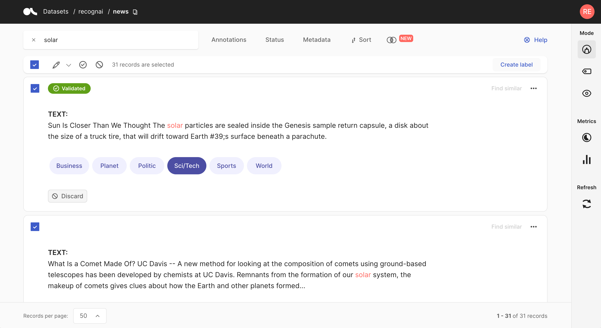
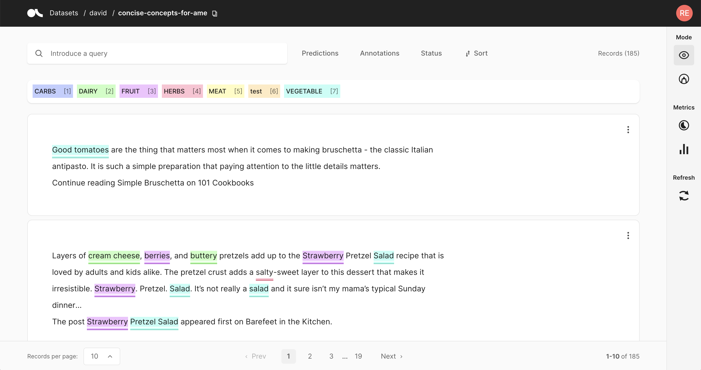
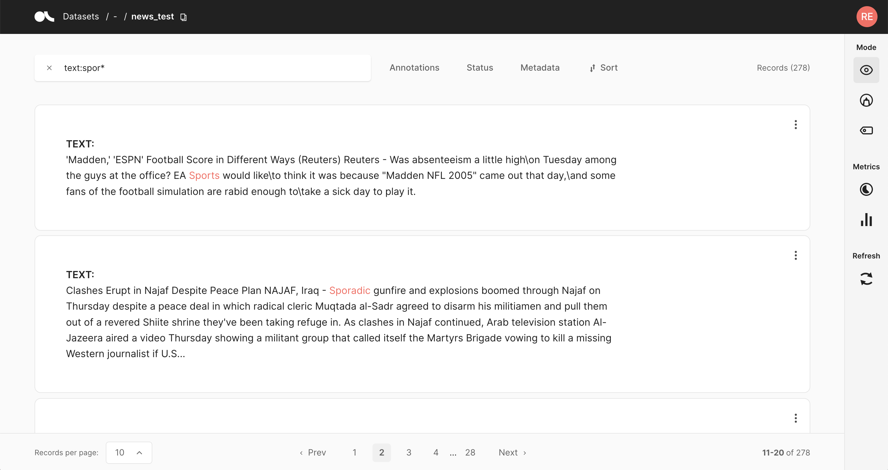
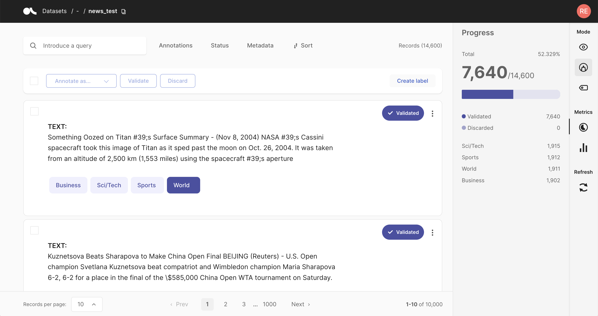

(features)=
# Features

## Annotate records



The Argilla UI has a dedicated mode to quickly label your data in a very intuitive way, or revise previous gold labels and correct them.
Argilla's powerful search and filter functionalities, together with potential model predictions, can guide the annotation process and support the annotator.

You can access the _Annotate mode_ via the sidebar of the [Dataset page](dataset.md).

### Create labels


For the text and token classification tasks, you can create new labels within the _Annotate mode_.
On the right side of the bulk validation bar, you will find a _"+ Create new label"_ button that lets you add new labels to your dataset.

### Annotate

To annotate the records, the Argilla UI provides a simple and intuitive interface that tries to follow the same interaction pattern as in the [Explore mode](explore_records.md).
As in the _Explore mode_, the record cards in the _Annotate mode_ are also customized depending on the [task](../../guides/task_examples.ipynb) of the dataset.

#### Text Classification


When switching in the _Annotate mode_ for a text classification dataset, the labels in the record cards become clickable and you can annotate the records by simply clicking on them.
For multi-label classification tasks, you can also annotate a record with no labels by either validating an empty selection or deselecting all labels.

Once a record is annotated, it will be marked as _Validated_ in the upper right corner of the record card.

#### Token Classification


For token classification datasets, you can highlight words (tokens) in the text and annotate them with a label.
Under the hood, the highlighting takes advantage of the `tokens` information in the [Token Classification data model](../python/python_client.rst#Argilla.client.models.TokenClassificationRecord).
You can also remove annotations by hovering over the highlights and pressing the _X_ button.

After modifying a record, either by adding or removing annotations, its status will change to _Pending_ and a _Save_ button will appear.
Once a record is saved, its status will change to _Validated_.

#### TextGeneration


For TextGeneration datasets, you have a text box available, in which you can draft or edit an annotation.
After editing or drafting your annotation, don't forget to save your changes.

### Bulk annotate


For all [tasks](../../guides/task_examples.ipynb), you can **bulk validate** the predictions of the records.
You can either select the records one by one with the selection box on the upper left of each card, or you can use the global selection box below the search bar, which will select all records shown on the page.
Then you can either _Validate_ or _Discard_ the selected records.

For the text classification task, you can additionally **bulk annotate** the selected records with a specific label, by simply selecting the label from the _"Annotate as ..."_ list.

### Validate predictions

In Argilla you can pre-annotate your data by including model predictions in your records.
Assuming that the model works reasonably well on your dataset, you can filter for records with high prediction scores, and simply _validate_ their predictions to quickly annotate records.

#### Text Classification

For this task, model predictions are shown as percentages in the label tags.
You can validate the predictions shown in a slightly darker tone by pressing the _Validate_ button:

- for a **single label** classification task, this will be the prediction with the highest percentage
- for a **multi label** classification task, this will be the predictions with a percentage above 50%

#### Token Classification

For this task, predictions are shown as underlines.
You can also validate the predictions (or the absence of them) by pressing the _Validate_ button.

Once the record is saved or validated, its status will change to _Validated_.

#### TextGeneration

You can validate or edit a prediction, by first clicking on the _view predictions_ button, and then the _Edit_ or _Validate_ button.
After editing or drafting your annotation, don't forget to save your changes.

### Search and filter


The powerful search bar allows you to do simple, quick searches, as well as complex queries that take full advantage of Argilla's [data models](../python/python_client.rst#module-Argilla.client.models).
In addition, the _filters_ provide you a quick and intuitive way to filter and sort your records with respect to various parameters, including the metadata of your records.
For example, you can use the **Status filter** to hide already annotated records (_Status: Default_), or to only show annotated records when revising previous annotations (_Status: Validated_).

You can find more information about how to use the search bar and the filters in our detailed [search guide](search_records.md) and [filter guide](filter_records.md).

```{note}
Not all filters are available for all [tasks](../../guides/task_examples.ipynb).
```

### Progress metric


From the sidebar you can access the _Progress metrics_.
There you will find the progress of your annotation session, the distribution of validated and discarded records, and the label distribution of your annotations.

You can find more information about the metrics in our dedicated [metrics guide](view_dataset_metrics.md).


## Weak labelling


The Argilla UI has a dedicated mode to find good **heuristic rules**, also often referred to as _labeling functions_, for a [weak supervision](https://www.snorkel.org/blog/weak-supervision) workflow.
As shown in our [guide](../../guides/weak-supervision.ipynb) and [tutorial](../../tutorials/labelling-textclassification-sentencetransformers-weaksupervision.ipynb), these rules allow you to quickly annotate your data with noisy labels in a semiautomatic way.

You can access the _Weak labelling_ mode via the sidebar of the [Dataset page](dataset.md).

```{note}
The _Weak labelling_ mode is only available for text classification datasets.
```

### Query plus labels


A rule in Argilla basically applies a chosen set of labels to a list of records that match a given [query](search_records.md), so all you need is a query plus labels.
After entering a query in the search bar and selecting one or multiple labels, you will see some [metrics](#rule-metrics) for the rule on the right and the matches of your query in the record list below.

```{warning}
Filters are not part of the rule, but are applied to the record list.
This means, if you have filters set, the record list does not necessarily correspond to the records affected by the rule.
```

If you are happy with the metrics and/or the matching record list, you can save the rule by clicking on "Save rule".
In this way it will be stored as part of the current dataset and can be accessed via the [manage rules](#manage-rules) button.

```{hint}
If you want to add labels to the available list of labels, you can switch to the [Annotation mode](annotate_records.md) and create labels there.
```

### Rule Metrics


After entering a query and selecting labels, Argilla provides you with some key metrics about the rule.
Some metrics are only available if your dataset has also annotated records.

- **Coverage**: Percentage of records labeled by the rule.
- **Annotated coverage**: Percentage of annotated records labeled by the rule.
- **Correct/incorrect**: Number of labels the rule predicted correctly/incorrectly with respect to the annotations.
- **Precision**: Percentage of correct labels given by the rule with respect to the annotations.

```{note}
For multi-label classification tasks, we only count wrongly predicted labels as incorrect, not labels that the rule misses.
```

#### Overall rule metrics


From the [right sidebar](dataset.md#sidebar) you can access the **Overall rule metrics**.
Here you will find the aggregated metrics, such as the coverages, the average precision and the total number of correctly/incorrectly predicted labels.
You can also find an overview about how many rules you saved and how they are distributed with respect to their labels.

```{hint}
If you struggle to increase the overall coverage, try to filter for the records that are not covered by your rules via the [Annotation filter](filter_records.md#annotations-filter).
```

### Manage rules


Here you will see a list of your saved rules.
You can edit a rule by clicking on its name, or delete it by clicking on the trash icon.

## Explore records



If you want to explore your dataset or analyze the predictions of a model, the Argilla UI offers a dedicated Explore mode.
The powerful search functionality and intuitive filters allow you to quickly navigate through your records and dive deep into your dataset.
At the same time, you can view the predictions and compare them to gold annotations.

You can access the _Explore mode_ via the sidebar of the [Dataset page](dataset.md).

### Search and filter


The powerful search bar allows you to do simple, quick searches, as well as complex queries that take full advantage of Argilla's [data models](../python/python_client.rst#module-Argilla.client.models).
In addition, the _filters_ provide you a quick and intuitive way to filter and sort your records with respect to various parameters, including predictions and annotations.
Both of the components can be used together to dissect in-depth your dataset, validate hunches, and find specific records.

You can find more information about how to use the search bar and the filters in our detailed [search guide](search_records.md) and [filter guide](filter_records.md).

```{note}
Not all filters are available for all [tasks](../../guides/task_examples.ipynb).
```

### Predictions and annotations

Predictions and annotations are an integral part of Argilla's [data models](../python/python_client.rst#module-Argilla.client.models).
The way they are presented in the Argilla UI depends on the [task](../../guides/task_examples.ipynb) of the dataset.

#### Text classification


In this task the predictions are given as tags below the input text.
They contain the label as well as a percentage score.
Annotations are shown as tags on the right together with a symbol indicating if the predictions match the annotations or not.

```{note}
When the dataset contains a large list of labels (10 +) we encourage viewing the record one by one (from the footer) and using the arrow keys to move quickly to the next record.
```

#### Token classification


In this task, predictions and annotations are displayed as highlights in the input text. To easily identify them at a glance, **annotations** are highlighted with the color of their corresponding label, while **predictions** are underlined with a solid line (see picture).

For datasets with available score, the solid line for **predictions** disappears when the **score filter** (in **Predictions filter** section) is applied.

#### TextGeneration


In this task predictions and the annotation are given in a text field below the input text.
You can switch between prediction and annotation via the "_View annotation_"/"_View predictions_" buttons.
For the predictions you can find an associated score in the lower left corner.
If you have multiple predictions you can toggle between them using the arrows on the button of the record card.

### Metrics


From the side bar you can access the [_Stats_ metrics](pages.md) that provide support for your analysis of the dataset.


## Search Records



The search bar in Argilla is driven by Elasticsearch's powerful [query string syntax](https://www.elastic.co/guide/en/elasticsearch/reference/7.10/query-dsl-query-string-query.html#query-string-syntax).

It allows you to perform simple fuzzy searches of words and phrases, or complex queries taking full advantage of Argilla's data model.

Check out the [query guide](../../guides/queries.md) for a comprehensive guide on how to search in the Argilla UI.

## Filter Records

The Argilla UI provides a set of filters that help you to quickly and conveniently navigate your records.
For example, you can filter records by their predictions, by a specific metadata, or choose to only view records that are missing annotations.
The filters are available in all [modes](dataset.md#modes) of the UI.

```{hint}
You can also filter the records through the search bar by means of [queries](../../guides/queries.md).
```

```{note}
Not all filters listed below are available for all [tasks](../../guides/task_examples.ipynb).
```

### Predictions filter


This filter allows you to filter records with respect of their predictions:

- **Predicted as**: filter records by their predicted labels
- **Predicted ok**: filter records whose predictions do, or do not, match the annotations
- **Score**: filter records with respect to the score of their prediction
- **Predicted by**: filter records by the [prediction agent](../python/python_client.rst#module-argilla.client.models)

### Annotations filter


This filter allows you to filter records with respect to their annotations:

- **Annotated as**: filter records with respect to their annotated labels
- **Annotated by**: filter records by the [annotation agent](../python/python_client.rst#module-argilla.client.models)
- **Only records not covered by rules**: this option only appears if you [defined rules](define_rules.md) for your dataset.
  It allows you to show only records that are **not** covered by your rules.

### Status filter


This filter allows you to filter records with respect to their status:

- **Default**: records without any annotation or edition
- **Validated**: records with validated annotations
- **Edited**: records with annotations but still not validated

### Metadata filter


This filter allows you to filter records with respect to their metadata.

```{hint}
Nested metadata will be flattened and the keys will be joint by a dot.
```

### Sort records


With this component you can sort the records by various parameters, such as the predictions, annotations or their metadata.

### Examples

Here we will provide a few examples how you can take advantage of the filters for different use cases.

#### Missing annotations

If you are annotating records and want to display only records that do not have an annotation yet, you can set the [status filter](#status-filter) to **Default**.

#### Low scores

If you uploaded model predictions and want to check for which records the model still struggles, you can use the [score filter](#predictions-filter) to filter records with a low score.

#### High loss

If you logged the *model loss* as a metadata for each record, you can [sort the records](#sort-records) by this loss in descending order to see records for which the model disagrees with the annotations (see this [tutorial](../../tutorials/08-error_analysis_using_loss.ipynb) for an example).


## View dataset metrics



The **Dataset Metrics** are part of the **Sidebar** placed on the right side of **Argilla datasets**. To know more about this component, click [here](dataset.md).

Argilla metrics are very convenient in terms of assesing the status of the dataset, and to extract valuable information.

### How to use Metrics

Metrics are composed of two submenus: **Progress** and **Stats**. These submenus might be different for **Token** and **Text Classification** tasks, as well as for the different modes (especially the **Weak labelling mode**).

#### Progress

This submenu is useful when users need to know how many records have been annotated, validated and/or discarded.

##### Annotation and Explore modes

When clicking on this menu, not only the progress is shown. The number of records is also displayed, as well as the number of labeled records or entities that are **validated** or **discarded**.


##### Weak labelling mode

In this mode, **progress** is related to the coverage of the rules. It shows the **model coverage** and the **annotated coverage**, and also the **precision average** and the number of correct and incorrect results.

In the **total rules** section, users can find the number of rules related to the different categories.


#### Stats

This submenu allows users to know more about the keywords of the dataset.

##### Explore and Weak labelling mode

In both modes, the **Keywords** list displays a list of relevant words and the number of occurrences.

##### Annotation mode

In the **annotation mode**, the stats show the **mentions** (this is, the entities) which are present in the records.

This submenu has the **Predicted as** (for predictions) and the **Annotated as** (for annotation) sections, and here users can see the number of entities predicted or annotated with a specific label. The number of occurrences is ordered from highest to lowest, and the labels are also ordered in that way.


#### Refresh button

Users should click this button whenever they wanted to see the page updated. If any change is made, this button displays the updated page.


