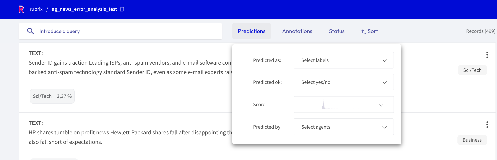
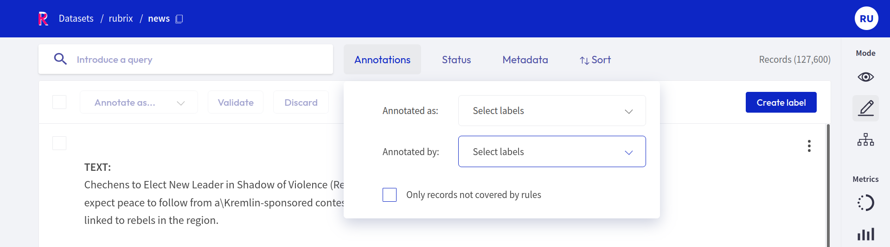
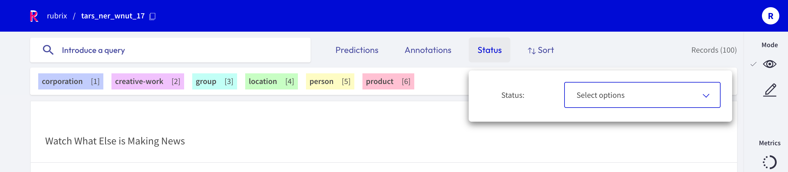
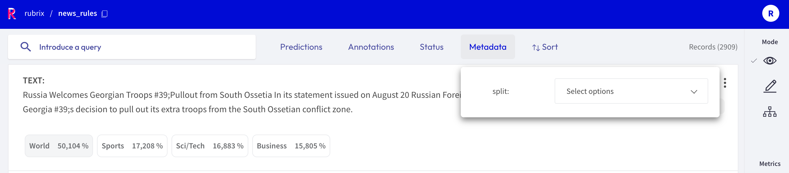
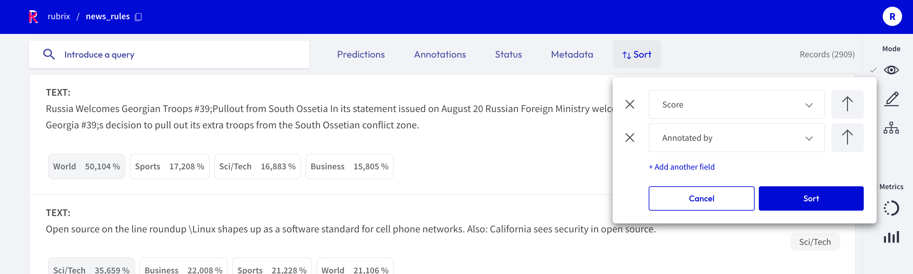

# Filter Records

The Argilla web app provides a set of filters that help you to quickly and conveniently navigate your records.
For example, you can filter records by their predictions, by a specific metadata, or choose to only view records that are missing annotations.
The filters are available in all [modes](dataset.md#modes) of the web app.

```{hint}
You can also filter the records through the search bar by means of [queries](../../guides/queries.md).
```

```{note}
Not all filters listed below are available for all [tasks](../../guides/task_examples.ipynb).
```

## Predictions filter



This filter allows you to filter records with respect of their predictions:

- **Predicted as**: filter records by their predicted labels
- **Predicted ok**: filter records whose predictions do, or do not, match the annotations
- **Score**: filter records with respect to the score of their prediction
- **Predicted by**: filter records by the [prediction agent](../python/python_client.rst#module-argilla.client.models)

## Annotations filter



This filter allows you to filter records with respect to their annotations:

- **Annotated as**: filter records with respect to their annotated labels
- **Annotated by**: filter records by the [annotation agent](../python/python_client.rst#module-argilla.client.models)
- **Only records not covered by rules**: this option only appears if you [defined rules](define_rules.md) for your dataset.
  It allows you to show only records that are **not** covered by your rules.

## Status filter



This filter allows you to filter records with respect to their status:

- **Default**: records without any annotation or edition
- **Validated**: records with validated annotations
- **Edited**: records with annotations but still not validated

## Metadata filter



This filter allows you to filter records with respect to their metadata.

```{hint}
Nested metadata will be flattened and the keys will be joint by a dot.
```

## Sort records



With this component you can sort the records by various parameters, such as the predictions, annotations or their metadata.

## Examples

Here we will provide a few examples how you can take advantage of the filters for different use cases.

### Missing annotations

If you are annotating records and want to display only records that do not have an annotation yet, you can set the [status filter](#status-filter) to **Default**.

### Low scores

If you uploaded model predictions and want to check for which records the model still struggles, you can use the [score filter](#predictions-filter) to filter records with a low score.

### High loss

If you logged the *model loss* as a metadata for each record, you can [sort the records](#sort-records) by this loss in descending order to see records for which the model disagrees with the annotations (see this [tutorial](../../tutorials/08-error_analysis_using_loss.ipynb) for an example).
