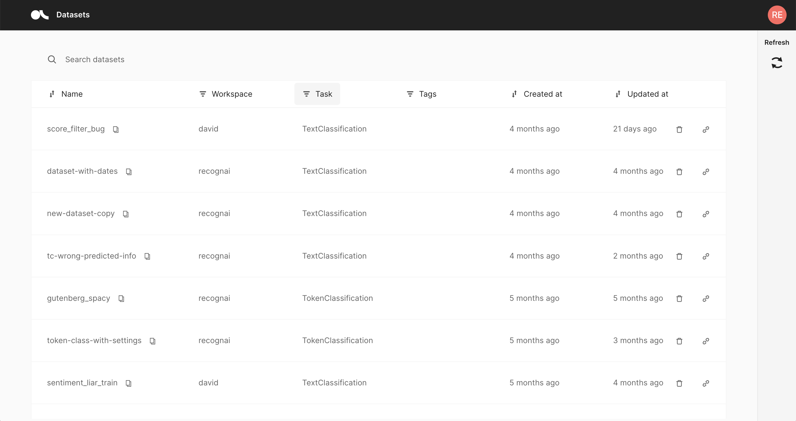
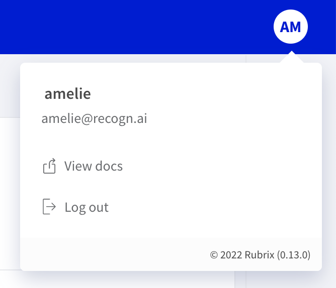

# Home page

The _Home page_ is mainly a **filterable, searchable and sortable list** of **datasets**.
It is the **entry point** to the Argilla web app and is composed of the following three components.

## Search bar

The "_Search datasets_" bar on the top allows you to search for a specific dataset by its name.

## Dataset list

In the center of the page you see the list of datasets available for **your user account**.
The list consists of following columns:

- **Name**: The name of the dataset, can be sorted alphabetically.
- **Workspace**: A filterable column showing the workspace to which the dataset belongs.
- **Task**: The [task](../../guides/task_examples.ipynb) of the dataset. This is a filterable column.
- **Tags**: User defined tags for the dataset.
- **Created at**: When was the dataset first logged by the client.
- **Updated at**: When was the dataset last modified, either via the Argilla web app or the client.

## Side bar

You can find a user icon and a refresh button on the top right:

- **User icon**: This icon shows the initials of your username and allows you to **view the documentation**, view your **current Argilla version**, and **log out**.
- **Refresh**: This button updates the list of datasets in case you just logged new data from the client.

