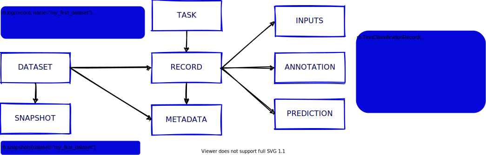

Concepts
========

The Python library and the UI are built around a few simple but key concepts. This section aims to clarify what those concepts and show you the main constructs for using Rubrix with your own models and data. Let's take a look at Rubrix's components and methods:

Dataset
-------

A dataset is a collection of records stored in Rubrix. The main things you can do with a ``Dataset`` are to ``log`` records and to ``load`` the records of a ``Dataset`` into a ``Pandas.Dataframe`` from a Python app, script, or a Jupyter/Colab notebook. 

Snapshot
--------

A snapshot is a version of a ``Dataset`` containing ``annotations`` at a given time. Snapshots can be created through the Rubrix UI so they can be loaded and used using the Python library.

Record
------

A record is a data item composed of ``inputs`` and, optionally, ``predictions`` and ``annotations``. Usually, inputs are the information your model receives (for example: 'Macbeth'). 

Think of predictions as the classification that your system made over that input (for example: 'Virginia Woolf'), and think of annotations as the ground truth that you manually assign to that input (because you know that, in this case, it would be 'William Shakespeare'). Records are defined by the type of ``Task``\ they are related to. Let's see three different examples:

Token classification record
^^^^^^^^^^^^^^^^^^^^^^^^^^^

(to complete)

.. code-block:: python

   ner_record = rb.TokenClassificationRecord(
       annotation=[],
     prediction=[]
   )

Text classification record
^^^^^^^^^^^^^^^^^^^^^^^^^^

(to complete)

.. code-block:: python

   ner_record = rb.TextClassificationRecord(
       annotation=[],
     prediction=[]
   )

Multi-label text classification record
^^^^^^^^^^^^^^^^^^^^^^^^^^^^^^^^^^^^^^

(to complete)

.. code-block:: python

   ner_record = rb.TextClassificationRecord(
       annotation=[],
     prediction=[]
   )

Task
----

A task defines the objective and shape of the predictions and annotations inside a record. [LINK a las tasks].

Annotation
----------

An annotation is a piece information assigned to a record, a label, token-level tags, or a set of labels, and typically by a human agent.

Prediction
----------

A prediction is a piece information assigned to a record, a label or a set of labels and typically by a machine process.

Metadata
--------

To complete, talk about metadata at dataset and record level

Methods
=======

rb.log
------

Register a set of logs into Rubrix. 

.. code-block:: python

   rb.log(
       rb.TextClassificationRecord(
           inputs={"text": "my first rubrix example"},
           prediction=[('spam', 0.8), ('ham', 0.2)]
       ),
       name='example-dataset'
   )

* 
  Show docstring

  .. code-block::

       Signature:
       rb.log(
           records: Union[rubrix.client.models.TextClassificationRecord, rubrix.client.models.TokenClassificationRecord, Iterable[Union[rubrix.client.models.TextClassificationRecord, rubrix.client.models.TokenClassificationRecord]]],
           name: str,
           tags: Union[Dict[str, str], NoneType] = None,
           metadata: Union[Dict[str, Any], NoneType] = None,
           chunk_size: int = 500,
       )
       Docstring:
       Register a set of logs into Rubrix

       Parameters
       ----------
       records:
           The data record object or list.
       name:
           The dataset name
       tags:
           A set of tags related to dataset. Optional
       metadata:
           A set of extra info for dataset. Optional
       chunk_size:
           The default chunk size for data bulk
       File:      ~/recognai/rubrix/venv/lib/python3.8/site-packages/rubrix/__init__.py
       Type:      function

rb.load
-------

Load a dataset or a snapshot as a Huggingface dataset.

.. code-block:: python

   rb.load(name='example-dataset')

* 
  Show docstring

  .. code-block::

       Signature:
       rb.load(
           name: str,
           snapshot: Union[str, NoneType] = None,
           ids: Union[List[Union[str, int]], NoneType] = None,
           limit: Union[int, NoneType] = None,
       ) -> pandas.core.frame.DataFrame
       Docstring:
       Load dataset/snapshot data as a huggingface dataset

       Parameters
       ----------
       name:
           The dataset name
       snapshot:
           The dataset snapshot id. Optional
       ids:
           If provided, load dataset records with given ids.
           Won't apply for snapshots
       limit:
           The number of records to retrieve

       Returns
       -------
           A pandas Dataframe
       File:      ~/recognai/rubrix/venv/lib/python3.8/site-packages/rubrix/__init__.py
       Type:      function

rb.snapshots
------------

Retrieve a dataset snapshot.

.. code-block:: python

   rb.snapshots(name='example-dataset')

* 
  Show docstring

  .. code-block::

       Signature: rb.snapshots(dataset: str) -> List[rubrix.sdk.models.dataset_snapshot.DatasetSnapshot]
       Docstring:
       Retrieve dataset snapshots

       Parameters
       ----------
       dataset:
           The dataset name

       Returns
       -------
               rA list with all DatasetSnapshot associated to the given dataset
       File:      ~/recognai/rubrix/venv/lib/python3.8/site-packages/rubrix/__init__.py
       Type:      function

rb.delete
---------

Delete a dataset with a given name.

.. code-block:: python

   rb.delete(name='example-dataset')

* 
  Show docstring

  .. code-block::

       Signature: rb.delete(name: str) -> None
       Docstring:
       Delete a dataset with given name

       Parameters
       ----------
       name:
           The dataset name
       File:      ~/recognai/rubrix/venv/lib/python3.8/site-packages/rubrix/__init__.py
       Type:      function

rb.init
-------

Client setup function. You can pass  the api url and api key via environment variables ``RUBRIX_API_URL`` and ``RUBRIX_API_KEY``\ , or via arguments of these functions. We recommend to use the environment variables, if you set them calling this function won't be necessary, magic will happen in the background.

.. code-block:: python

   rb.init(api_url='http://localhost:9090', api_key='4AkeAPIk3Y')

* 
  Show docstring

  .. code-block::

       Signature:
       rb.init(
           api_url: Union[str, NoneType] = None,
           api_key: Union[str, NoneType] = None,
           timeout: int = 60,
       )
       Docstring:
       Client setup function.

       Calling the RubrixClient init function.
       Passing an api_url disables environment variable reading, which will provide
       default values.

       Parameters
       ----------
       api_url : str
           Address from which the API is serving. It will use the default UVICORN address as default
       api_key: str
           Authentification api key. A non-secured log will be considered the default case. Optional
       timeout : int
           Seconds to considered a connection timeout. Optional
       File:      ~/recognai/rubrix/venv/lib/python3.8/site-packages/rubrix/__init__.py
       Type:      function
