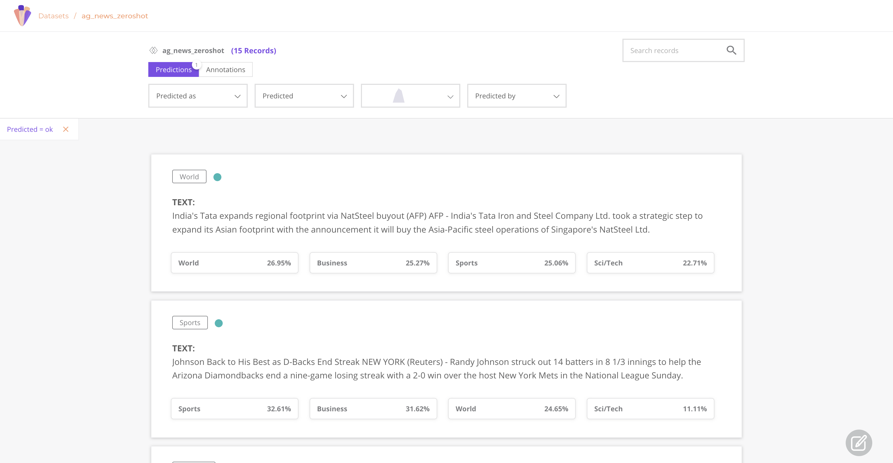

Introduction to Rubrix
======================

What's Rubrix?
--------------

`Rubrix <https://rubrix.ml>`_ is a free and open-source tool for tracking and iterating on data for AI projects. 

With Rubrix, you can:

* **Monitor** the predictions of deployed models.
* **Collect** ground-truth data for starting up a project or evolving an existing one.
* **Iterate** on ground-truth data and predictions to debug, track and improve your models over time.
* **Build** custom applications and dashboards on top of your model predictions and ground-truth data.

Rubrix is designed to enable novel, human-in-the loop workflows involving data scientists, subject matter experts and data engineers for curating, understanding and evolving data for AI projects.

We've tried to Rubrix easy, fun and seamless to use with your favourite libraries  while keeping it scalable and flexible. Rubrix's main components are:

* a **Python library**  you can install with ``pip`` to interact with your data and models,
* a **web application and a REST API,** you can launch using ``Docker`` or with a local installation.

.. image:: images/rubrix_intro.svg
   :target: images/rubrix_intro.svg
   :alt: images/rubrix_intro.svg

Rubrix's architecture and components

Rubrix currently focuses on ``natural language processing`` and ``knowledge graph`` use cases but we will be adding support for speech recognition and computer vision soon. 

Quickstart
----------

Getting started with the Rubrix is really easy, let's see a quick example using the 🤗 ``transformers`` and ``datasets`` libraries:

#. 
   Make sure you have ``Docker`` installed and run (check our **Setup and Installation[add_link]** guide for a more detailed installation process):
   
   .. code-block::

      wget -O docker-compose.yml https://raw.githubusercontent.com/recognai/rubrix/master/docker-compose.yaml && docker-compose up

   #. Install Rubrix python library (and ``transformers`` and ``datasets`` libraries for this example):

``pip install rubrix transformers datatasets``

#. Use your favourite editor or a Jupyter notebook to run the following:

.. code-block:: python

   from transformers import pipeline
   from datasets import load_dataset  
   import rubrix as rb

   model = pipeline('zero-shot-classification', model="typeform/squeezebert-mnli")

   dataset = load_dataset("ag_news", split='test[0:100]')

   for record in dataset:
       # Our labels are: ['World', 'Sports', 'Business', 'Sci/Tech']
       prediction = model(record['text'], dataset.features["label"].names) 

       item = rb.TextClassificationRecord(
           inputs={"text": record["text"]},
           prediction=list(zip(prediction['labels'], prediction['scores'])), 
           annotation=categories[record["label"]]
       )

       rb.log(item, name="ag_news_zeroshot")

[here we will include a short video, or gif]

Next steps
----------

[here we describe the docs structure with links to subsections: what and who are they for]

* **Setup and installation**
* **Concepts**
* **Tutorials**
* **Guides**
* **Reference**
* **Community**
