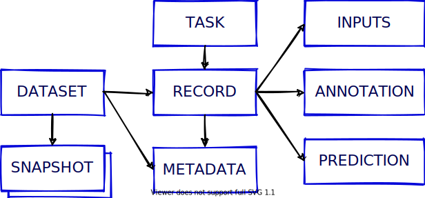

.. _concepts:

Concepts
========

In this section, we introduce the core concepts of Rubrix. These concepts are important for understanding how to interact with the tool and its core Python client.

We have two main sections: Rubrix data model and Python client API methods.

Rubrix data model
-----------------

The Python library and the web app are built around a few simple concepts.
This section aims to clarify what those concepts are and to show you the main constructs for using Rubrix with your own models and data.
Let's take a look at Rubrix's components and methods:

Dataset
^^^^^^^

A dataset is a collection of records stored in Rubrix. The main things you can do with a ``Dataset`` are to ``log`` records and to ``load`` the records of a ``Dataset`` into a ``Pandas.Dataframe`` from a Python app, script, or a Jupyter/Colab notebook. 

Record
^^^^^^

A record is a data item composed of ``inputs`` and, optionally, ``predictions`` and ``annotations``. Usually, inputs are the information your model receives (for example: 'Macbeth'). 

Think of predictions as the classification that your system made over that input (for example: 'Virginia Woolf'), and think of annotations as the ground truth that you manually assign to that input (because you know that, in this case, it would be 'William Shakespeare'). Records are defined by the type of ``Task``\ they are related to. Let's see three different examples:

Text classification record
"""""""""""""""""""""""""""

Text classification deals with predicting in which categories a text fits. As if you're shown an image you could quickly tell if there's a dog or a cat in it, we build NLP models to distinguish between a Jane Austen's novel or a Charlotte Bronte's poem. It's all about feeding models with labelled examples and seeing how they start predicting over the very same labels.

Let's see examples of a spam classifier.

.. code-block:: python

    record = rb.TextClassificationRecord(
        inputs={
            "text": "Access this link to get free discounts!"
        },
        prediction = [('SPAM', 0.8), ('HAM', 0.2)]
        prediction_agent = "link or reference to agent",

        annotation = "SPAM",
        annotation_agent= "link or reference to annotator",

        metadata={  # Information about this record
            "split": "train"
        },

   )

Multi-label text classification record
""""""""""""""""""""""""""""""""""""""

Another similar task to Text Classification, but yet a bit different, is Multi-label Text Classification. Just one key difference: more than one label may be predicted. While in a regular Text Classification task we may decide that the tweet "I can't wait to travel to Egypts and visit the pyramids" fits into the hastag #Travel, which is accurate, in Multi-label Text Classification we can classify it as more than one hastag, like #Travel #History #Africa #Sightseeing #Desert.

.. code-block:: python

   record = rb.TextClassificationRecord(
        inputs={
            "text": "I can't wait to travel to Egypts and visit the pyramids"
        },
        multi_label = True,

        prediction = [('travel', 0.8), ('history', 0.6), ('economy', 0.3), ('sports', 0.2)],
        prediction_agent = "link or reference to agent",

        # When annotated, scores are suppoused to be 1
        annotation = ['travel', 'history'],   # list of all annotated labels,
        annotation_agent= "link or reference to annotator",

        metadata={  # Information about this record
            "split": "train"
        },

   )

Token classification record
"""""""""""""""""""""""""""

Token classification kind-of-tasks are NLP tasks aimed to divide the input text into words, or syllabes, and assign certain values to them. Think about giving each word in a sentence its gramatical category, or highlight which parts of a medical report belong to a certain speciality. There are some popular ones like NER or POS-tagging.

.. code-block:: python

    record = rb.TokenClassificationRecord(
        text = "Michael is a professor at Harvard",
        tokens = token_list,

        # Predictions are a list of tuples with all your token labels and its starting and ending positions
        prediction = [('NAME', 0, 7), ('LOC', 26, 33)],
        prediction_agent = "link or reference to agent",

        # Annotations are a list of tuples with all your token labels and its starting and ending positions
        annotation = [('NAME', 0, 7), ('ORG', 26, 33)],
        annotation_agent = "link or reference to annotator",

        metadata={  # Information about this record
            "split": "train"
            },
        )

Task
^^^^

A task defines the objective and shape of the predictions and annotations inside a record. You can see our supported tasks at :ref:`tasks`

Annotation
^^^^^^^^^^

An annotation is a piece information assigned to a record, a label, token-level tags, or a set of labels, and typically by a human agent.

Prediction
^^^^^^^^^^

A prediction is a piece information assigned to a record, a label or a set of labels and typically by a machine process.

Metadata
^^^^^^^^

Metada will hold extra information that you want your record to have: if it belongs to the training or the test dataset, a quick fact about something regarding that specific record... Feel free to use it as you need! 

Methods
-------

To find more information about these methods, please check out the :ref:`python_client`.

rb.init
^^^^^^^

Setup the python client: :meth:`rubrix.init`

rb.log
^^^^^^

Register a set of logs into Rubrix: :meth:`rubrix.log`

rb.load
^^^^^^^

Load a dataset as a pandas DataFrame: :meth:`rubrix.load`

rb.delete
^^^^^^^^^

Delete a dataset with a given name: :meth:`rubrix.delete`

