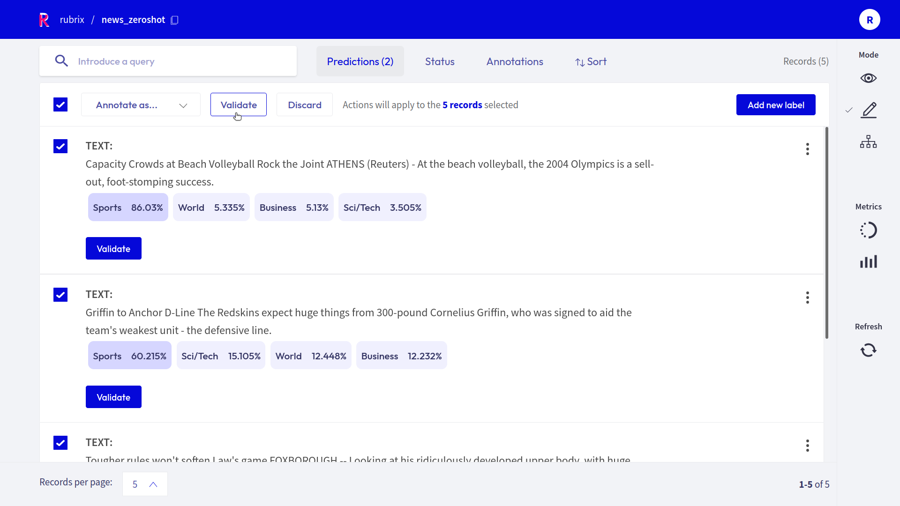

.. rubrix documentation master file, created by
   sphinx-quickstart on Fri Mar 26 17:19:26 2021.
   You can adapt this file completely to your liking, but it should at least
   contain the root `toctree` directive.

Welcome to Rubrix
=================

.. raw:: html

   <video width="100%" controls><source src="https://user-images.githubusercontent.com/1107111/148930791-ed4c3640-aa74-41b1-bfc5-5717e137bc1b.mp4" type="video/mp4"></video>

What's Rubrix?
--------------

`Rubrix <https://rubrix.ml>`_ is a **production-ready Python framework for exploring, annotating, and managing data** in NLP projects.

Key features:

- **Open**: Rubrix is free, open-source, and 100% compatible with major NLP libraries (Hugging Face transformers, spaCy, Stanford Stanza, Flair, etc.). In fact, you can **use and combine your preferred libraries** without implementing any specific interface.

- **End-to-end**: Most annotation tools treat data collection as a one-off activity at the beginning of each project. In real-world projects, data collection is a key activity of the iterative process of ML model development. Once a model goes into production, you want to monitor and analyze its predictions, and collect more data to improve your model over time. Rubrix is designed to close this gap, enabling you to **iterate as much as you need**.

- **User and Developer Experience**: The key to sustainable NLP solutions is to make it easier for everyone to contribute to projects. *Domain experts* should feel comfortable interpreting and annotating data. *Data scientists* should feel free to experiment and iterate. *Engineers* should feel in control of data pipelines. Rubrix optimizes the experience for these core users to **make your teams more productive**.

- **Beyond hand-labeling**: Classical hand labeling workflows are costly and inefficient, but having humans-in-the-loop is essential. Easily combine hand-labeling with active learning, bulk-labeling, zero-shot models, and weak-supervision in **novel data annotation workflows**.

Rubrix currently supports several ``natural language processing`` and ``knowledge graph`` use cases but we'll be adding support for speech recognition and computer vision soon.

Quickstart
----------

Getting started with Rubrix is easy, let's see a quick example using the 🤗 ``transformers`` and ``datasets`` libraries:

.. code-block:: bash

   pip install rubrix[server]==0.12.1 transformers[torch] datasets

If you don't have `Elasticsearch (ES) <https://www.elastic.co/elasticsearch>`__ running, make sure you have `Docker` installed and run:

.. note::
   Check the :ref:`setup and installation section <setup-and-installation>` for further options and configurations regarding Elasticsearch.

.. code-block:: bash

   docker run -d \
     --name elasticsearch-for-rubrix \
     -p 9200:9200 -p 9300:9300 \
     -e "ES_JAVA_OPTS=-Xms512m -Xmx512m" \
     -e "discovery.type=single-node" \
     docker.elastic.co/elasticsearch/elasticsearch-oss:7.10.2

Then simply run:

.. code-block:: bash

   python -m rubrix

Afterward, you should be able to access the web app at `http://localhost:6900/ <http://localhost:6900/>`__.
**The default username and password are** ``rubrix`` **and** ``1234``.

Now, let's see an example: **Bootstraping data annotation with a zero-shot classifier**

**Why**:

- The availability of pre-trained language models with zero-shot capabilities means you can, sometimes, accelerate your data annotation tasks by pre-annotating your corpus with a pre-trained zeroshot model.
- The same workflow can be applied if there is a pre-trained "supervised" model that fits your categories but needs fine-tuning for your own use case. For example, fine-tuning a sentiment classifier for a very specific type of message.

**Ingredients**:

- A zero-shot classifier from the 🤗 Hub: `typeform/distilbert-base-uncased-mnli`
- A dataset containing news
- A set of target categories: `Business`, `Sports`, etc.

**What are we going to do**:

1. Make predictions and log them into a Rubrix dataset.
2. Use the Rubrix web app to explore, filter, and annotate some examples.
3. Load the annotated examples and create a training set, which you can then use to train a supervised classifier.

Use your favourite editor or a Jupyter notebook to run the following:

.. code-block:: python

   from transformers import pipeline
   from datasets import load_dataset
   import rubrix as rb

   model = pipeline('zero-shot-classification', model="typeform/squeezebert-mnli")

   dataset = load_dataset("ag_news", split='test[0:100]')

   labels = ['World', 'Sports', 'Business', 'Sci/Tech']

   records = []
   for record in dataset:
       prediction = model(record['text'], labels)

       records.append(
           rb.TextClassificationRecord(
               inputs=record["text"],
               prediction=list(zip(prediction['labels'], prediction['scores'])),
           )
       )

   rb.log(records, name="news_zeroshot")

Now you can explore the records in the Rubrix UI at `http://localhost:6900/ <http://localhost:6900/>`_.
**The default username and password are** ``rubrix`` **and** ``1234``.

Let's filter the records predicted as `Sports` with high probability and use the bulk-labeling feature for labeling 5 records as `Sports`:

After a few iterations of data annotation, we can load the Rubrix dataset and create a training set to train or fine-tune a supervised model.

.. code-block:: python

   # load the Rubrix dataset as a pandas DataFrame
   rb_df = rb.load(name='news_zeroshot')

   # filter annotated records
   rb_df = rb_df[rb_df.status == "Validated"]

   # select text input and the annotated label
   train_df = pd.DataFrame({
      "text": rb_df.inputs.transform(lambda r: r["text"]),
      "label": rb_df.annotation,
   })

Use cases
---------

* **Model monitoring and observability:** log and observe predictions of live models.
* **Ground-truth data collection**: collect labels to start a project from scratch or from existing live models.
* **Evaluation**: easily compute "live" metrics from models in production, and slice evaluation datasets to test your system under specific conditions.
* **Model debugging**: log predictions during the development process to visually spot issues.
* **Explainability:** log things like token attributions to understand your model predictions.

Next steps
----------

The documentation is divided into different sections, which explore different aspects of Rubrix:

* :ref:`setup-and-installation`
* :ref:`concepts`
* **Tutorials**
* **Guides**
* **Reference**

Community
---------
You can join the conversation on our Github page and our Github forum.

* `Github page <https://github.com/recognai/rubrix>`_
* `Github forum <https://github.com/recognai/rubrix/discussions>`_

.. toctree::
   :maxdepth: 3
   :caption: Getting Started
   :hidden:

   getting_started/setup&installation
   getting_started/concepts
   getting_started/user-management
   getting_started/advanced_setup_guides

.. toctree::
   :maxdepth: 3
   :caption: Guides
   :hidden:

   guides/cookbook
   guides/task_examples
   guides/weak-supervision
   guides/monitoring
   guides/metrics
   guides/datasets

.. toctree::
   :maxdepth: 3
   :caption: Tutorials
   :hidden:

   tutorials/01-labeling-finetuning
   tutorials/weak-supervision-with-rubrix
   tutorials/02-spacy
   tutorials/05-active_learning
   tutorials/find_label_errors
   tutorials/07-zeroshot_ner
   tutorials/08-error_analysis_using_loss
   tutorials/09-automatic_fastapi_log
   tutorials/skweak

.. toctree::
   :maxdepth: 4
   :caption: Reference
   :hidden:

   reference/python/index
   reference/webapp/index

.. toctree::
   :maxdepth: 2
   :caption: Community
   :hidden:

   community/developer_docs
   Github page <https://github.com/recognai/rubrix>
   Discussion forum <https://github.com/recognai/rubrix/discussions>
