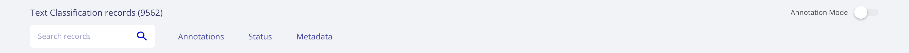

.. _webapp_reference:

Rubrix UI reference
========================
This section contains a quick overview of the Rubrix web-app's User Interface (UI).

The web-app has two main pages: the **Home** page and the **Dataset** page.

Home page
---------
The **Home page** is the entry point to Rubrix Datasets. 

Specifically, it is a searchable and sortable list of datasets with the following attributes:

- **Name**
- **Tags**, which displays the ``tags`` passed to the ``rubrix.log`` method. Tags are useful to organize your datasets by project, model, status and any other dataset attribute you can think of.
- **Task**, which is defined by the type of ``Records`` logged into the dataset.
- **Created at**, which corresponds to the timestamp of the Dataset creation. Datasets in Rubrix are created by directly using ``rb.log`` to log a collection of records.
- **Updated at**, which corresponds to the timestamp of the last update to this dataset, either by adding/changing/removing some annotations with the UI or via the Python client or the REST API.

.. image:: ../images/reference/ui/home_page.png
   :alt: Rubrix Home page view

Dataset page
------------
The **Dataset page** is the main workspace for exploring and annotating Datasets in Rubrix. Every Task has its own specialized components, while keeping a similar layout and structure.

Search components
^^^^^^^^^^^^^^^^^
The Rubrix Dataset page is built around search features. The search bar gives users quick filters for easily exploring and selecting dataset subsets.

The main sections of the search-bar are following:

**Search input**

This component enables:

*Full-text queries* over all record ``inputs``.

*Queries using Elasticsearch's query DSL* with the `query string syntax <https://www.elastic.co/guide/en/elasticsearch/reference/current/query-dsl-query-string-query.html#query-string-syntax>`_\, which enables powerful queries for advanced users, using the Rubrix data model. Some examples are:

``inputs.text:(women AND feminists)``, records containing "women" AND "feminist" in the inputs.text field.

``inputs.text:(NOT women)``, records NOT containing women in the inputs.text field.

``inputs.hypothesis:(not OR don't)``, records containing women in the inputs.text field.

``metadata.format:pdf AND metadata.page_number>1``, records with metadata.format equals pdf and with metadata.page_number greater than 1.

``NOT(_exists_:metadata.format)``, records that don't have a metadata.format.

.. image:: ../images/reference/ui/es_query_dsl_string.png
   :alt: Search input with Elasticsearch DSL query string

**Predictions filters**

**Annotations filters**

.. image:: ../images/reference/ui/annotation_filters.png
   :alt: Rubrix annotation filters

**Status filters**

.. image:: ../images/reference/ui/status_filters.png
   :alt: Rubrix status filters

**Metadata filters**

**Active query parameters**

.. image:: ../images/reference/ui/active_query_params.png
   :alt: Active query params bar

Explore mode
^^^^^^^^^^^^

Annotation mode
^^^^^^^^^^^^^^^

