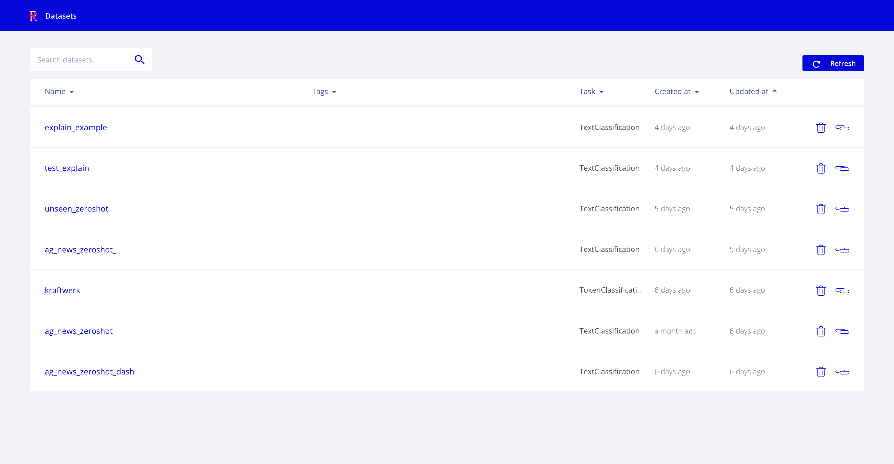
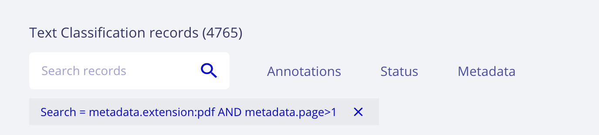
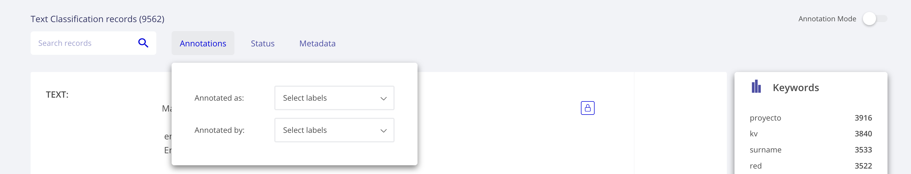
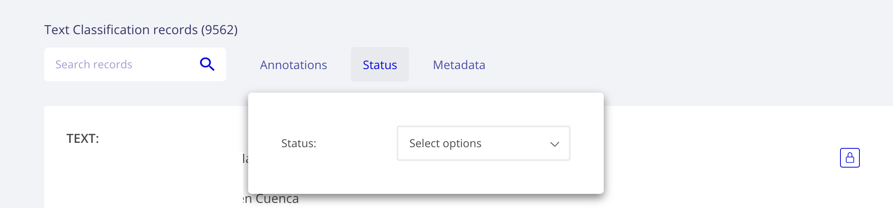
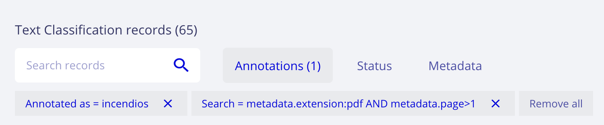
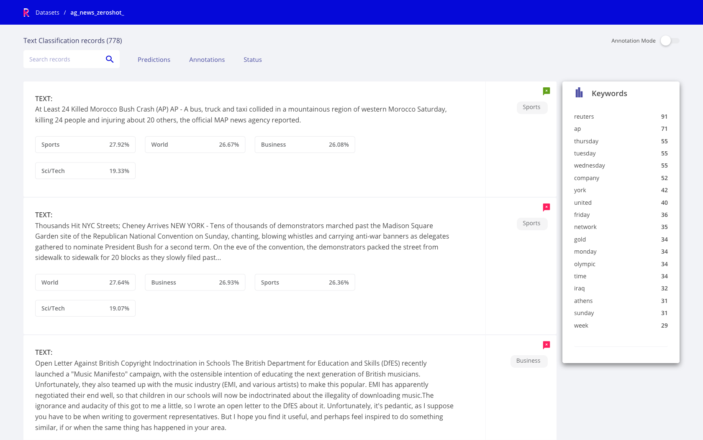
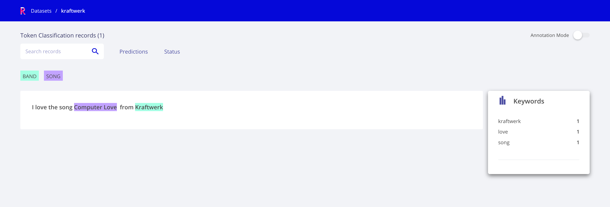
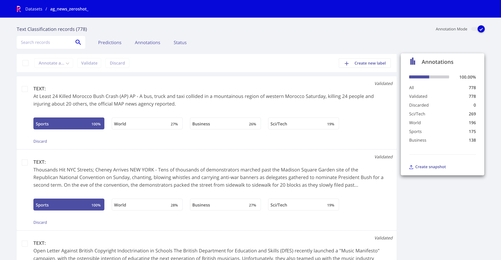
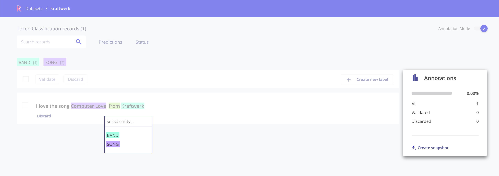

.. _webapp_reference:

Web App UI
==========
This section contains a quick overview of Rubrix web-app's User Interface (UI).

The web-app has two main pages: the **Home** page and the **Dataset** page.

Home page
---------
The **Home page** is the entry point to Rubrix Datasets. It's a searchable and sortable list of datasets with the following attributes:

- **Name**
- **Tags**, which displays the ``tags`` passed to the ``rubrix.log`` method. Tags are useful to organize your datasets by project, model, status and any other dataset attribute you can think of.
- **Task**, which is defined by the type of ``Records`` logged into the dataset.
- **Created at**, which corresponds to the timestamp of the Dataset creation. Datasets in Rubrix are created by directly using ``rb.log`` to log a collection of records.
- **Updated at**, which corresponds to the timestamp of the last update to this dataset, either by adding/changing/removing some annotations with the UI or via the Python client or the REST API.

   Rubrix Home page view

Dataset page
------------
The **Dataset page** is the workspace for exploring and annotating records in a Rubrix Dataset. Every task has its own specialized components, while keeping a similar layout and structure.

Here we describe the search components and the two modes of operation (Explore and Annotation).

The Rubrix Dataset page is driven by search features. The search bar gives users quick filters for easily exploring and selecting data subsets.
The main sections of the search bar are following:

Search input
^^^^^^^^^^^^

This component enables:

**Full-text queries** over all record ``inputs``.

**Queries using Elasticsearch's query DSL** with the `query string syntax <https://www.elastic.co/guide/en/elasticsearch/reference/current/query-dsl-query-string-query.html#query-string-syntax>`_\, which enables powerful queries for advanced users, using the Rubrix data model. Some examples are:

``inputs.text:(women AND feminists)`` : records containing the words "women" AND "feminist" in the inputs.text field.

``inputs.text:(NOT women)`` : records NOT containing women in the inputs.text field.

``inputs.hypothesis:(not OR don't)`` : records containing the word "not" or the phrase "don't" in the inputs.hypothesis field.

``metadata.format:pdf AND metadata.page_number>1`` : records with metadata.format equals pdf and with metadata.page_number greater than 1.

``NOT(_exists_:metadata.format)`` : records that don't have a value for metadata.format.

``predicted_as:(NOT Sports)`` : records which are not predicted with the label ``Sports``, this is useful when you have many target labels and want to exclude only some of them.

   Rubrix search input with Elasticsearch DSL query string

Elasticsearch's query DSL supports **escaping special characters** that are part of the query syntax. The current list special characters are

``+ - && || ! ( ) { } [ ] ^ " ~ * ? : \``

To escape these character use the \\ before the character. For example to search for (1+1):2 use the query:

``\(1\+1\)\:2``

Elasticsearch fields
^^^^^^^^^^^^^^^^^^^^

Below you can find a summary of available fields which can be used for the query DSL as well as for building Kibana Dashboards: common fields to all record types, and those specific to certain record types:

+-----------------+
| Common fields   |
+=================+
| annotated_as    |
+-----------------+
| annotated_by    |
+-----------------+
| event_timestamp |
+-----------------+
| id              |
+-----------------+
| last_updated    |
+-----------------+
| metadata.*      |
+-----------------+
| multi_label     |
+-----------------+
| predicted       |
+-----------------+
| predicted_as    |
+-----------------+
| predicted_by    |
+-----------------+
| status          |
+-----------------+
| words           |
+-----------------+

+----------------------------+
| Text classification fields |
+============================+
| inputs.*                   |
+----------------------------+
| score                      |
+----------------------------+

+------------------------------+
| Tokens classification fields |
+==============================+
| tokens                       |
+------------------------------+

Predictions filters
^^^^^^^^^^^^^^^^^^^

This component allows filtering by aspects related to predictions, such as:

- predicted as, for filtering records by predicted labels,
- predicted by, for filtering by prediction_agent (e.g., different versions of a model)
- predicted ok or ko, for filtering records whose predictions are (or not) correct with respect to the annotations.

Annotations filters
^^^^^^^^^^^^^^^^^^^

This component allows filtering by aspects related to annotations, such as:

- annotated as, for filtering records by annotated labels,
- annotated by, for filtering by annotation_agent (e.g., different human users or dataset versions)

   Rubrix annotation filters

Status filter
^^^^^^^^^^^^^

This component allows filtering by record status:

- **Default**: records without any annotation or edition.
- **Validated**: records with validated annotations.
- **Edited**: records with annotations but not yet validated.

   Rubrix status filters

Metadata filters
^^^^^^^^^^^^^^^^
This component allows filtering by metadata fields. The list of filters is dynamic and it's created with the aggregations of metadata fields included in any of the logged records.

Active query parameters
^^^^^^^^^^^^^^^^^^^^^^^
This component show the current active search params, it allows removing each individual param as well as all params at once.

   Active query params module

Explore mode
^^^^^^^^^^^^
This mode enables users to explore a records in a dataset. Different tasks provide different visualizations tailored for the task.

   Rubrix Text Classification Explore mode

   Rubrix Token Classification (NER) Explore mode

Annotation mode
^^^^^^^^^^^^^^^
This mode enables users to add and modify annotations, while following the same interaction patterns as in the explore mode (e.g., using filters and advanced search), as well as novel features such as bulk annotation for a given set of search params.

   Rubrix Text Classification Annotation mode

   Rubrix Token Classification (NER) Annotation mode

Annotation by different users will be saved with different annotation agents.
To setup various users in your Rubrix server, please refer to our :ref:`user management guide <user-management>`.