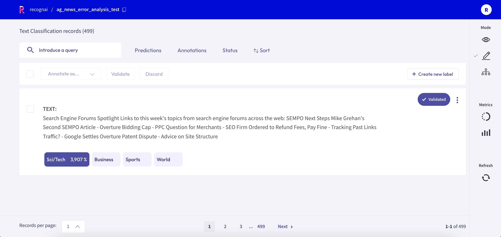
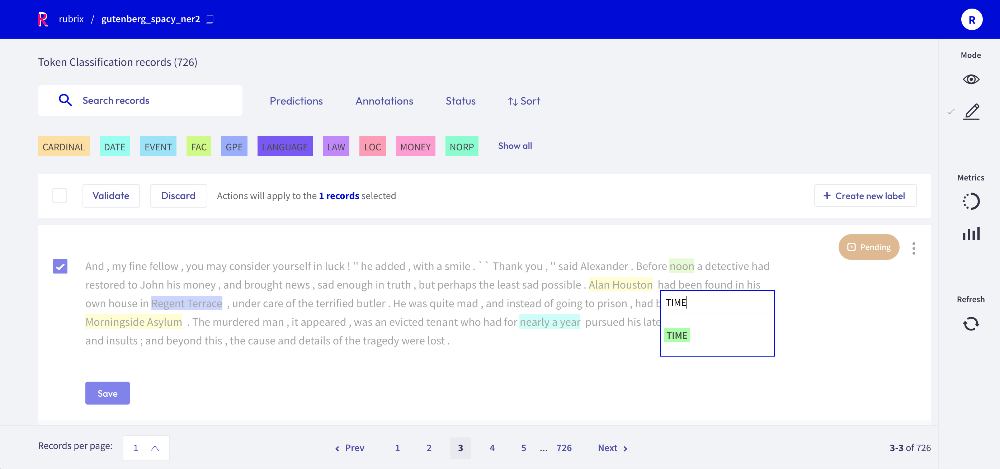
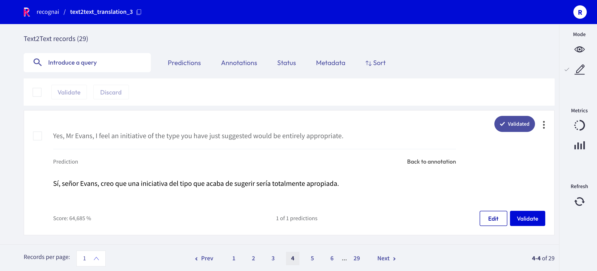
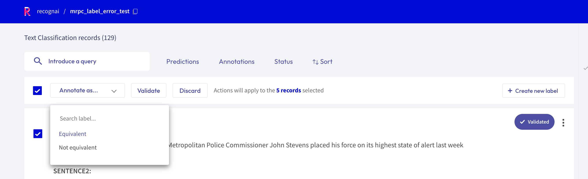
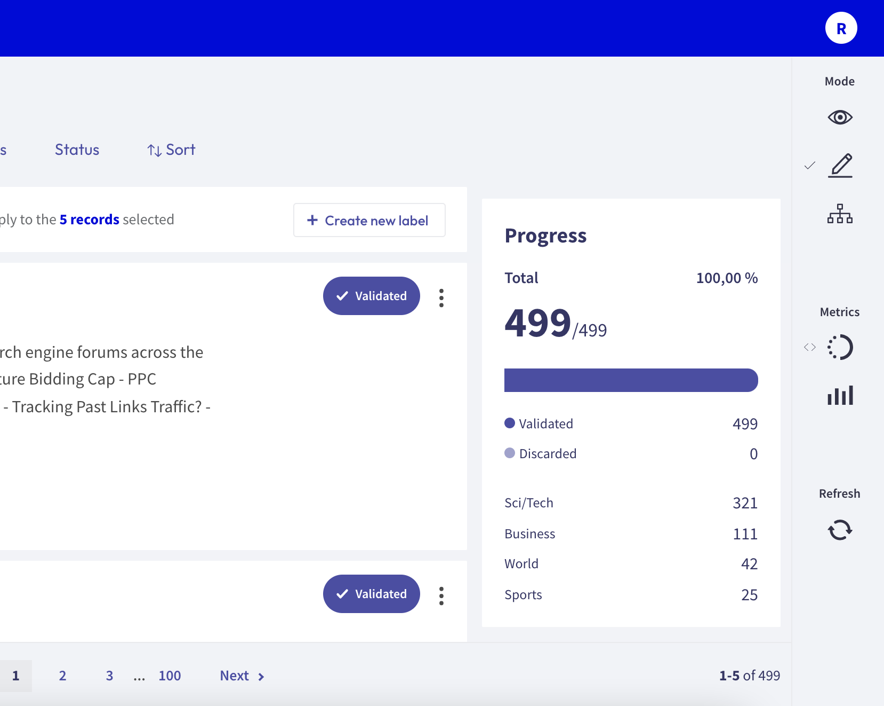

# Annotate records

<video width="100%" controls><source src="../../_static/reference/webapp/annotation_mode.mp4" type="video/mp4"></video>

The Rubrix web app has a dedicated mode to quickly label your data in a very intuitive way, or revise previous gold labels and correct them.
Rubrix's powerful search and filter functionalities, together with potential model predictions, can guide the annotation process and support the annotator.

You can access the _Annotate mode_ via the sidebar of the [Dataset page](dataset.md).

## Search and filter


The powerful search bar allows you to do simple, quick searches, as well as complex queries that take full advantage of Rubrix's [data models](../python/python_client.rst#module-rubrix.client.models).
In addition, the _filters_ provide you a quick and intuitive way to filter and sort your records with respect to various parameters, including the metadata of your records.
For example, you can use the **Status filter** to hide already annotated records (_Status: Default_), or to only show annotated records when revising previous annotations (_Status: Validated_).

You can find more information about how to use the search bar and the filters in our detailed [search guide](search_records.md) and [filter guide](filter_records.md).

```{note}
Not all filters are available for all [tasks](../../guides/task_examples.ipynb).
```

## Annotate

To annotate the records, the Rubrix web app provides a simple and intuitive interface that tries to follow the same interaction pattern as in the [Explore mode](explore_records.md).
As the _Explore mode_, the record cards in the _Annotate mode_ are also customized depending on the [task](../../guides/task_examples.ipynb) of the dataset.

### Text Classification



When switching in the _Annotate mode_ for a text classification dataset, the labels in the record cards become clickable and you can annotate the records by simply clicking on them.
You can also validate the predictions shown in a slightly darker tone by pressing the _Validate_ button:

- for a **single label** classification task, this will be the prediction with the highest percentage
- for a **multi label** classification task, this will be the predictions with a percentage above 50%

Once a record is annotated, it will be marked as _Validated_ in the upper right corner of the record card.

### Token Classification



For token classification datasets, you can highlight words (tokens) in the text and annotate them with a label.
Under the hood, the highlighting takes advantage of the `tokens` information in the [Token Classification data model](../python/python_client.rst#rubrix.client.models.TokenClassificationRecord).
You can also remove annotations by hovering over the highlights and pressing the _X_ button.

After modifying a record, either by adding or removing annotations, its status will change to _Pending_ and a _Save_ button will appear.
You can also validate the predictions (or the absent of them) by pressing the _Validate_ button.
Once the record is saved or validated, its status will change to _Validated_.

### Text2Text



For text2text datasets, you have a text box available, in which you can draft or edit an annotation.
You can also validate or edit a prediction, by first clicking on the _view predictions_ button, and then the _Edit_ or _Validate_ button.
After editing or drafting your annotation, don't forget to save your changes.

## Bulk annotate



For all [tasks](../../guides/task_examples.ipynb), you can **bulk validate** the predictions of the records.
You can either select the records one by one with the selection box on the upper left of each card, or you can use the global selection box below the search bar, which will select all records shown on the page.
Then you can either _Validate_ or _Discard_ the selected records.

For the text classification task, you can additionally **bulk annotate** the selected records with a specific label, by simply selecting the label from the _"Annotate as ..."_ list.

## Create labels


For the text and token classification tasks, you can create new labels within the _Annotate mode_.
On the right side of the bulk validation bar, you will find a _"+ Create new label"_ button that lets you add new labels to your dataset.

## Progress metric



From the sidebar you can access the _Progress metrics_.
There you will find the progress of your annotation session, the distribution of validated and discarded records, and the label distribution of your annotations.

You can find more information about the metrics in our dedicated [metrics guide](view_dataset_metrics.md).
