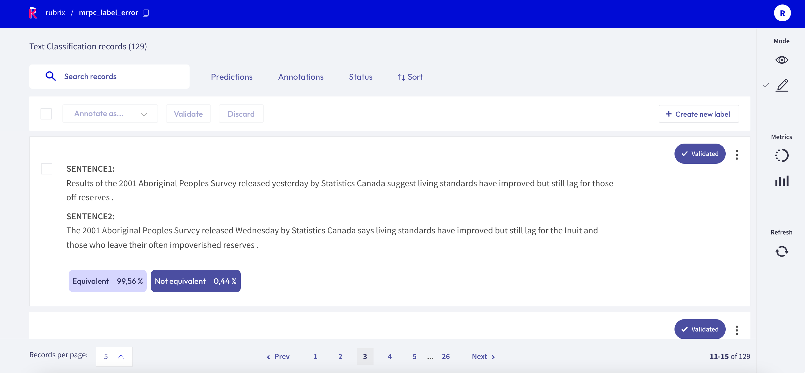
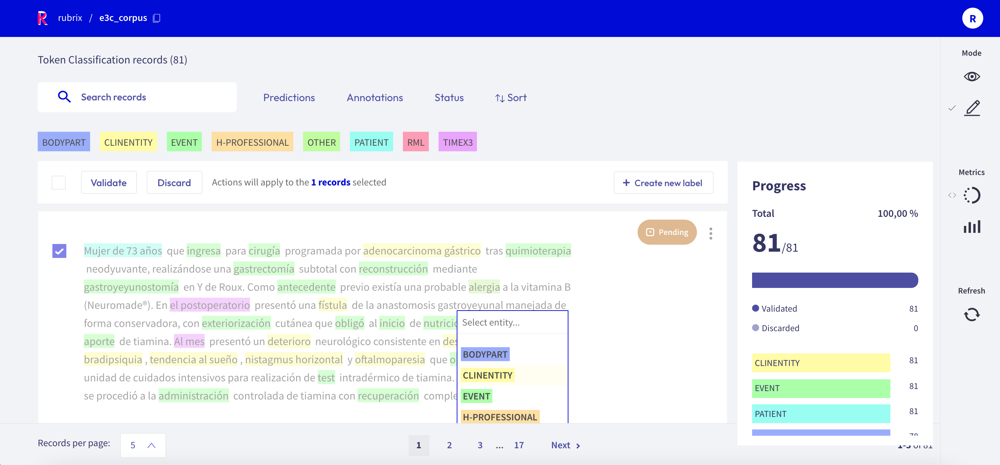

# Annotate records

The **Annotation mode** enables users to add and modify annotations. This mode follows the same interaction patterns as in the [**Explore mode**](explore_records.md).

Novel features, such as **bulk annotation** for a given set of search parameters are also available.

More detailed information about the features related to the **Annotation mode** can be found [here](dataset.md).

## How to annotate

This section is intended to explain how the **Annotation Mode** works.

When choosing this mode, the display of the selected dataset is slightly different. The **"Bulk Annotation"** bar appears (see below), and records appear editable.

Users can annotate one record by one, or several records in a row, but the annotation will change depending on the task:

- **Text2Text Tasks**: Records can be edited, validated or discarded in these tasks.
- **Token Classification Tasks**: The record will show different labels on its words. Users can select words or sequences of words (tokens) in order to annotate them with labels, and then, records can be validated or discarded.
- **Text Classification Tasks**: A record will be displayed with different labels below. Users have to choose one or more labels (or validate the selected one) and validate the record. Records can be discarded too.

<video width="100%" controls><source src="images/random_examples.mp4" type="video/mp4"></video>

### Bulk Annotation

With this feature, from 5 to 20 records can be validated or discarded at the same time. In order to use it, users must operate with the bar placed below the search bar and the filters. One or more records can be selected by clicking on specific checkbox or by choosing the **Select all** checkbox.

After choosing the records to be annotated, a label must be selected on the **Annotate as** dropdown. After that, these records must be validated or discarded.

It is also posible to create new labels by clicking on **Create new label**.

## Filters and search

Using filters can be very helpful when it comes to annotate specific records or to carry out subtasks.

More information about these features can be found  [here](dataset.md), and their use is described  [here](filter_records.md).

Click [here](search_records.md) to find out more about searching records.

## Sidebar and metrics

In all modes (**Explore**, **Annotation** and **Define rules**), the **Metrics** menu is available on the sidebar. Learn more about it [here](dataset.md) (features) or [here](view_dataset_metrics.md) (an "user guide").

Annotation by different users will be saved with different **annotation agents**.
To setup various users in your Rubrix server, please refer to our [user management guide](https://docs.rubrix.ml/en/stable/getting_started/user-management.html).

Click [here](https://docs.rubrix.ml/en/stable/getting_started/setup%26installation.html) to start with the installation.
