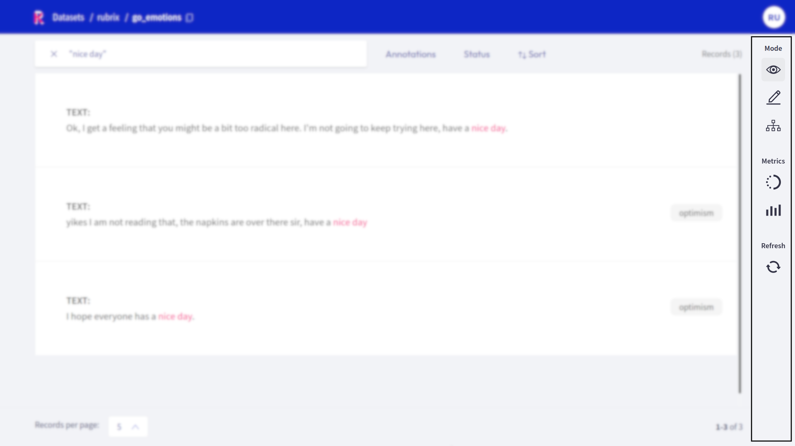

# Dataset


The _Dataset_ page is the main page of the Rubrix web app.
From here you can access most of Rubrix's features, like **exploring and annotating** the records of your dataset.

The page is composed of 4 major components:

```{contents}
:local:
```

## Search bar


Rubrix's _search bar_ is a powerful tool that allows you to thoroughly explore your dataset, and quickly navigate through the records.
You can either fuzzy search the contents of your records, or use the more advanced [query string syntax](https://www.elastic.co/guide/en/elasticsearch/reference/7.10/query-dsl-query-string-query.html#query-string-syntax) of Elasticsearch to take full advantage of Rubrix's [data models](../python/python_client.rst#module-rubrix.client.models).
You can find more information about how to use the search bar in our detailed [search guide](search_records.md).

## Filters


The _filters_ provide you a quick and intuitive way to filter and sort your records with respect to various parameters.
You can find more information about how to use the filters in our detailed [filter guide](filter_records.md).


## Record cards

The record cards are at the heart of the _Dataset_ page and contain your data.
There are three different flavors of record cards depending on the [task](../../guides/task_examples.ipynb) of your dataset.
All of them share the same basic structure showing the input text and a vertical ellipsis (or "kebab menu") on the top right that lets you access the record's metadata.
Predictions and annotations are shown depending on the current [mode](#modes) and [task](../../guides/task_examples.ipynb) of the dataset.

Check out our [exploration](explore_records.md) and [annotation](annotate_records.md) guides to see how the record cards work in the different [modes](#modes).

### Text classification


In this task the predictions are given as tags below the input text.
They contain the label as well as a percentage score.
When in [Explore mode](#modes) annotations are shown as tags on the right together with a symbol indicating if the predictions match the annotations or not.
When in [Annotate mode](#modes) predictions and annotations share the same labels (annotation labels are darker).

A text classification dataset can support either single-label or multi-label classification - in other words, records are either annotated with one single label or various.

### Token classification


In this task annotations are given as colored highlights in the input text, while predictions are indicated by underlines.
At the top of the record list you will find a legend that connects the colors to the respective labels.
When in [Annotate mode](#modes) you can remove annotations or add new ones by simply selecting the desired text.

```hint
When using the [score filter](filter_records.md#predictions-filter), the predictions that do **not** fall in the selected range will miss the solid thin line.
```

### Text2Text


In this task predictions and the annotation are given in a text field below the input text.
You can switch between prediction and annotation via the "_View annotation_"/"_View predictions_" buttons.
For the predictions you can find an associated score in the lower left corner.
If you have multiple predictions you can toggle between them using the arrows on the button of the record card.

## Sidebar



The right sidebar is divided into three sections.

### Modes

This section of the sidebar lets you switch between the different Rubrix modes that are covered extensively in their respective guides:

- **Explore**: this mode is for [exploring your dataset](explore_records.md) and gain valuable insights
- **Annotate**: this mode lets you conveniently [annotate your data](annotate_records.md)
- **Define rules**: this mode helps you to [define rules](define_rules.md) to automatically label your data

```{note}
Not all modes are available for all [tasks](../../guides/task_examples.ipynb).
```

### Metrics

In this section you find several "metrics" that can provide valuable insights to your dataset.
They also provide some support while annotating your records, or defining heuristic rules.
There are three different kind of _metrics_:

- **Progress**: see metrics of your annotation process, like its progress and the label distribution (only visible in the _Explore_ and _Annotate_ mode)
- **Overall rule metrics**: see aggregated metrics about your defined rules (only visible in the _Define rules_ mode)
- **Stats**: check the keywords of your dataset and the error distribution of the predictions

You can find more information about each metric in our dedicated [metrics guide](view_dataset_metrics.md).

### Refresh

This button allows you to refresh the list of the record cards with respect to the activated filters.
For example, if you are annotating and use the [Status filter](filter_records.md#status-filter) to filter out annotated records, you can press the _Refresh_ button to hide the latest annotated records.
