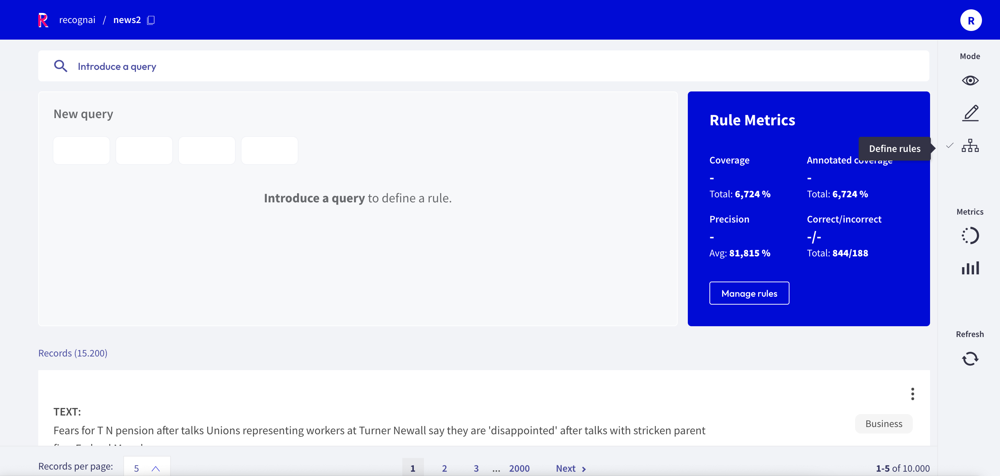
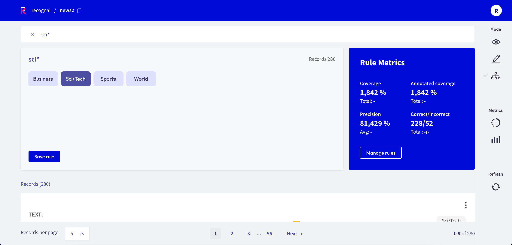
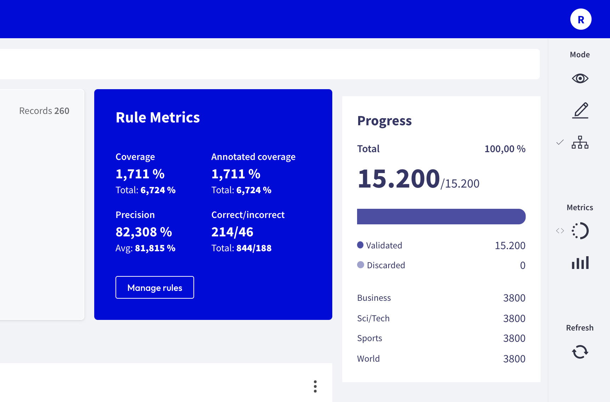
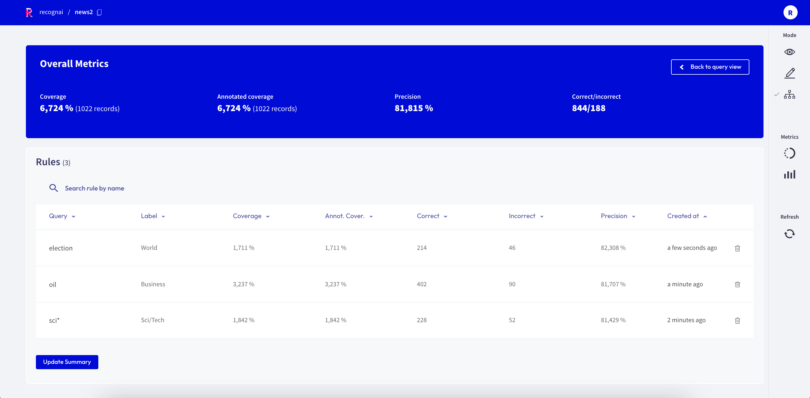

# Define rules



The Rubrix web app has a dedicated mode to find good **heuristic rules**, also often referred to as _labeling functions_, for a [weak supervision](https://www.snorkel.org/blog/weak-supervision) workflow.
As shown in our [guide](../../guides/weak-supervision.ipynb) and [tutorial](../../tutorials/weak-supervision-with-rubrix.ipynb), these rules allow you to quickly annotate your data with noisy labels in a semiautomatic way.

You can access the _Define rules_ mode via the sidebar of the [Dataset page](dataset.md).

```{note}
The _Define rules_ mode is only available for single-label text classification datasets.
```

## Query plus label



A rule in Rubrix basically applies a chosen label to a list of records that match a given [query](search_records.md), so all you need is a query plus a label.
After entering a query in the search bar and selecting a label, you will see some [metrics](#rule-metrics) for the rule on the right and the matches of your query in the record list below.

If you are happy with the metrics and/or the matching record list, you can save the rule by clicking on "Save rule".
In this way it will be stored as part of the current dataset and can be accessed via the [manage rules](#manage-rules) button.

```{note}
If you want to add labels to the available list of labels, you can switch to the [Annotation mode](annotate_records.md) and create labels there.
```

## Rule Metrics



After entering a query and selecting a label, Rubrix provides you with some key metrics about the rule.
Some metrics are only available if your dataset has also annotated records.

- **Coverage**: Number of records (percentage) of records labeled by the rule
- **Annotated coverage**: Number of records (percentage) of annotated records labeled by the rule
- **Correct/incorrect**: Number of records the rule labelled correctly/incorrectly (if annotations are available)
- **Precision**: Percentage of correct labels given by the rule (if annotations are available)

## Manage rules

Here you will see a list of your saved rules as well as their overall metrics.
You can edit a rule by clicking on its name, or delete it by clicking on the trash icon.


