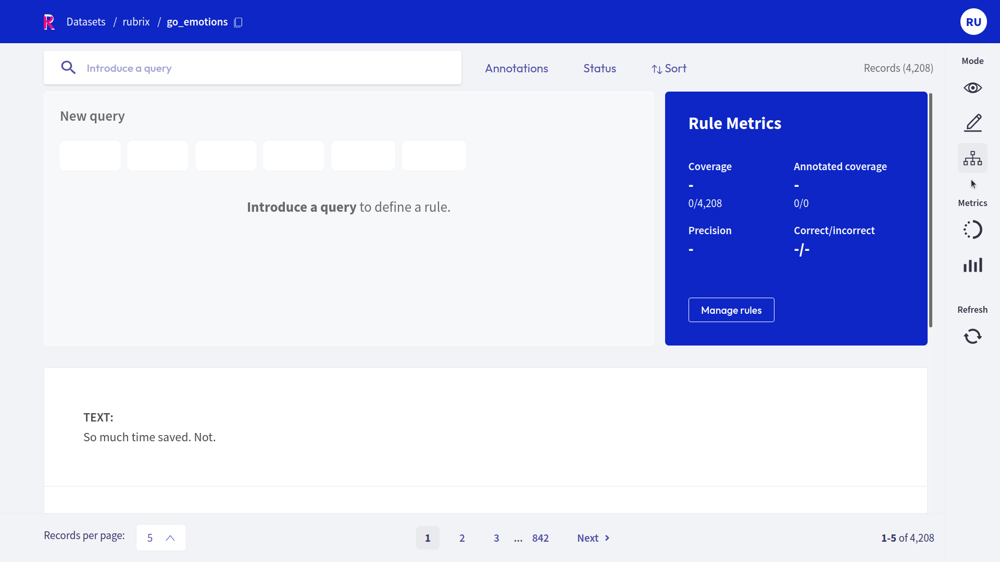
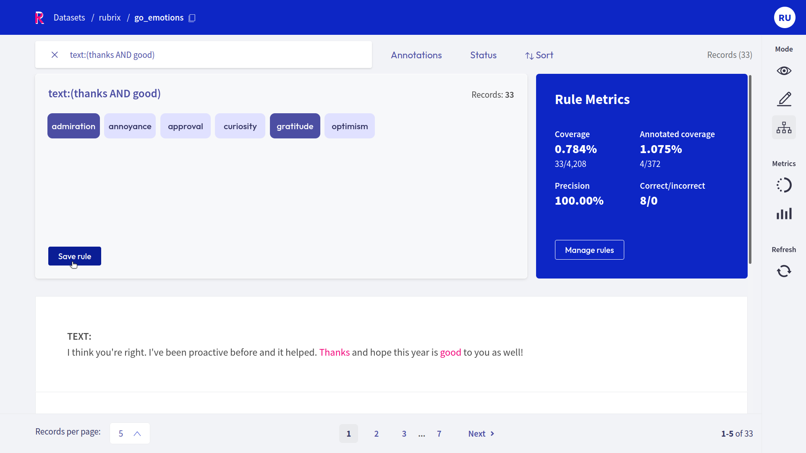
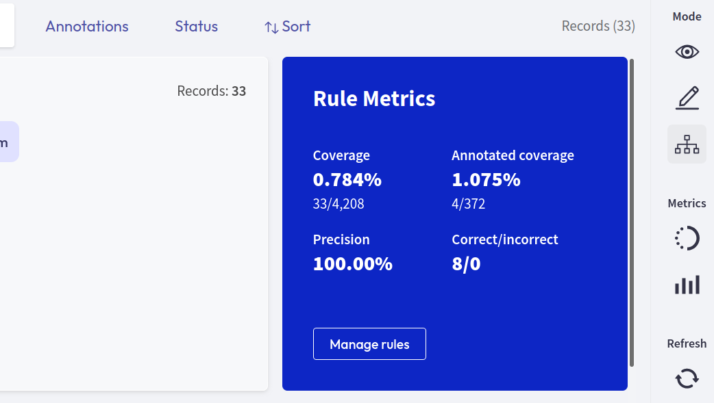
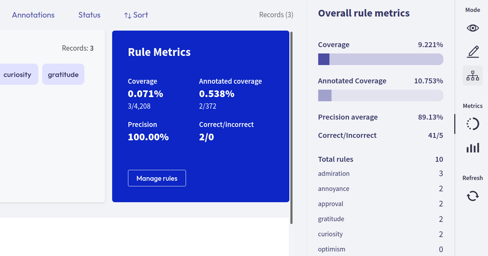
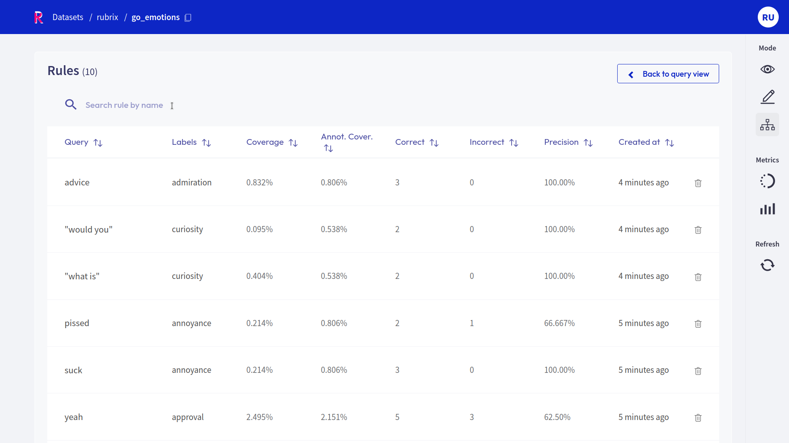

# Define rules



The Rubrix web app has a dedicated mode to find good **heuristic rules**, also often referred to as _labeling functions_, for a [weak supervision](https://www.snorkel.org/blog/weak-supervision) workflow.
As shown in our [guide](../../guides/weak-supervision.ipynb) and [tutorial](../../tutorials/weak-supervision-with-rubrix.ipynb), these rules allow you to quickly annotate your data with noisy labels in a semiautomatic way.

You can access the _Define rules_ mode via the sidebar of the [Dataset page](dataset.md).

```{note}
The _Define rules_ mode is only available for text classification datasets.
```

## Query plus labels



A rule in Rubrix basically applies a chosen set of labels to a list of records that match a given [query](search_records.md), so all you need is a query plus labels.
After entering a query in the search bar and selecting one or multiple labels, you will see some [metrics](#rule-metrics) for the rule on the right and the matches of your query in the record list below.

```{warning}
Filters are not part of the rule, but are applied to the record list.
This means, if you have filters set, the record list does not necessarily correspond to the records affected by the rule.
```

If you are happy with the metrics and/or the matching record list, you can save the rule by clicking on "Save rule".
In this way it will be stored as part of the current dataset and can be accessed via the [manage rules](#manage-rules) button.

```{hint}
If you want to add labels to the available list of labels, you can switch to the [Annotation mode](annotate_records.md) and create labels there.
```

## Rule Metrics



After entering a query and selecting labels, Rubrix provides you with some key metrics about the rule.
Some metrics are only available if your dataset has also annotated records.

- **Coverage**: Percentage of records labeled by the rule.
- **Annotated coverage**: Percentage of annotated records labeled by the rule.
- **Correct/incorrect**: Number of labels the rule predicted correctly/incorrectly with respect to the annotations.
- **Precision**: Percentage of correct labels given by the rule with respect to the annotations.

```{note}
For multi-label classification tasks, we only count wrongly predicted labels as incorrect, not labels that the rule misses.
```

### Overall rule metrics



From the [right sidebar](dataset.md#sidebar) you can access the **Overall rule metrics**.
Here you will find the aggregated metrics, such as the coverages, the average precision and the total number of correctly/incorrectly predicted labels.
You can also find an overview about how many rules you saved and how they are distributed with respect to their labels.

## Manage rules



Here you will see a list of your saved rules.
You can edit a rule by clicking on its name, or delete it by clicking on the trash icon.

