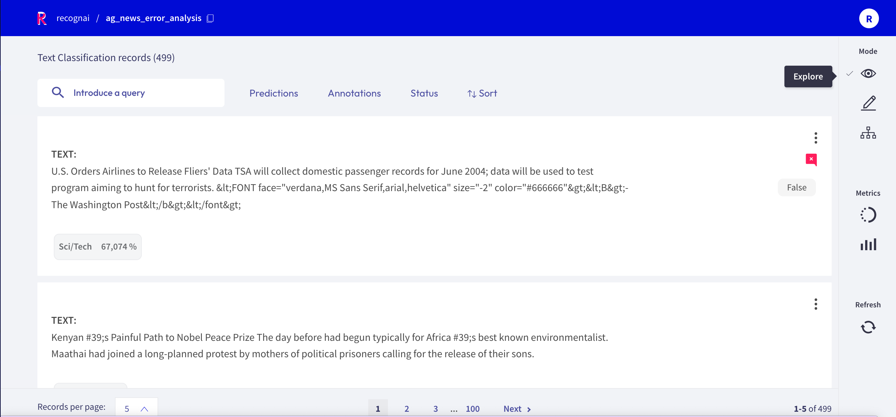
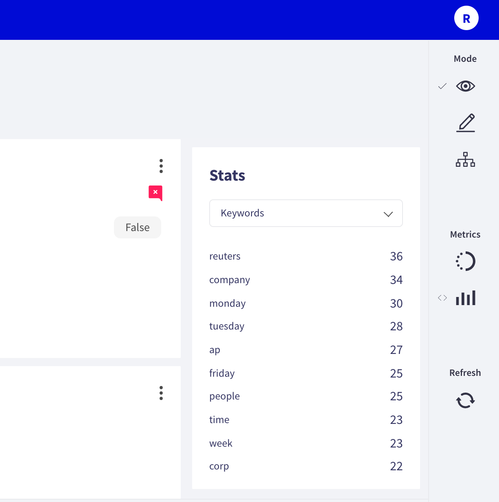

# Explore records



If you want to explore your dataset or analyze the predictions of a model, the Rubrix web app offers a dedicated Explore mode.
The powerful search functionality and intuitive filters allow you to quickly navigate through your records and dive deep into your dataset.
At the same time, you can view the predictions and compare them to gold annotations.

You can access the _Explore mode_ via the sidebar of the [Dataset page](dataset.md).

## Search and filter


The powerful search bar allows you to do simple, quick searches, as well as complex queries that take full advantage of Rubrix's [data models](../python/python_client.rst#module-rubrix.client.models).
In addition, the _filters_ provide you a quick and intuitive way to filter and sort your records with respect to various parameters, including predictions and annotations.
Both of the components can be used together to dissect in-depth your dataset, validate hunches, and find specific records.

You can find more information about how to use the search bar and the filters in our detailed [search guide](search_records.md) and [filter guide](filter_records.md).

```{note}
Not all filters are available for all [tasks](../../guides/task_examples.ipynb).
```

## Predictions and annotations

Predictions and annotations are an integral part of Rubrix's [data models](../python/python_client.rst#module-rubrix.client.models).
The way they are presented in the Rubrix web app depends on the [task](../../guides/task_examples.ipynb) of the dataset.

### Text classification


In this task the predictions are given as tags below the input text.
They contain the label as well as a percentage score.
Annotations are shown as tags on the right together with a symbol indicating if the predictions match the annotations or not.

### Token classification


In this task predictions and annotation are given as highlights in the input text.
Work in progress ...

### Text2Text


In this task predictions and the annotation are given in a text field below the input text.
You can switch between prediction and annotation via the "_View annotation_"/"_View predictions_" buttons.
For the predictions you can find an associated score in the lower left corner.
If you have multiple predictions you can toggle between them using the arrows on the button of the record card.

## Metrics



From the side bar you can access the [_Stats_ metrics](view_dataset_metrics.md#stats) that provide support for your analysis of the dataset.
