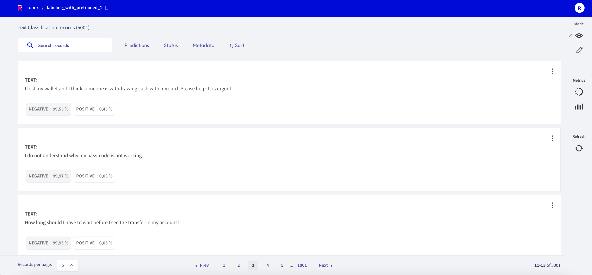
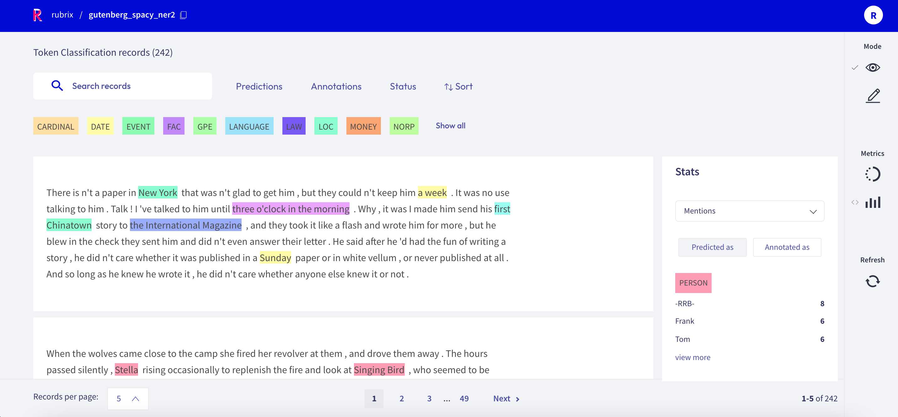

# Explore records

_TODO: Screenshot_

If you want to explore your dataset or analyze the predictions of a model, the Rubrix web app offers a dedicated Explore mode.
The powerful search functionality and intuitive filters allow you to quickly navigate through your records and dive deep into your dataset.
At the same time, you can view the predictions and compare them to gold annotations.

You can access the Explore mode via the sidebar of the [Dataset page](dataset.md).

## Search and filter

_TODO: Screenshot of the search bar and filters_

The powerful search bar allows you to do simple, quick searches, as well as complex queries that take full advantage of Rubrix's [data models](../python/python_client.rst#module-rubrix.client.models).
The _filters_, on the other hand, provide you a quick and intuitive way to filter and sort your records with respect to various parameters, including predictions and annotations.
Both of the components can be used together to dissect in-depth your dataset, validate hunches, and find specific records.

You can find more information about how to use the search bar and the filters in our detailed [search guide](search_records.md) and [filter guide](filter_records.md).

```{note}
Not all filters are available for all [tasks](../../guides/task_examples.ipynb).
```

## Predictions and annotations

Predictions and annotations are an integral part of Rubrix's [data models](../python/python_client.rst#module-rubrix.client.models).
The way they are presented in the Rubrix web app depends on the [task](../../guides/task_examples.ipynb) of the dataset.

### Text classification


In this task the predictions are given as tags below the input text.
They contain the label as well as a percentage score.
Annotations are shown as tags on the right together with a symbol indicating if the predictions match the annotations or not.

### Token classification


In this task predictions and annotation are given as highlights in the input text.
Work in progress ...

### Text2Text


In this task predictions and the annotation are given in a text field below the input text.
You can switch between prediction and annotation via the "_View annotation_"/"_View predictions_" buttons.
For the predictions you can find an associated score in the lower left corner.
If you have multiple predictions you can toggle between them using the arrows on the button of the record card.

## Metrics

## Old

If you want to explore your dataset or analyze the predictions of a model
The **Exploration mode** turns out convenient when it comes to explore and analyze records in a dataset.

As Rubrix allows different tasks to be carried out, different visualizations are tailored for the task. For example, it is possible to see and analyze the keywords, metrics, the labels and to choose the parameters described above.

More detailed information about the features related to the **Explore mode** can be found [here](dataset.md).

## Tasks and Records

As it is known, Rubrix deals with three different types of tasks:

- **Text2Text Tasks**: In these tasks, it is possible to use the Metrics menu (on the sidebar) and to analyze the score, the prediction agent and the status, or users can also sort the results by these parameters.

- **Token Classification Tasks**: When it comes to tokenization tasks, Rubrix displays labels in a very transparent way— each label in a dataset has a different color, and their caption is displayed next to the search bar. All filters and the Metrics menu can be used.

- **Text Classification Tasks**: In this mode, it works in a very similar way to token classification tasks. The **explore mode** is specially interesting with binary models— when it comes to positive or negative annotations, their corresponding icon is displayed next to the record.

<video width="100%" controls><source src="../../_static/reference/webapp/explore_mode.mp4" type="video/mp4"></video>

## Filters and search

Filters can be useful in order to sort and find records easily.

More information about these features can be found [here](dataset.md), and their use is described [here](filter_records.md).

More information about searching records can be found [here](search_records.md).

## Sidebar and metrics

In all modes (**Explore**, **Annotation** and **Define rules**), the **Metrics** menu is available on the sidebar. Learn more about it [here](dataset.md) (features) or [here](view_dataset_metrics.md) (an "user guide").



An example is displayed here:


