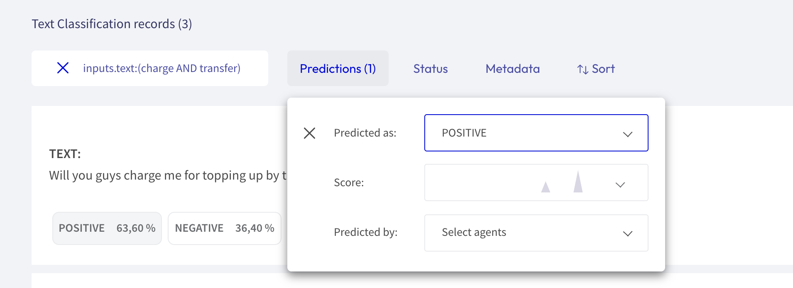

# Search Records

<video width="100%" controls><source src="../../_static/reference/webapp/search_records.mp4" type="video/mp4"></video>

You can search records by using full-text queries (a normal search), or by Elasticsearch with its [query string syntax](https://www.elastic.co/guide/en/elasticsearch/reference/current/query-dsl-query-string-query.html#query-string-syntax).

This component enables:

1. **Full-text queries** over all record `inputs`.

2. Queries using **Elasticsearch's query DSL** with the [query string syntax](https://www.elastic.co/guide/en/elasticsearch/reference/current/query-dsl-query-string-query.html#query-string-syntax). Some examples are: -`inputs.text:(women AND feminists)` : records containing the words "women" AND "feminist" in the inputs.text field.

   -`inputs.text:(NOT women)` : records NOT containing women in the inputs.text field.

   -`inputs.hypothesis:(not OR don't)` : records containing the word "not" or the phrase "don't" in the inputs.hypothesis field.

   -`metadata.format:pdf AND metadata.page_number>1` : records with metadata.format equals pdf and with metadata.page_number greater than 1.

   -`NOT(_exists_:metadata.format)` : records that don't have a value for metadata.format.

   -`predicted_as:(NOT Sports)` : records which are not predicted with the label `Sports`, this is useful when you have many target labels and want to exclude only some of them.

**NOTE**: Elasticsearch's query DSL supports **escaping special characters** that are part of the query syntax. The current list special characters are:

`+ - && || ! ( ) { } [ ] ^ " ~ * ? : \`

To escape these character use the \\ before the character. For example to search for (1+1):2 use the query `\(1\+1\)\:2`.

In both **Annotation** and **Exploration** modes, the search bar is placed in the upper left-hand corner. To search something, users must type one or several words (or a query) and click the **Intro** button.

Note that this feature also works as a kind of filter. If users search something, it is possible to explore and/or annotate the results obtained. [Filters](filter_records.md) can be applied.

## Elasticsearch fields

Shown below is a summary of available fields that can be used for the query DSL, as well as for building **Kibana Dashboards**— common fields to all record types, and those specific to certain record types:

| Common fields   | Text classification fields | Token classification fields |
| --------------- | -------------------------- | --------------------------- |
| Annotated_as    | inputs.\*                  | tokens                      |
| Annotated_by    | score                      |                             |
| event_timestamp |                            |                             |
| id              |                            |                             |
| last_updated    |                            |                             |
| metadata.\*     |                            |                             |
| multi_label     |                            |                             |
| predicted       |                            |                             |
| predicted_as    |                            |                             |
| predicted_by    |                            |                             |
| status          |                            |                             |
| words           |                            |                             |
| words.extended  |                            |                             |

With this component, users are able to search specific information on the dataset, either by **full-text queries** or by queries using **Elasticsearch**.
