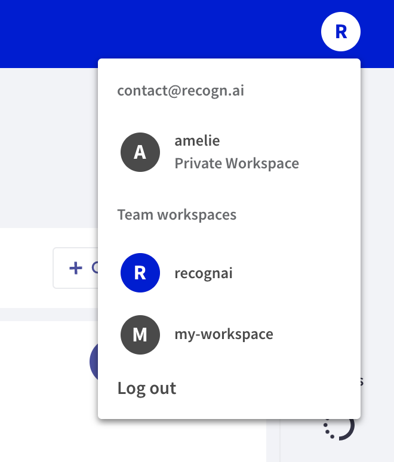

# Switch workspaces

This feature turns out very convenient when users need to use different workspaces for different purposes.

The **switch workspace** menu is located in the upper right-hand corner, where the user icon is shown. It displays the different workspaces available for the user.

In order to switch workspaces, users must click on the user icon and select another one. This will drive the user to the main page of the **Workspace**.

