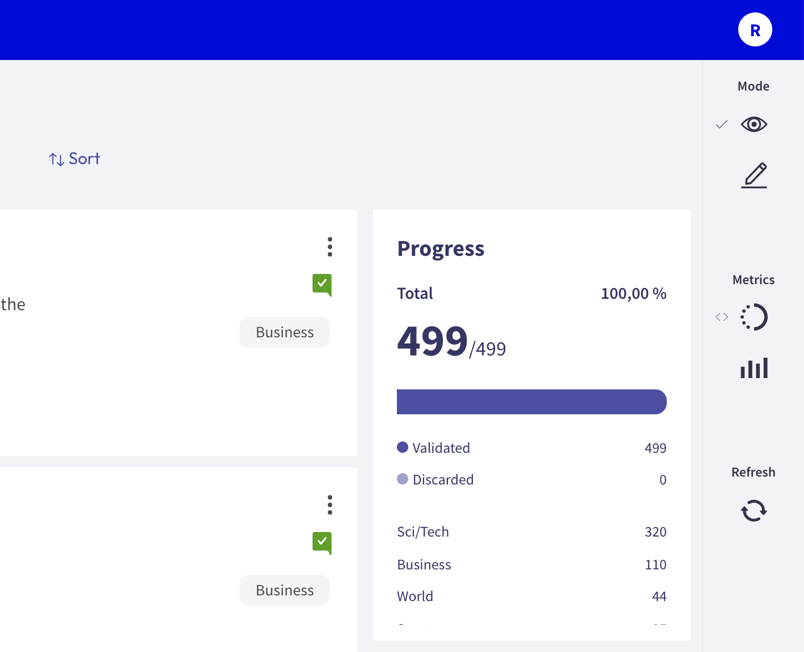

# View dataset metrics

The **Dataset Metrics** are part of the **Sidebar** placed on the right side of **Rubrix datasets**. To know more about this component, click [here](dataset.md).

Rubrix metrics are very convenient in terms of assesing the status of the dataset, and to extract more valuable information.

## How to use Metrics

Metrics are composed of two submenus: **Progress** and **Stats**. They work similarly in **Annotation**, **Explore** and **Define rules** mode.

### Progress

This submenu is useful when users need to know how many records are annotated, validated and/or discarded.

When clicking on this menu, not only the progress is shown, but also the number of labels and records.

### Stats

This submenu allows users to know more about the keywords and the error distribution of the dataset.

It is composed of a dropdown with two dropdowns:

- The **Keywords** dropdown displays a list of annotated words and the number of occurrences.
- The **Error Distribution** dropdown displays a pie chart with the number of records, correct and incorrect predictions.

Please, note that this section might vary, depending on the task carried out.

<video width="100%" controls><source src="../../_static/reference/webapp/stats.mp4" type="video/mp4"></video>

### Refresh button

Users should click this button whenever they would like to see the page updated. If changes are made, this button displays the page updated.
