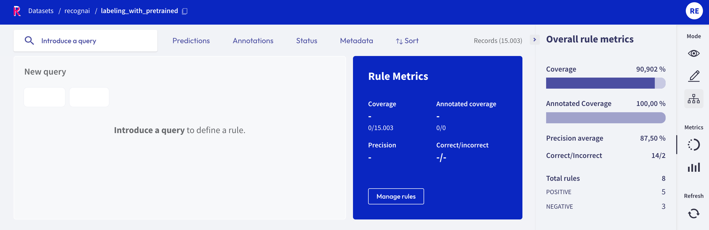
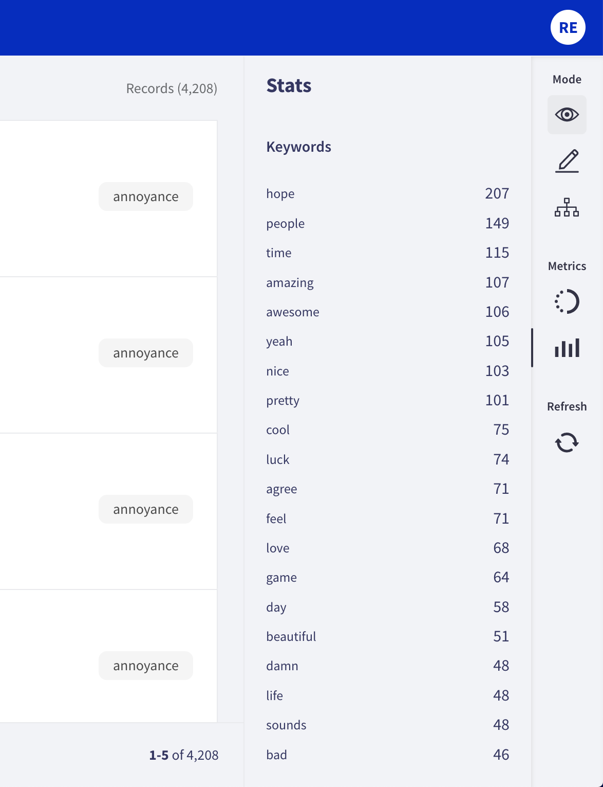

# View dataset metrics

The **Dataset Metrics** are part of the **Sidebar** placed on the right side of **Rubrix datasets**. To know more about this component, click [here](dataset.md).

Rubrix metrics are very convenient in terms of assesing the status of the dataset, and to extract valuable information.

## How to use Metrics

Metrics are composed of two submenus: **Progress** and **Stats**. These submenus might be different for **Token** and **Text Classification** tasks, as well as for the different modes (especially the **Define rules mode**).

### Progress

This submenu is useful when users need to know how many records have been annotated, validated and/or discarded.

#### Annotation and Explore modes

When clicking on this menu, not only the progress is shown. The number of records is also displayed, as well as the number of labeled records or entities that are **validated** or **discarded**.

#### Define rules mode

In this mode, **progress** is related to the coverage of the rules. It shows the **model coverage** and the **annotated coverage**, and also the **precision average** and the number of correct and incorrect results.

In the **total rules** section, users can find the number of rules related to the different categories.

### Stats

This submenu allows users to know more about the keywords of the dataset.

#### Explore and Define Rules mode

In both modes, the **Keywords** list displays a list of relevant words and the number of occurrences.

#### Annotation mode

In the **annotation mode**, the stats show the **mentions** (this is, the entities) which are present in the records.

This submenu has the **Predicted as** (for predictions) and the **Annotated as** (for annotation) sections, and here users can see the number of entities predicted or annotated with a specific label. The number of occurrences is ordered from highest to lowest, and the labels are also ordered in that way.

<video width="100%" controls><source src="../../_static/reference/webapp/stats.mp4" type="video/mp4"></video>

### Refresh button

Users should click this button whenever they wanted to see the page updated. If any change is made, this button displays the updated page.
