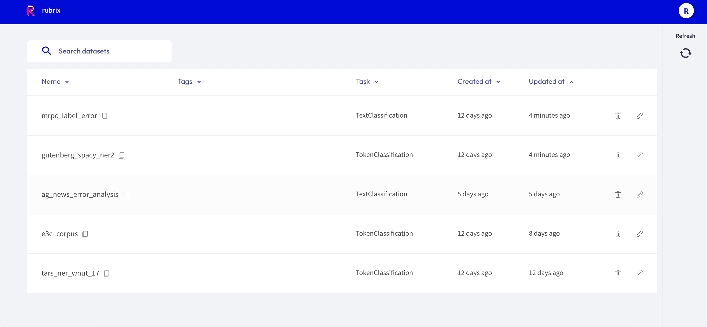

# Workspace

The _Workspace_ page is mainly a **searchable and sortable list** of **datasets**.
It is the **entry point** to the Rubrix web app and is composed of the following 3 components.

## Search bar

The "_Search datasets_" bar on the top allows you to search for a specific dataset by its name.

## Dataset list

In the center of the page you see the list of datasets available in the current workspace.
The list consists of following columns:

- **Name**: The name of the dataset, can be sorted alphabetically.
- **Tags**: User defined tags for the dataset.
- **Task**: The [task](../../guides/task_examples.ipynb) of the dataset.
- **Created at**: When was the dataset first logged by the client.
- **Updated at**: When was the dataset last modified, either via the Rubrix web app or the client.

## Side bar

On the top right you can find a user icon and a refresh button:

- **User icon**: Showing the initials of your user name, this icon allows you to view and switch the workspace.
- **Refresh**: This button updates the list of datasets in case you just logged new data from the client.
